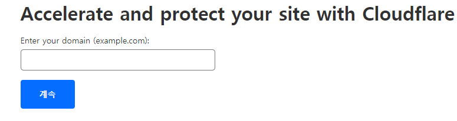
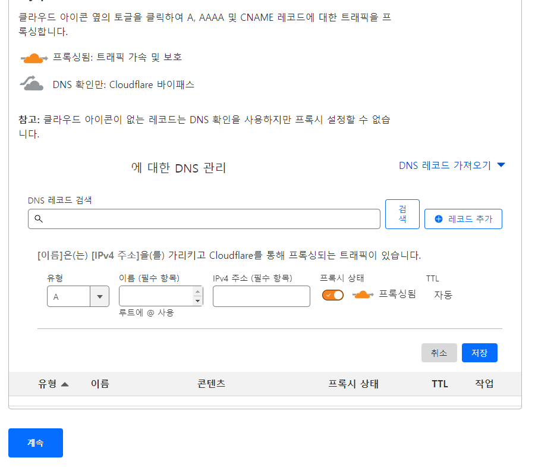
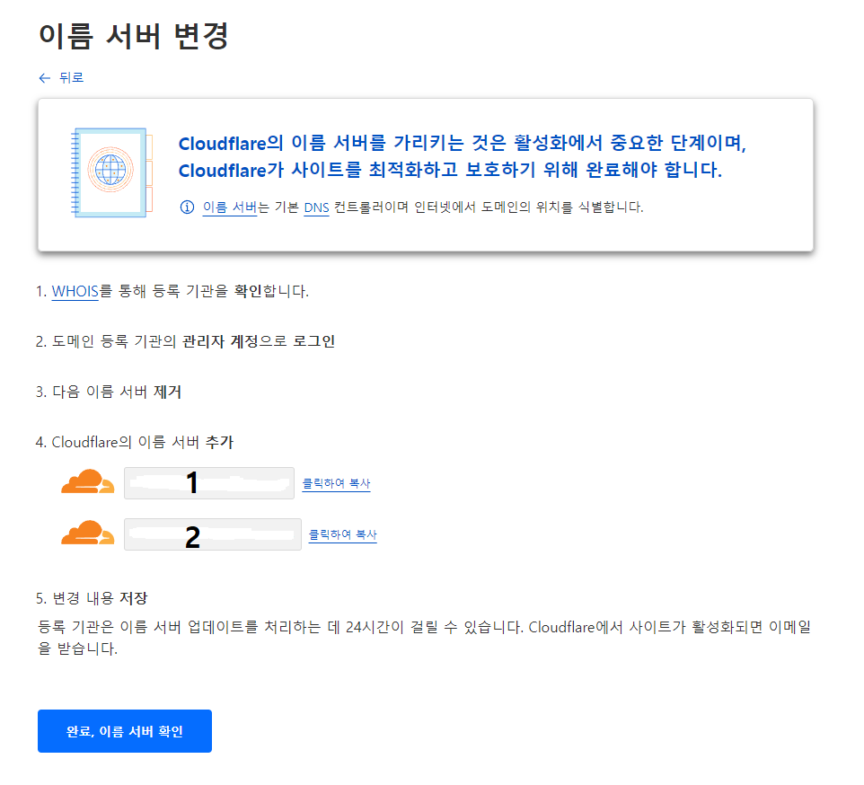
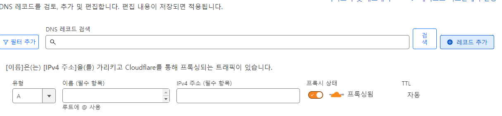
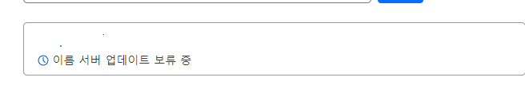

### 배포할 Django프로젝트의 DEBUG모드를 바꿔주자


개발도중 테스트용도로 runserver로 Django프로젝트를 실행해볼때는 DEBUG모드가 True여도 상관없지만 Django프로젝트를 퍼블릭으로 배포할때는 디버그모드를 보안상의 이유로 False로 바꿔줘야한다.

하지만 디버그 모드를 False로 바꾸면 미디어파일이나 스태틱파일들이 제대로 불러와지지않아 css가 적용되지않는 문제가 발생한다.

디버그모드가 False여도 css가 잘 적용될수있게 미디어/스태틱파일들을 불러올수있도록 배포전에 설정해주자.


```python

#settings.py

DEBUG = False

STATIC_URL = '/static/'
MEDIA_URL = '/media/'

STATICFILES_DIRS = [
    STATIC_DIR,]

if DEBUG:   #디버그모드를 계속 false로 둘거면 굳이 if로 분기점을 나눠줄필요는없다.
    STATICFILES_DIRS = [os.path.join(BASE_DIR, "static")]
    # OR STATICFILES_DIRS = [STATIC_DIR,]
else: #하지만 true와 false를 왔다갔다할거면 분기점으로 나누면 편하다.
    STATIC_ROOT = os.path.join(BASE_DIR, 'static')

MEDIA_ROOT = [os.path.join(BASE_DIR, 'media')]


#urls.py

from django.urls import re_path as url # 해당 라이브러리는 Django4.0이상 버전부터 이렇게쓴다.
#from django.conf.urls import url 이건 Django 4버전 이하의버전에서 사용
from django.conf import settings
from django.views.static import serve

urlpatterns = [
    path('admin/', admin.site.urls),
    path(~~~),
    url(r'^media/(?P<path>.*)$', serve, {'document_root':settings.MEDIA_ROOT}),
    url(r'^static/(?P<path>.*)$', serve, {'document_root':settings.STATIC_ROOT}),


]

위와같이 설정하고 서버를 가동시켜서 모든 css가 잘 적용되는지 확인한다.
```

### 아나콘다
필요에따라, 아나콘다로 실행해야하는경우도있으니 GCP에서 GPU VM생성+아나콘다설치는 해당 링크를 참조.
[GPU VM생성](https://m.blog.naver.com/blueday9404/221919561565)

아나콘다의설치는 [아나콘다공식홈페이지](https://www.anaconda.com/download)에서 가장 하단에서 각 OS에맞는 버전을 다운로드받을수있다.
wget으로 다운받으려면 링크를복사하자.


### Test 인스턴스를 한개 더 생성하자

도커 이미지로 배포하여 도커 컨테이너로 프로젝트가 정상적으로 실행되는지 비교하기위해,
Django서비스만 운영할 Test인스턴스를 한개 더 생성하여 비교해볼것이다.

사양은 Master 인스턴스와 같게 설정한 후, 동일하게 고정ip를 발급받을것이다.

로컬에있는 파일을 올리는방법은 여러가지가있겠지만, 나는 GCP콘솔 페이지에 접속해 SSH를눌러 인스턴스에 접속한 후, 파일업로드를 눌러 Django프로젝트 파일을 업로드했다.

이후 unzip패키지를 설치해 zip파일의 압축을 해제해줬다.

```bash
#패키지설치하기
>sudo apt install unzip -y

#압축해제
>unzip [파일명.zip]

#압축하기
>zip [파일명.zip] [폴더명]

```

## 로컬 Vscode에 Django Test용 인스턴스를 연결

Django 프로젝트를 사용할때 파일내부구조를 Vscode를 통하면 보기 쉬우므로 로컬의 Vscode와 연결하여 
사용해봄.

- ctrl+shift+p : 가상환경을 vs코드에서 자주설정해줄것기이기때문에 단축기를 익혀두자


**[참고사이트]**

[VSCODE GCP인스턴스에 연결하기](https://wooiljeong.github.io/server/gce-vscode/)

```bash

우선 로컬의 ssh키와 테스트인스턴스의 키를 교환해준다.

#vs코드가 wsl가아닌 로컬의 윈도우에 설치되어있으니, 윈도우의 ssh키를 따로만들어서 GCP인스턴스와 교환해준다.

# cmd <-> 리눅스 명령어

cmd에 alias 처럼 리눅스 명령어로 바꾸어 쓸수있다.

dir or tree /f = ls
type = cat
rd or rdir =rm -r /rm -rf 
del = rm
cd = pwd or cd

# del로 삭제된건 복구x

#vscode에 remode ssh를 설치하고 연결하자

이후 vs code를 열고, 왼쪽 하단의 EXTENSTIONS에 들어가서 필요한 패키지를 받아주자.
Remote SSH 플러그인을 검색하여 설치한다.

설치가 끝나면 좌측 하단에 새로생긴 Remote SSH플러그인 아이콘을 클릭하여, +버튼을 눌러 연결할 GCP인스턴스의 정보를입력해주자.

여기서, ssh키가 있는 위치에 config파일을 만들어서

>ssh -i ssh개인키 gcp계정@gcp인스턴스외부ip

위와 같은 형식대신

>ssh gcp1

과 같은 형식으로도 연결할수있다.

연결할 gcp의 정보를 모두입력하고 ssh 개인키를 통해 접속하면,
초기화면에 OS를 선택하는 바가 생기고, 연결한 인스턴스의 OS환경에 맞춰 선택해주면 연결이 끝난다.
```


## Test인스턴스에서 업로드한 서비스를 실행시켜보자

서비스를 실행시키기전에 환경을 만들어준다.
Django프로젝트안에 같이들어있는 pip 패키지 설치리스트 requirements.txt를 설치하자

```bash

pip install -r requirements.txt

# 필요 pip중에 mysql-client가 있는데, mysql-config not found를 만났다. 해당 오류는 mysql-client 패키지를 설치하기전에
# 헤더파일을 설치해야한다고 나와있다. 링크참조
# https://pypi.org/project/mysqlclient/

위의 링크에서 안내해준대로 아래 헤더패키지를 먼저 설치함

>sudo apt-get install python3-dev default-libmysqlclient-dev build-essential

이후 mysql-client를 설치한다

>pip install mysql-client

```

※ 참고사항

```bash

# pytorch

torch == pytorch인데, requirements.txt안에 포함이되어있어도 사양이낮은 서버에는 설치가 자동으로 종료된다.


pip install torch==1.11.0
Collecting torch==1.11.0
Killed

▲ 사양이낮으면 자동종료되버린다.

이럴경우, 설치할때 옵션으로 사양을 지정해주면된다.


pip install torch-1.11.0-cp38-cp38-manylinux1_x86_64.whl

or

pip install torch-1.11.0 --no-cache-dir


# openCV & libgl1

만약 opencv오류가나면 
opencv의 설치해주고, libGL.so.1: 오류가난다면

sudo apt-get -y install libgl1-mesa-glx 


# tensorflow 오류

GCP에서 Django용 인스턴스를 생성할때, GPU가 너무비싸서 GPU를 사용하지않았다.
이후, pip를 통해 tensorflow를 설치해주니까 제대로 tensorflow가 제대로 작동하지않는다.

찾아보니 gpu를 지원받는버전, cpu만사용하는 버전이있었고 설치방법에도 아나콘다를이용한(conda) 설치방법과
pip를 이용하여 설치하는 방법이있었다
찾아보니 pip를 이용하여 tensorflow를 설치하게된다면 느린 cpu성능과 gpu지원에 필요한 CUDA나 각종 라이브러리를 수동으로 설치/설정해줘야한다.
반면 conda를 이용할시, 더 나은 cpu성능과 gpu지원에 필요한 라이브러리들을 같이설치해준다.
(tensorflow는 GPU를 이용하면 CPU만 이용하는 버전보다 훨씬빠르다.)

```

## django실행에 성공했으면 외부에서 작동중인 서버에 접속해보자

기본적으로 django는 8000번 포트를 사용한다.
일단 기본포트로 두고, 외부에서 접속해본다.

- python manage.py runserver gcp내부ip:8000 or 0.0.0.0:8000

테스트용으로 프로젝트가 잘 구동하는지 확인할수있다.
인터넷 브라우저에서 gcp외부ip:django포트번호를 입력하면된다.


## django 프로젝트 배포환경을 만들어보자

runserver로 간단히 테스트해보았을때, 문제없이 정상동작이된다면 운영환경을 만들어본다.
runserver는 django에서 개발중 테스트용으로 제공하는 내장서버이기때문에 운영환경에서는 runserver로 운영하는건 바람직하지않다.
그래서 wsgi(uwsgi / gunicorn) + Nginx 을 이용하여 구축한다.
웹 서비스는 보통 클라이언트 <-> 웹서버 <-> 웹 어플리케이션(WAS) <-> DB 와 같은 흐름을 가지고있다. 

* gunicorn : 파이썬의 wsgi를 구현하는 http 서버. 다수의 웹 프레임워크와 호환가능하고 동작속도가빠르다.
* nginx : 웹서버 종류중 하나. 높은 성능과 적은 메모리사용 & 리버스 프록시 사용 여부가 장점이다.
* wsgi : 웹서버가 웹애플리케이션과 통신하는 방법을 중간에서 설명해주는 역할을한다.

Django가 제공해주는 테스트용 서버를 벗어나 이제 본격적으로 배포를 위해 프로젝트에 이것저것 연결해보자.


1. Uwsgi설치 & 연결

위에서 설명했듯이 Django는 웹서버와 바로 통신할수없으므로 Uwsgi를 중간에 둬야한다.
그러기위해서 uwsgi 파이썬 패키지를 설치하여 Django와 이 패키지를 연결해줘야한다.

<u>나는 Django 프로젝트가 작동하고있는 GCP서버에 텐서플로우때문에 Conda를 설치하여 프로젝트를 실행중이므로, 가상환경에서 Uwsgi를 설치한다.</u>

```bash

pip install uwsgi (혹은 pip3 install uwsgi)

    ★패키지 설치시 whell패키지 오류가나지만 uwsgi가 설치된경우.
    
    pip install whell

    이후 uwsgi 재설치 pip uninstall uwsgi -> pip install uwsgi

    ★패키지 설치시 whell패키지 오류가나면서 uwsgi가 설치가되지않는경우

    나는 아예 uwsgi가 설치되지않았다. 찾아보니 파이썬이 whell을 감지하지못하는거같은데 파이썬 버전을 업그레이드하거나 다운그레이드하기에는 부담이 커서 일단 conda로 설치를 진행해보았다.

    conda install -c conda-forge uwsgi

    -확인
    conda list

    uwsgi                     2.0.21           py39h068a5ad_2

    정상적으로 설치가된걸 확인할수있다.


uwsgi가 가상환경에 성공적으로 설치되었다면 이제 uwsgi서버와 django를 연결해준다.

uwsgi --http :[포트번호] --home [가상환경 경로] --chdir [장고프로젝트폴더 경로] -w [wsgi 모듈이 있는 폴더].wsgi

포트번호 -> 장고의 포트번호 8000 or 기본 8080

가상환경 경로 -> uwsgi를 설치한 가상환경이 존재하는 경로. 절대경로로 지정해주는것이좋음. ~/ -> /home/계정명/ 이므로, 만약 계정명아래에 가상환경이있다면 /home/계정명/env이름 을 적어줌

나같은경우는 anaconda아래에있으므로 /home/계정명/anaconda3/envs/env_name


장고프로젝트 폴더 경로 -> 장고프로젝트의 경로

wsgi 모듈이있는 폴더 -> 장고프로젝트 내부의 wsgi모듈이들어있는 폴더의 이름

예를들어 프로젝트명이 test_pro고 test_pro안에 mysite라는 폴더안에 wsgi모듈이있으면

프로젝트경로는 ~/(중략)/test_pro이고 wsgi경로는 mysite.wsgi 가된다.

설명을 토대로 완성된 uwsgi로 django서버를 가동시키는 내 명령어는

uwsgi --http GCP내부IP OR 빈값:port --home /home/계정명/anaconda3/envs/myenv  --chdir /home/계정명/myproject -w mysite.wsgi

위와같다.

하지만 나는 해당 프로젝트에서 수집된 뉴스기사내용을 요약하는 스케줄러가 실행되고있기때문에, 아래와 같은 에러를 만났다.

    RuntimeError: The scheduler seems to be running under uWSGI, but threads have been disabled. You must run uWSGI with the --enable-threads option for the scheduler to work.


해당 오류를 찾아보니 스케줄러를 사용하기위해 스레딩기능을 활성화라하는것같다.

Python 스레딩은 uwsgi에서 기본적으로 비활성화되어 있으며 옵션을 추가하여 활성화할 수 있다고한다.

오류메세지에서 알려주듯이 끝에 --enable-threads 를 추가해줘서 스레딩기능을 활성화해준다.

uwsgi의 스레딩기능과 스케줄러에대한 정보는 아래 사이트에서 찾았다.
(https://www.ibm.com/docs/ko/cloud-paks/cp-management/2.3.x?topic=mppa-monitoring-premises-python-applications-running-in-individual-docker-container)


그럼 스레딩 기능을 활성화시킨후에 서버를 재가동시켜본다.

uwsgi --http GCP내부IP OR 빈값:port --home /home/계정명/anaconda3/envs/myenv  --chdir /home/계정명/myproject -w mysite.wsgi --enable-threads

위와같이 uwsgi를 실행하면 스케줄러가 정상적으로 실행된다.

매번 긴 명령어를 쓸 필요없이 ini파일을 만들어서 

uwsgi test_uwsgi.ini 으로 바로 실행시킬수도있다.


# ini 파일만들기

먼저  manage.py가 있는 폴더에서 .config 폴더를 만들어주자.

mkdir .config
cd .config

그리고 .config 파일안에 uwsgi 폴더도 하나 만들어주자


mkdir uwsgi

해당 폴더안에 원하는 이름의 ini파일을 하나 생성한다.

touch test.ini

아까 명령어에 쳤던 내용과 비슷하게 작성해준다.

## test.ini

chdir = /home/계정명/myproject
module = mysite.wsgi:application
home = /home/계정명/anaconda3/envs/myenv

uid = 계정명
gid = 계정명

http = 8000 or gcp내부아이피:포트

#http를 지우고 아래와같이 입력해도된다

#####
socket = /tmp/myproject.sock
chmod-socket = 666 #socket의 권한
chown-socket = 계정명:계정명 #socket의 소유권
#####


enable-threads = true
master = true
vacuum = true
pidfile = /tmp/myproject.pid
logto = /var/log/uwsgi/myproject/@(exec://date +%%Y-%%m-%%d).log
log-reopen = true

# master: uWSGI 프로세스를 master로 돌아가게한다
# vacuum = uWSGI를 통해서 생성된 파일들은 삭제하는 옵션
# pidfile: 생성할 pid 파일의 위치
# logto: uwsgi 서버의 로그저장폴더위치
# log-reopen : 재시작할 시 로그를 다시 열어준다.

ini 파일의 생성이 끝났으면 없는 경로에 없는 폴더를 만들어준다.

# 경로만들어주기

기본적으로 var/log 안에는 uwsgi가없으니 uwsgi폴더를 하나만들어준다.

sudo mkdir -p /var/log/uwsgi/myproject


# 만든 폴더에대해 권한부여

sudo chown -R $USER:$USER /var/log/uwsgi/myproject #나는 현재로그인되어있는 유저로 통신할것이므로

이렇게 기본적으로 원하는 경로를 설정해주고 폴더를 만들고 권한을 주면 ini의 세팅은 끝난다.


실행시켜보자

uwsgi --ini /경로/test.ini

실행시켜보면 아래와같이 서버가 실행된다.

[uWSGI] getting INI configuration from/경로/test.ini

접속해서 페이지가 잘 동작되는지 확인하자.

만약 일반유저로 실행되지않는다면 sudo를 사용하여 실행해보자

sudo /home/계정명/env_name/bin/uwsgi -i /실행시킬 ini파일 경로/test.ini

※ uwsgi는 해당패키지를 설치한 가상환경안 -> bin 폴더안에있다. bin폴더안에는 conda list로 조회할수있는 해당 가상환경에 설치된 패키지를 확인할수있다.

※gcp기준 나같은 경우는 /home/계정명/anaconda3/envs/env_name/bin 아래에 uwsgi가있다.

```

2. Nginx 설치 & 연결

1차배포가 끝났으면 Nginx를 설치해서 연결해보자.

```python

# 설치
sudo apt-get install nginx -y

# Nginx에 Nginx를 사용하는 계정이 누구인지 알려주는 작업을해야한다.

sudo vi /etc/nginx/nginx.conf

user www-data; -> user 계정명;

저장 후 conf파일 종료

# Nginx conf파일을 프로젝트에맞게 새로하나 생성해주자.
# 프로젝트용 conf파일은 uwsgi에 쓰이는 test.ini 파일을만들어놓은 .config폴더안에 생성할것이다. 그렇게되면 구조는 Django프로젝트폴더 > .config폴더 > nginx폴더(생성)> test.conf 가 될것이다.

mkdir -p ~/myproject/.config/nginx

vi ~/myproject/.config/nginx/test.conf

    server {
        listen 80; #http기본포트가 80번이다. 여기서 설정한 포트가 nginx가 점유하는포트가될것이다. 해당 구문은 요청받을 포트를 설정하는것이다.
        server_name ip; #요청받을 서버의 주소. ALLOWED_HOSTS와 비슷하다.
        charset utf-8; #인코딩
        client_max_body_size 128M;

        location / { #server_name/ 이런식으로 들어올때 처리할 내용에대해 정의한다.
            uwsgi_pass  unix:///tmp/mysite.sock; #location /static / {} => sever_name/static/ 과 같다.
            include     uwsgi_params;
        }
        # location /static/ { # 해당 구문은 장고프로젝트를 만들때 static파일들을 모으는작업을 미리안했거나, 했음에도 css,js등 static파일들이 깨져서 사이트가 제대로나오지않을때 추가. 나는 해당 구문을 추가하지않아도 정상작동하였다.
        # alias /srv/django-deploy-test/static/;
        # }
    }

위와같이 내용을 입력해주고 저장한다.

그리고 수정된 파일을 서버에 올리기전에 반드시 nginx는 켜져있어야하고, nginx-uwsgi를 연결해야하니 uwsgi도 항상 켜져있어야한다. 그러므로 uwsgi를 백그라운드로 계속 실행할수있도록 'uwsgi.service'파일을 만들어놓자.

# .config 폴더 > uwsgi폴더 > uwsgi.service 파일생성

vi uwsgi.service 

    [Unit]
    Description=uWSGI service
    After=syslog.target

    [Service]
    ExecStart=/uwsgi가설치된env경로/bin/uwsgi -i /장고프로젝트경로/.config/uwsgi/mysite.ini #uwsgi를 관리자권한으로 실행할때의 명령어. service에 이것을 등록할것이다.
    Restart=always
    KillSignal=SIGQUIT
    Type=notify
    StandardError=syslog
    NotifyAccess=all

    [Install]
    WantedBy=multi-user.target

위와같이 입력하고 저장한후 서비스파일을 등록해주자

# uwsgi.service파일 데몬등록

/etc/systemd/system/에 링크를 건다.

sudo ln -f /장고프로젝트경로/.config/uwsgi/uwsgi.service /etc/systemd/system/uwsgi.service

# ※/etc/systemd/system/ 폴더안에는 인스턴스가 시작되면 데몬으로 자동실행할 서비스들이있다.
# (ex: sshd.service같은것들)

해당명령어를 실행하고 uwsgi.service파일이 제대로 들어가있는지 확인한다

cd /etc/systemd/system/

    uwsgi.service

해당파일이 들어있으면 제대로등록된것.

# 데몬을 새로고침해주자

sudo systemctl daemon-reload

# uwsgi 서비스 사용가능하게 변경 후 재시작
sudo systemctl enable uwsgi

위의 명령어를 실행하면,

    Created symlink /etc/systemd/system/multi-user.target.wants/uwsgi.service → /etc/systemd/system/uwsgi.service.

    이런 안내메세지가나온다.

재시작 해주자

sudo systemctl restart uwsgi

# 장고 프로젝트내의 ngins 설정파일을 cp 커맨드를 이용하여 nginx폴더안의 sites-available 폴더안에 등록해주자.

sudo cp -f /장고프로젝트 경로/.config/nginx/test.conf /etc/nginx/sites-available/test.conf

※sites-available폴더 = 여기에있는 파일,폴더 등 정보들이 실제 nginx에 반영되지는않지만, sites-enabled 폴더를 통해 available폴더안의 각종 설정들을 실제 nginx에 반영할수있다.

# sites-available에 복사된 설정파일을 sites-enables폴더에 등록

주로 available에서 생성/옮겨놓은 파일들이나 설정정보들을 실제 적용시키기위해 sites-enables에 설정파일들을 링크형태로 등록해준다.
링크를 걸어주자

sudo ln -sf /etc/nginx/sites-available/test.conf /etc/nginx/sites-enabled/test.conf

# site-enables 폴더안에는 기본값 default폴더가있는데 해당 폴더를 삭제해준다

sudo rm /etc/nginx/sites-enabled/default

# 모든 설정을 끝냈으니 데옴을 리로드해주고 nginx와 uwsgi를 재부팅해준다

sudo systemctl daemon-reload

sudo systemctl restart uwsgi nginx

###
이제 장고프로젝트가 가동중인 gcp서버의 외부ip를 포트번호없이 주소창에 입력하여 접속해보자.
포트번호없이 방화벽에 등록된ip를 가진곳에서 장고프로젝트를 배포중인 인스턴스의 외부ip를 브라우저에 입력해서 페이지가 정상적으로 나오면 성공.

# nginx 서비스 시작 & 중지

## 시작 & 재시작 & 구성변경후 리로드
sudo systemctl start nginx
sudo systemctl restart nginx
sudo systemctl reload nginx

## 중지 & 부팅시 자동으로 시작하지않게하기
sudo systemctl stop nginx
sudo systemctl disable nginx

```


장고프로젝트에 만든 페이지대로 잘 나온다면 성공.

이후 .config 폴더안에 들어있는 <u>nginx conf파일에 변경사항</u>이 생긴다면, 
<u>반드시 링크를 수정된파일로 재등록해줘야한다는것을 잊지말자.</u>

```
sudo cp -f /장고프로젝트 경로/.config/nginx/test.conf /etc/nginx/sites-available/test.conf

sudo ln -sf /etc/nginx/sites-available/test.conf /etc/nginx/sites-enabled/test.conf
```

uwsgin와 nginx를 연결하고보니 Gunicorn이 uwsgi보다 훨씬 동작속도가빠르고 가볍다는걸알았다.
그런데 이미 uwsgi를 연결했기때문에 다음에 GCP에 장고프로젝트를 배포할일이있으면 Gunicorn을 사용하여 배포해야겠다.
현재 프로젝트는 많이무겁지않아서 uwsgi로 동작시켜도 사용하는데 큰 문제는 없는것같다.


3. 도메인을 연결해보자

도메인을 구매하여 배포중인 Django서비스에 연결해보자.

도메인을 구매하는 방법은 여러가지이다. GCP에서 도메인을 발급받는 방법도있고, 대표적으로 가비아 에서 도메인을 구입하는방법도있다.

(GCP는 Cloud Domains라는 서비스에서 도메인을 발급받을수있다.)


어찌됐든 중요한건 <mark>도메인을 구입해서 연결</mark> 하는것이다.


GCP를 이용중이니까 GCP에서하면 도메인을 발급받아서 등록해주면 편하겠지만, 나는 현재 GCP 무료평가판을 사용하는중이여서 추후 Domain 서비스에대한 과금구조를 정확히 알수없어서 그냥 **가비아에서 도메인을 구입** 하는 방향으로 진행할것이다.

[가비아](https://www.gabia.com/)

가비아에 들어가서 가입을하고 원하는 도메인을 구매해주자.

나는 기업도아니고 정식적으로 뭔가를 서비스할게아니라, 배포연습겸 프로젝트 전시/포트폴리오용으로 Django서비스를 이용할것이기때문에 만원이 넘지않는 도메인들중에서 고르기로했다.


.stor / .xyz / .info 등 여러가지있었지만
그중 무난한가격에 무난해보이는 .site를 선택했다.

도메인 이름을 지을때는 .com .net .co.kr 등 인지도가 높은 도메인들을 선점이되어있을확률이높으니 도메인이름을 지을때 하이픈같은것들을 적절히 잘 활용하여 이름을 생성해주자.


<mark>결제할때 꼭 금액을 부과금액을 확인해주자. 결제할떄 보통 3년이 기본으로 되어있으니까, 1년으로 선택하여 부가세포함한 가격인지 잘 확인하고 구매해주자.</mark>


**안전잠금 서비스는 무료니까 사용해주자.**

결제가 완료되고나면 홈>DNS설정에서 구매한 도메인을확인할수있다.


### 이제 구매한 외부도메인(가비아)을 GCP에 등록해주자


제일 먼저 Cloud Dns메뉴에 들어가서 영역을생성해준다.

해당 api는 처음에 사용설정이 기본으로안되어있는데 무료체험계정에서 무료로 액세스할수있는 서비스인지 잘 모르겠어서 공식 doc를 찾아보았다.

하지만 무료체험 지원 프로그램에서는 해당 서비스가 없어서 구글에 직접 물어봤다.

결과 외부든 자체적으로 발급받은 도메인이든 도메인을 등록하여 사용하게끔 하는건 다른 요금이 부가된다고한다.
등록한 도메인의 갯수에따라, 요청들어온 쿼리량에따라 이용요금이달라진다고한다.

도메인을 등록하는 서비스는 Cloud DNS만있는것이아니라, 다른곳에서도 많이하는 서비스이다.


네이버 Global DNS 는 GCP의 공인IP(외부)를 이용하여 등록가능하다고한다. 두 서비스 모두 가격은 비슷하고 30일기준으로 가격이책정된다고한다.

네이버에서 서비스하는 Global DNS는 따로 요금계산기까지 제공하니, 미리 계산해보는것도 나쁘지않을것같다.

네이버나 구글말고도 **클라우드 플레어**라는곳이있는데 프록시기능도 제공하니 원하는 업체를 선정하여 도메인을 등록하면될것같다.


그럼 이제 가비아에서 구매한 도메인을 등록해보자.


1. 클라우드 플레어에 로그인하여 도메인을 등록해주자



빈칸에 가비아나, <u>미리 구매해뒀던 사용할 도메인을 입력한다.</u>


도메인을 입력하고 다음버튼을 누르면 잠시 뒤 요금제선택이나온다. 나는 프리를선택했다.

이후, 클라우드플레어와 연동해놓은것이 아무것도없기때문에 클라우드 플레어가 잠시 알아서 탐색한후에 현재등록된 레코드를 보여준다. 일단 아래에 계속버튼을눌러 진행한다.



계속버튼을 누르면 경고창이 하나뜨는데 일단 넘어가주자.



경고창을 무시하고 넘어가면 네임서버를 설정하는 단계가나온다. 여기서 이제 <mark>가비아로가서 네임서버를 클라우드플레어용으로 바꿔주자</mark>

가비아에가서 My가비아에 들어가 구매한 도메인을 클릭하고 관리를 눌러준다.

만약 안전서비스를 설정해놨으면 소유자인증과 안전서비스해지후에 네임서버변경이가능하므로 진행해준다.

인증을하고 네임서버변경을 눌러서 아까 클라우드 플레어에서 등록하라고 알려준 <mark>두개의 네임서버를 가비아 도메인에 등록해준다.</mark> 네임서버변경을하면 상황에따라 1~2일의 시간이 소요될수있다고하니 참고하자.

사용하려는 도메인에 네임서버를 추가해줬으면 다시 <u>클라우드 플레어</u>로 돌아와서 완료버튼을 누르자.

이후 빠른시작에서 HTTPS 설정을해주고 DNS 레코드를 등록해준다.




네임에는 @ /  IP4 ADDRESS에는 GCP의 외부IP주소 / Proxy status는 DNS ONLY / TTL은 5분~10사이로 바꿔주고 저장

※TTL = 짧으면 서버의 캐시에서 빨리 사라짐


이제 설정은 끝났고 클라우드플레어에서 네임서버 업데이트를 위해 하루~이틀정도 걸린다니 메일을 기다리거나 대시보드에서 해당 도메인이 활성화되었다는 표시가 나타날때까지 기다린다.



▲아직 내가등록한 도메인이 클라우드플레어에 반영되지않았다.

4. SSL인증서발급
