# 사용버전

GCP / Window = ELK 7.10.1

VM(Ubunto 20.22) = ELK 7.17.7

★ 해당 문서는 아래 출처의 문서와 강의의 내용을 참고하여 작성되었습니다.

- [Elstic가이드북](https://esbook.kimjmin.net/)
- [한국 Elstic사용자 그룹 유튜브](https://www.youtube.com/@elastic7014)

# curl설치

엘라스틱서치 클러스터가 잘 실행되고있는지 확인하고싶어서 curl로 확인해보려고하니,
Windowpowershell에서 -x get 명령어가 실행이되지않는다.
CMD 에선 잘되는데.. 찾아보니까 여러이유가있는것같아서 그냥 새로운버전으로 설치하기로함

>[curl공홈](https://curl.se/)

위의 링크에서 각자 필요한 버전을 받자.

다운로드받고 압축을해제하면 curl-버전명-os명-mingw 이런식으로 폴더가생긴다.
이 폴더를 원하는 드라이브에 넣어주고 시스템 환경변수를 등록해주면 끝이다.
나는 a드라이브에 넣고 curl bin파일의 경로를 환경변수에 등록해줬다.
> A:\curl-7.87.0_4\bin

이제 파워쉘에서 제대로 작동하는지 확인해보면 된다.


**안됨.**

그래서 기존 curl이 별칭으로 등록되어있다는 내용을찾아 삭제해주었음

>remove-item alias:\curl


여튼 별칭을 지워주고 파워쉘에서 curl을 실행해보니 아주잘됨.
혹시 모르니 CMD창에서도 실행해보니 문제없이 아주실행잘됨
다만, 파워쉘을 닫고 다시실행시키면 초기화되어있다는 문제가있다. 
터미널을 재시작할때마다 매번실행시켜줘야한다는 번거로움..


## .yml(기본 설정파일)에서 클러스터이름을 변경해주자

엘라스틱 서치는 기본적으로 클라이언트와 통신하는포트는 9200번이다.
그리고 tcp로 9300번포트는 노드끼리 통신하는 포트이다.

그리고 하나의 클러스터로 실행된다.
그래서 클러스터의 이름은 자동할당으로 쓰지말고 구분하기좋은이름으로 사용하면좋다고한다.

클러스터의 이름을 바꿔보자.

confing폴더안의 elasticsearch.yml 파일을 열면, 엘라스틱서치의 기본적인설정이나온다.

간단하게 살펴보면 아래와같다. 

앞에 다 #으로 주석처리가되어있으니, 풀고사용하면된다.

        Cluster
    cluster.name : my-appliction ->초기 node의 이름이다.자동적으로 엘라스틱서치라는이름이됨. 나는 nag-els 라고바꿔줌.
        Node
    node.name :node-1 ->node의 이름이다. 기본적으로 node-1이라고되어있는데, 클러스터이름과 달리, ""로 묶어줘야한다. 나는 "na-els-node-1"으로 바꿔줌.
        Path
    path.data : /path/to/data -> data파일이 저장되는경로. data폴더가 생성되고 그아래 저장한다는 의미
    path.logs : /path/to/logs ->log파일이 저장되는경로이다.

        Network
    nework.host : 로컬호스트 ->엘라스틱 서치가 실행되는 호스트주소. 기본적으로 로컬호스트로되어있고, 외부에서 접근을 허가하려면 허가할 ip나,"_site_"라고 적어주거나, 0.0.0.0으로 작성해주면된다. 이것은 아래에서 좀 더 자세히다룸
        set a custm port for HTTP:
    http.port : 9200 ->엘라스틱서치가 클라이언트랑 통신할 포트
        Discovery
    cluster.initial_master_nodes: ["node-1", "node-2"] ->마스터노드가 될 후보들의 리스트이다. 위에서 노드의 이름을바꿔줬으니, node-1은
    nag-els-node-1으로 바꿔줘야한다. 기본적으로 주석처리되어있어서 이름부분만 바꾸고 주석처리를 해제해도 문제가되진않는다.
    


**이름이 지정한이름으로 바뀌어져있는걸 알수있다.**

**※yml 문법은 :에서 한칸 띄우고 입력해야 정상적으로작동한다.**

    path.data -> 데이터를 저장할위치인데 배열형태로 여러 저장경로를 등록할수있기때문에, 한 서버에 여러저장경로를 등록할수있다.

    path.logs -> 클러스터명.log파일을 저장하는 위치이다. 실행중인 시스템로그는 날짜가 변경되면, 이전 로그파일뒤에 날짜가 붙은파일로 변경된다.

    위의 두 경로는
    path:
        data: 경로
        logs: 경로

    처럼 작성 할수있다.

    **bootstrap.memory_lock:T/F** -> 엘라스틱서치가 사용중인 힙메모리영역을 다른 자바프로그램이 못쓰게 점유하는 설정이다.

    network.host: ip주소 -> 엘라스틱서치가 실행되는 서버의 ip주소. 기본적으로 로컬호스트이며, 로컬호스트를 벗어날시 운영모드로들어가서 bootstrap체크를한다.

    network.bind_host:내부망

    network.publish_host:외부망

    위 두가지에 설정되는 변수값은
    - _local_ : 로컬호스트ip 127.0.0.1
    - _site_ : 로컬네트워크 주소로 설정됨. 실제로 클러스터링 구성할때 주로 설정하는값. (**GCP에 엘라스틱을 설치한 경우, _site_ 라고 입력하면, 해당인스턴스의 내부ip가 할당된다.**)
    - _global_ : 외부에서 바라보는 주소로 설정. (**GCP의 경우, 해당인스턴스의 외부ip할당**)


## 한개의 서버에서 여러 노드를 실행해보자.

엘라스틱서치를 여러개 다운로드받아서, 각 .yml파일에서 

클러스터 이름은 같게 clu-1, node네임만 다르게 node-1, node-2로두었다.

그리고 node-1을 실행시키고 node-2를실행시키면, node-1에 **added {{node-2}}** 라고 node-2가 추가되는것을 볼수있다.

그러면 port는  node-1은 9200, node-2는 9201 로 할당되지만, 같은 클러스터로 묶여있어서(clu-1)
어느포트로 접속하던, 어느 데이터를 조작할수있다.

하지만 만약 같은서버에서 다른 클러스터를 실행시키게되면, 9202번이 할당되게되고, 9202번은 데이터를 조작할수없다.

이런식으로 하나의 서버에서 여러 노드를 실행시킬수도있고, 여러 서버에서 각각의 노드를 실행시킬수도있다.

## 엘라스틱서치 윈도우에서 데몬으로 실행하기

엘라스틱서치를 매번 경로를 지정해서 실행하기 귀찮다.

리눅스나 윈도우나 엘라스틱서치가 실제로 실행되는파일이있는 경로를 모두써줘야하니, 
아무리 파일이름을 짧게바꾼다고해도 좀 귀찮았다.
(나는 엘라스틱서치를 els-7.10.1, 키바나를 kib-7.10.1, 로그스태시를 logs-7.10.1로 바꿔놨다.)

또,터미널을닫아버리면 엘라스틱서치가 꺼져버리니, 그것도불편하다.

리눅스는
>엘라스틱서치 bin파일경로/실행파일(elasticsearch)

윈도우는
>엘라스틱서치 bin파일경로/실행파일.bat 이다.

★7버전이상부터는 다운로드패키지에 jdk가 포함되어있어서, 따로 자바를설치할필요가없다고한다.

여튼 공식문서에가보면 실행옵션이 두가지가있다.
-d 옵션은 데몬으로 실행하는방법이다.

>els-7.10.1\bin\elasticsearch.bat -d

명령프롬포트에서 아까와같이 curl명령어를 찍어보면 정상적으로 출력되는게 맞다.
그런데 윈도우는 데몬으로 돌리면 -log파일만 출력이되지않을뿐 다른조작이 안된다(나만그런걸수도있고)
그래서 결국 다른터미널을 켜야해서 결론적으로는 같다.

### 종료방법
보통은 -c를 눌러종료시키지만, 지금은 -d옵션으로 데몬으로 실행시키는중이니 프로세스를
찾아 종료시켜줘야한다.

리눅스는 kill로 데몬을 삭제할수있고,
윈도우는 taskkill이다. 옵션은 거의 동일. 

- taskkill /im 이미지이름 or /pid pid번호
- -f는 강제종료옵션. 그냥 뒤에 /f 를붙이면되고 리눅스는 -f.

작업관리자를 켜서 이름을 복사해서붙여넣거나 pid를 확인하면된다.
리눅스는 ps명령어를 사용해서 ps -e 나 -f(pid포함 프로세스 상세정보확인)
로 프로세스를 확인하자.

## 윈도우에서 자동실행을 시켜보자

서비스에 등록해서 자동실행시키는 방법도있겠지만, .sh파일을 만들어서 git bash로 만들어서 필요할때마다 실행시키는게 효율적이라고 생각했다.
-p옵션이나 -d옵션 등 많지만, 기본적으로 실행만시키는 쉘스크립트파일을 만들어서 엘라스틱서치를 실행시켜보기로했다.

elsgo.sh (엘라스틱서치 실행파일) 내용

```bash
#!/bim/sh
echo "els start!"
C:/els-7.10.1/bin/elasticsearch.bat

#*기본경로를 복사하면 윈도우는 \ 로 들어오는데, .sh로 실행시키기위해서는 / 로바꿔줘야한다.*
#echo는 실행이 잘되고있는지 알아보기위해서 적어놓음
#!/bin/sh 는 chmod 로 권한을 바꿔주지않고도 실행파일로 인식시키기위해 적어놨다. .sh파일의 시작되는 첫문장이 !/bin/sh면 실행파일로인식한다고한다.
```

Git bash를 실행시키고 ll(소문자L)명령어로 해당파일의 권한을 확인해보자
※해당파일이있는 경로로 이동한 후에 명령어를 실행시키길 권장.

>ll elsgo.sh


나는 경로를 이동하지않고 그냥 조회했다. 별도의 chmoe작업없이도 실행파일로인식한다.


**실행시켜보자**

>sh elsgo.sh


잘실행되고있는것을 알수있다.

위와같은 방식으로 키바나 sh파일도 생성해주었다.
로그스태시는 기본적으로 파이프라인을 지정해주거나 -e(명령어에서 바로 파이프라인설정), -f(conf파일) 옵션을 사용하여 읽어와서 아직
가져올게 정해지지않았으니 패스.

## 리눅스용 실행파일을 만들어보자 start.sh / stop.sh

실행용 .sh파일과 종료용 .sh파일을 만들어보자.
(실행파일이름 약자.pid 를 하면 실행되는것의 pid를 기록해주는것을 응용)

메모장이나 아무 편집기를열어 

**이름.sh**파일을 만들어주자.
나는 터미널을 켜면 처음위치해있는 경로에서 움직이기 싫어서 elasticsearch실행파일의
절대경로를 **start.sh**파일안에 넣어줬다. 그리고 -d 옵션은 사용하지않고 pid만 기록해주는 -p옵션만 사용했다.

> bin/elasticsearch -d -p els.pid

위와같이 입력하고 저장.

**정지용으로 stop.sh**도 만들자
>kill 'cat els.pid'

정상적으로 만들어졌으면 두 실행파일에 실행권한을 추가해주고 실행하면된다.

>chmod 755 *.sh or start.sh
>chmod 755 stop.sh 

같은경로에 .sh파일이많다면 개별로지정해서 권한을주자. 

# elk 기본조작

>server에서 elk의 기본적인 설치화 실행방법, 설정을 다뤄봤으니 이제 elk를 조작하여 원하는 결과를얻어보자.
>나는 news와 실시간 트위터데이터(카프카이용)를 받아와, nori토크나이저를 이용하여 저장한다.
>키바나로 뉴스기사에대하여 간략한 데이터마켓을 구축하는것이 목표이다.


## 엘라스틱 서치를 외부에서도 접속할수있게 해보자.

엘라스틱 서치는 .yml파일에 network.host의 값을 설정하는 순간, 개발자모드 -> 운영모드가된다. 그러면 여러 부트스트랩체크를 하게되는데
<mark>단 , 주의할점은 .yml문법은 꼭 : 이후 공백이한칸있어야하고, 설정을 마치고 마지막줄 아래에도 한줄 공백이있어야하는것같다.</mark>

왜냐하면
  1 설정1
  2 설정2
  3 설정3
  ###엘라스틱주석내용###

위와같은식으로 .yml파일안에 작성을해놓았더니, 오류를만났다.(URL에 연결할수없다는 오류)

**network.host에만 값을 설정했을때 어떤 오류가 생기는지 알아본다.**

>[1]: max virtual memory areas vm.max_map_count [65530] is too low, increase to at least [262144]

    해당오류는 운영체제에서 하나의 프로세스가 너무많은 파일을 점유하는것을 막아놨기때문에 발생하는 오류이다. 그래서 한개의 프로세스가 점유할수있는 파일의 갯수를 제한해둔것을 늘리면된다.
    
    방법1. -> 1회성.
    sudo su
    ulimit -n 65535
    su 사용자이름

    방법2. -> 영구적
    /etc/security/limits.conf , /etc/sysctl.conf 수정하기.

    sudo vi /etc/security/limits.conf

    사용자이름 - nofile 65535 ->입력 후, 재시작 해야적용이된다.

    sudo vi /etc/sysctl.conf

    vm.max_map_count=262144 ->입력 후, 재시작 (sudo shutdown -r 로 시스템 재시작)

    해결.

>[2]: the default discovery settings are unsuitable for production use; at least one of [discovery.seed_hosts, discovery.seed_providers, cluster.initial_master_nodes] must be configured

    config/elasticsearch.yml 파일안의 discoverey.seed_hosts에서 접속할 호스트를 아래 host1,host2에 넣어주면된다. GCP의 방화벽에서 GCP에 접근할 IP를 등록해주는 작업과같다.

    vi config/elasticsearch.yml

    discovery.seed_hosts: ["host1", "host2"] ->"host1","host2"자리에 접속을허용할 ip OR hostname입력

    터미널에 hostname 입력하고 seed_hosts에 추가.(GCP의 경우 현재 인스턴스의 이름이 나온다.)

    cluster.initial_master_nodes: ["node-1","node-2"] ->discovery.seed_hosts와 꼭 같이사용해야하는 옵션이다. "node-1","node-2"자리에 노드이름을 넣어주면된다.

    해결.

이제 정상적으로 엘라스틱 서치가 운영모드로 실행된다. 


**하지만, 이제는 로컬호스트로 접속할수없다.** 로컬호스트로 실행하고싶다면 network관련 설정들을 주석처리 해주면 된다.

나는 다른 사용자들이 데이터마켓을 보도록 구축할것이기때문에, 그대로 둠.

운영모드에서 엘라스틱서치 접속


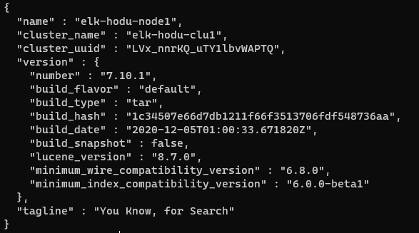

>curl 내부ip:포트번호 

위와같이 접속하면 정상접속이되는것을 볼수있다.
내부 ip는 ifconfig로 확인하거나, GCP는 콘솔의 내부ip를 복사해도된다.

같은 호스트안에서 접속하지말고 다른 인스턴스나, vm에서 접속도 가능하다.

**단, GCP는 반드시 방화벽에서 해당인스턴스에 접근할 IP를 등록해주는 작업을거쳐야한다.**

나는 이미 설정을해놨으니 생략하고 Window 로컬 pc에서 접속해보았다.

>curl 외부IP:포트번호 (GCP는 콘솔의 외부IP)

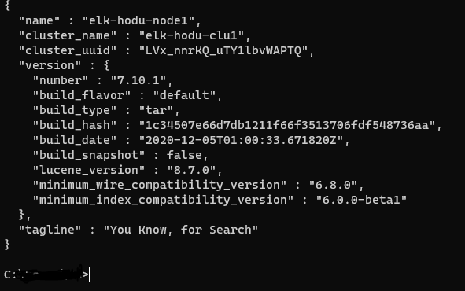


### 추가로 로컬호스트에서도 접속하고싶다면 위의 내용에 아래와같이 로컬호스트만 추가해주면된다.


config/elasticsearch.yml파일에
배열형태로 추가해주면된다.


## 분산통신을 해보자.

GCP를 더 생성하여 클러스터를 나누고 각각의 다른 서버에서 클러스터끼리 통신할수있도록 환경을 구축해본다.


출처:[Elasticsearch사용자 그룹 유튜브강의](https://www.youtube.com/watch?v=LM5IqDTWN60&list=PLhFRZgJc2afp0gaUnQf68kJHPXLG16YCf&index=8)

다만 나는 ip를 0.0.0.0/0 으로 하지않고 다른 것을 사용했다.

elasticsearch.yml 파일의 .SEED_HOST옵션에 내부IP 주소를넣어도되지만, 

HOST파일에서 IP주소와 이름을 매칭하여 사용해볼것이다.

**HOST파일을 수정해보자**

    GCP 1번호스트(1번인스턴스)
    
    sudo vi /etc/hosts

    (파일안에 작성)

    인스턴스1의 내부IP(GCP내부IP)  해당 내부IP를 부를 이름1
    인스턴스2의 내부IP            해당 내부IP를 부를 이름2
    
다음, **GCP방화벽 설정을한다**

    이름:elasitc-internal
    포트:9200,9300 ->9300번 포트를 열어주지않으면 서로 바인딩이되지않음!
    ★소스필터:elastic-internal ->ip주소를 직접 지정하는게아닌, 같은 태그를가진 인스턴스의 접근을 허용하게된다.
    ※GCP를사용하지 않는 유저의 접근을 허용할때는 ip주소가 편할수있지만,GCP인스턴스끼리 통신할때는 소스필터-소스태그가 편할수있다.
    태그:elastic-internal

    이후, 다른 인스턴스에서 /etc/hosts를 편접하지않았으니 일단 2번인스턴스의 .yml파일안에 discovery.seed_hosts를 1번에서 2번 자신의 이름을 바꿔준다.
    

접속테스트 : 1번인스턴스 -> 2번인스턴스로 접속

>curl 내부ip주소 or 1번인스턴스에서 지정한 내부ip이름:포트

아래와같이나오면 성공.

    {
    "name" : "2번인스턴스에서 지정한 노드이름",
    "cluster_name" : "2번인스턴스에서 지정한 클러스터이름(현재환경에서는 1번과같은 클러스터)",
    ...
    },
    "tagline" : "You Know, for Search"
    }

**인스턴스1에도 /etc/hosts/ 파일안에 ip를 이름으로 등록해준다.** 

다음에 모든인스턴스에 동일하게 discovery.SEED_HOST 와 cluster.initial_master_nodes에 호스트 이름들을 추가해준다

    discovery.SEED_HOST: ["인스턴스1번 호스트이름","인스턴스2번 호스트이름"]
    cluster.initial_master_nodes: ["인스턴스1번 노드이름", "인스턴스2번 노드이름"]

바인딩 확인

각각의 엘라스틱 서치를 모두 실행한 후, Winodw로컬에서 curl명령어를 이용하여 인스턴스1번의 외부ip로 인스턴스에 접속해본다.(인스턴스2번은 방화벽에설정에서 winodw(로컬)로 접속하지못하게 막아놓음)

>curl 외부ip:포트(9200)

>curl 외부ip:포트/_cat_/nodes

    C:\Users\User_name>curl 인스턴스1_외부ip:포트/_cat/nodes
    인스턴스1내부ip 6 56 3 0.00 0.07 0.05 cdhilmrstw * 인스턴스1_노드이름

    ->바인딩 실패. 인스턴스2의 노드이름도 같이나와야한다.


엘라스틱서치는 실행하게되면 자동으로 data폴더와 log폴더가 elasticsearch 폴더 하위에 생기게된다.

**★따로따로 실행한 이력(data폴더가 생김)이 있어서 바인딩이 제대로이루어지지않았다. elasticsearch폴더안의 data폴더를 삭제하고 다시실행.(log폴더는 삭제하지않았음.)**

>rm -rf data폴더경로

**결과**

    C:\Users\User_name>curl 인스턴스1_외부ip:포트/_cat/nodes
    인스턴스1내부ip 9 56 11 0.30 0.19 0.08 cdhilmrstw * 인스턴스1_노드이름   -> * 표시가 되어있는게 현재 Master노드
    인스턴스1내부ip 19 24 33 0.57 0.22 0.09 cdhilmrstw - 인스턴스2_노드이름

    >성공

    위의 항목들의 타이틀을 같이 출력하고싶다면

    >curl "http://외부ip:포트/_cat/nodes?v"

    ip         heap.percent ram.percent cpu load_1m load_5m load_15m node.role  master name
    인스턴스1내부ip 9 56 11 0.30 0.19 0.08 cdhilmrstw * 인스턴스1_노드이름

    위와같이 출력된다.

## 엘라스틱서치 노드간의 TLS 통신 적용과 ID/PASSWORD를 생성해보자

config/elasticsearch.yml파일에 아래내용 추가

    xpack.security.enabled: true
    xpack.security.transport.ssl.enabled: true

이후 ssl을 생성하지않았다면 ssl키를 생성해준다.

### ssl키 생성 + 인증서 생성

엘라스틱서치는 elasticsearch-certutil을 이용해서 인증서를 생성할수있다.

위치는 아래와같다.

>./bin/elasticsearch-certutil 

그리고 공식문서대로 명령어 실행

>./bin/elasticsearch-certutil ca

    Please enter the desired output file [elastic-stack-ca.p12]: ->디폴트로만들어지는 키 이름
    Enter password for elastic-stack-ca.p12 ->패스워드입력하세요

패스워드를 입력하고나면, elasticsearch폴더 아래에 디폴트 이름인 elastic-stack-ca.p12 가 생성된걸볼수있다.

이제 **대칭키**를 생성해보자.

※elasticsearch 폴더 아래에 생성한다.

>mkdir config/certs

이후 아래 명령어 입력

    ./bin/elasticsearch-certutil cert \
    --ca 공개키이름(위에서 생성한) \
    --dns 클러스터링할 노드의 호스트명들(=노드1,2,3의 dns) \
    --ip dns에 등록한 dns의 ip들 \ (GCP는 인스턴스 내부IP)
    --out config/certs/지정하고싶은이름.p12

    Enter password for CA (elastic-stack-ca.p12) : ->아까 생성한 공개키의 패스워드입력
    Enter password for 방금지정한.p12파일의 패스워드입력.p12 ->
    ->생성완료

>ls config/certs/ 해당 경로안에 대칭키가 만들어졌으면 성공.

**elasticsearch.yml파일에 추가**

    xpack.security.transport.ssl.keystore.path: certs/대칭키.p12
    xpack.security.transport.ssl.truststore.path: certs/대칭키.p12

    ★절대경로를 지정하지않으면 config디렉터리 이하부터 상대경로를본다.

    ※Password추가. ▼ 안하면 오류남
    >ElasticsearchSecurityException[failed to load SSL configuration [xpack.security.transport.ssl]]; nested: ElasticsearchException[failed to initialize SSL TrustManager]; nested: IOException[keystore password was incorrect]; nested: UnrecoverableKeyException[failed to decrypt safe contents entry: javax.crypto.BadPaddingException: Given final block not properly padded. Such issues can arise if a bad key is used during decryption.];

    xpack.security.transport.ssl.keystore.secure_password: "대칭키패스워드"
    xpack.security.transport.ssl.truststore.secure_password: "대칭키패스워드"

    -> ▼ 위에서 추가한 두줄의 패스워드는 "keystore"에 넣어라. yml파일은 설정파일이니까 안된다.
    Setting [xpack.security.transport.ssl.keystore.secure_password] is a secure setting and must be stored inside the Elasticsearch keystore, but was found inside elasticsearch.yml

**keystore에 패스워드넣기**

엘라스틱서치는 key를 안전하게보관할수있는 keystore를 제공한다.

아래 명령어 입력해서 keystore를 최초생성한다.(elasticsearch폴더 위치에서 실행)

>./bin/elasticsearch-keystore create

An elasticsearch keystore already exists. Overwrite?[y/n] ->이미 만들어진게있다고하면 n


>./bin/elasticsearch-keystore add xpack.security.transport.ssl.keystore.secure_password

->대칭키 패스워드 새로입력.

>./bin/elasticsearch-keystore add xpack.security.transport.ssl.truststore.secure_password

-> 대칭키 패스워드 새로입력

Keystore에 Key가 등록된것을 확인

>bin/elasticsearch-keystore list

    keystore.seed
    xpack.security.transport.ssl.keystore.secure_password
    xpack.security.transport.ssl.truststore.secure_password
    ->정상등록


## SCP명령어를 이용하여 인증서를 가져와서 다른인스턴스에 적용

인스턴스간에서 scp를 이용하여 인증서가 복사가되지않으니, 로컬pc를거쳐서 인스턴스에 넣어준다.

(로컬)

>scp -i ~/.ssh/ssh키 계정명@외부ip:/home/계정명/대칭키경로/대칭키명.p12 ./

대칭키명.p12           100% 3628   118.3KB/s   00:00 ->성공

>ls 로 현재위치에 제대로 가져와졌는지 확인


### 다른인스턴스에 전송

※다른 인스턴스에 certs디렉터리를 만들지않았다면, elasticsearch/config/하위에 cerets생성.

>mkdir certs

(로컬에서 입력, 계정명과 외부ip는 복사할인스턴스의 정보)

>scp -i ~/.ssh/ssh키 계정명@외부ip:/home/계정명/대칭키경로/대칭키명.p12

제대로 복사가되었으면, 인스턴스1번처럼 보안설정을한다.

### id/password생성

보안설정을 마쳤으니 이제 엘라스틱서치에 접속할때 id와 password를 설정해줘야한다.

※비밀번호를 잊어버리면 두가지방법이있음.

- bin/elasticsearch-users useradd {user} -p {password} -r{role} ->해당노드에서만 가능
- data폴더를 모두 삭제하고 비밀번호 새로설정

>.bin/elasticsearch-setup-passwords

elasticsearch-setup-passwords를 이용하여 password를 설정하자.

두가지 옵션이있다.

- auto: 비밀번호 자동성생
- interactive: 모든 시스템아이디에 사용자가 비밀번호를 직접지정

두가지 옵션 중, interactive를 사용하여, 비밀번호를 지정함.

(**단,아래 명령어를 실행하기 전, 비밀번호를 지정하려는 엘라스틱서치가 실행중이여야한다!**)

>bin/elasticsearch-setup-passwords interactive

    elastic,apm_system,kibana,kibana_system,logstash_system ... 등 이것외에 더많은
    시스템 id의 비밀번호를 설정하게된다. 패스워드를 설정할때 두번씩 물어본다.

>curl ip or dns:포트 -u 시스템id:설정한패스워드

위와 같이 입력하여 엘라스틱서치 서버에 잘 접속이되면 성공.

★같은 클러스터로 묶여있는 모든 노드들에 같은 패스워드가 지정이된다. 클러스터에 패스워드가 저장이되기때문이다. (위의 users useradd는 노드에만 적용하는것이라서 같은 클러스터에있는 다른 노드들에 적용X)


### users useradd도 이용해보자

>bin/elasticsearch-users useradd 아이디 -p 비밀번호 -r 롤(권한)

위의 명령어를 실행하면,명령어를 실행한 해당 노드는

노드 패스워드 / 클러스터 패스워드 둘 중 원하는것으로 엘라스틱서버에 접속할수있다.

>curl ip or dns:포트 -u 노드유저id:노드유저패스워드

node유저 계정 정보를 확인하기

>elasticserach/config/users ->id,password(패스워드는 암호화되어있음) 확인가능

>elasticsearch/config/users_roles -> 유저의 권한 확인가능


## GCP로 Kibna에 접속하기

### 아키텍쳐 리뷰

- GCP인스턴스1 <-> GCP인스턴스2 (9300포트를 이용하여 노드들끼리 바인딩시킴)
- GCP인스턴스1 <-> client (elasticsearch만 통신하도록 설정)
- GCP인스턴스2 <-> client(Kibana만 통신하도록 설정)

## Kibana 실행전 설정

kib/config/kibana.yml 파일에 몇가지 추가해준다.

    server.host: "ip주소 or 매핑된 이름" -> 키바나를 실행할ip. 기본적으로 localhost이다.
    server.name: "my-kibana" ->엘라스틱서치의 노드네임과 같은 개념. 키바나 이름
    elasticsearch.hosts: ["http://ip(or name):포트"] ->키바나가 접속할 엘라스틱서치의 호스트. 다른 인스턴스에있는 엘라스틱서치에 접속할것이면 해당 인스턴스의 주소를 적어주고 엘라스틱서치 포트는 열려있어야한다.
    elasticserach.username: "위에서 생성한 엘라스틱서치 시스템id"
    elasticsearch.password: "위에서 생성한 엘라스틱서치 password"


그 외의 다른 옵션들

    kibana.index -> 한개의 클러스터에 여러 키바나를 운영하고싶을때 사용. index이름을 서로 다르게 입력하면 충돌날 확률이 적다.
    키바나는 키바나자체의 설정을 엘라스틱서치에 인덱스로 저장하게되는데, 이 옵션을 바꾸면 키바나 설정을 저장하는 인덱스의 이름이 변경이됨. 그렇게 키나바나의 인덱스 이름을 다르게하여 충돌을 피할수있다.


**elasticsearch때와 마찬가지로, yml파일에 password를 직접입력하지않고 keystore에 등록한다.**

kibana 디렉터리에 위치해있다고 가정

>bin/kibana-keystore create

Kibana keystore를 생성하고 elasticsearch에서 설정한 시스템 password를 등록

>bin/kibana-keystore add elasticsearch.password

＊확인

>bin/kibana-keystore list

elasticsearch.password 

위와같이 명령어에서 add한것이 뜨면 제대로 등록된것

### GCP에서 kibana를 실행시키고 로컬PC브라우저에서 접속해본다.

이제 kibana/bin/kibana를 실행시켜서 로컬pc에서 접속해보자.(GCP는 방화벽설정은 필수)

>bin/kibana

    log   [14:53:19.518] [info][listening] Server running at http://지정한 DNS OR ID:지정한 Kibana포트

    위의 내용처럼 서버가 실행중이라는 내용이뜨면 성공.

    (방화벽설정은 전과 동일하게진행)

로컬PC브라우저에서 Kibana에 접속

>kibana를실행중인GCP외부IP:Kibana포트

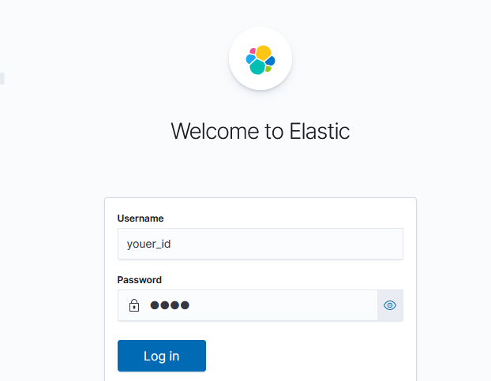

사진처럼 나오면 제대로 동작중인것이다. elasticsearch 서버의 id,password를 입력하면 된다.


### Kibana에서 유저추가하는법

위의 쉘에서

>bin/elasticsearch-users useradd {user} -p {password} -r{role} 

▲명령어를 이용하여 해당노드에 유저를 추가하여 id/password를 만들었다. 

이것과 같은것을 Kibana에서도 할수있다.

▼ 방법은 아래 사진을 참고 


▲ 필요한 정보를 입력하고, Create User를 클릭하면 생성이 끝난다.

생성된 id/password로 Kibana 웹브라우저에서 로그인할수있다.


## Kibana를 pm2로 데몬으로 실행하기

키바나는 -d, -p, -e등 같은 명령어가없다.
리눅스의 & 명령어를 이용하여 

>bin/kibana & ->이렇게 실행할수있다. 종료는 ctrl+z

또는

>./node/bin/node ./src/cli/cli.js -> 이것도 가능. kibana를 배포하는 js라고함.

**※Kibana는 프로세스를 kibana라고 찾으면 나오지않음 nodejs로 실행중이기 때문임**

>ps -ef | grep kibana -> X

>ps -ef | grep node -> O

**pm2 프로그램을 사용하기위해 반드시 kibana node에 맞는 버전을 다운로드받아야한다.**

kibana node 버전확인

>vi kibana/package.json

"engines" 부분이 node버전이다.

다양한 node버전을 다운로드받을수있는 **nvm**을 먼저 설치하자.

[nvm_github](https://github.com/nvm-sh/nvm)

```bash
curl OR wget으로 실행한다.

>curl -o- https://raw.githubusercontent.com/nvm-sh/nvm/v0.39.3/install.sh | bash

>wget -qO- https://raw.githubusercontent.com/nvm-sh/nvm/v0.39.3/install.sh | bash

★ .bash_profile, ~/.zshrc, ~/.profile또는 ~/.bashrc에 아래 내용이 "자동으로 추가되지않은경우", "수동"으로 추가해준다.

export NVM_DIR="$([ -z "${XDG_CONFIG_HOME-}" ] && printf %s "${HOME}/.nvm" || printf %s "${XDG_CONFIG_HOME}/nvm")"
[ -s "$NVM_DIR/nvm.sh" ] && \. "$NVM_DIR/nvm.sh" # This loads nvm

자동이던 수동이던 .bashrc에 추가가 되었기때문에, 재접속하거나 아래 명령어로 bashrc를 업데이트해준다.

>source ~/.bashrc
```
실행확인

>nvm

    Node Version Manager (v0.39.3)

    Note: <version> refers to any version-like string nvm understands. This includes:
    - full or partial version numbers, starting with an optional "v" (0.10, v0.1.2, v1)
    - default (built-in) aliases: node, stable, unstable, iojs, system
    - custom aliases you define with `nvm alias foo`

위와같이 다른내용들과 함께 나오면 제대로 동작중이다. 이제 버전에 맞는 node를 설치해보자

>nvm install 10.22.1(kibana node버전)

**설치가 완료되면 "node"명령어 사용가능**

    사용자명@인스턴스명:~$ node
    > 
    >
    사용자명@인스턴스명:~$ node -v
    v10.22.1
    
    성공

### pm2설치

이제 pm2를 설치해보자.

[pm2 공식홈페이지](https://pm2.io/)


```bash
아래 명령어를 이용하여 설치

>npm install pm2 -g

설치가 완료되면 pm2 명령어를 사용할수있다.

>pm2 start app.js

pm2로 시작한 app.js 은 데몬으로 실행되고, pm2가 해당 js를 관리해준다.

js파일을 실행시켜야하니까 kibana js를 실행

>pm2 start kibana/src/cli/cli.js

제대로 실행이되면 이렇게나온다.
┌─────┬────────┬─────────────┬─────────┬─────────┬──────────┬────────┬──────┬───────────┬──────────┬──────────┬──────────┬──────────┐
│ id  │ name   │ namespace   │ version │ mode    │ pid      │ uptime │ ↺    │ status    │ cpu      │ mem      │ user
 │ watching │
├─────┼────────┼─────────────┼─────────┼─────────┼──────────┼────────┼──────┼───────────┼──────────┼──────────┼──────────┼──────────┤
│ 0   │ cli    │ default     │ 7.10.1  │ fork    │ 41995    │ 0s     │ 0    │ online    │ 0%       │ 27.6mb   │ d.. │ disabled │
└─────┴────────┴─────────────┴─────────┴─────────┴──────────┴────────┴──────┴───────────┴──────────┴──────────┴─────────

로컬 pc 브라우저에서 kibana에 잘 접속이 된다.

종료

>pm2 stop cli

프로세스 삭제

>pm2 delete 프로세스명


실행 프로세스 이름 바꾸기(실행할때 이름을 지정해주는 방법)

>pm2 start kibana/src/cli/cli.js --name kibana

위와 같이 실행하면 name이 kibana로 바뀐다.

```

## Index와 샤드를 알아보고 Kibana로 샤드를 모니터링해보자

### Index와 샤드의 개념

- Document: Elasticsearch에서의 "단일 데이터 단위"를 의미한다.
- Index: Document를 모아놓은 하나의 집합을 Index라고한다 또한 인디시즈(Indices)라고도불린다.
- Shard: Node에 분산되어 저장되는 Index의단위. Index의 단위라고생각하면된다. 노드에 분산되어저장
- Replica: Shard의 복사본. 샤드는 프라이머리 샤드와 복제본으로 나뉜다. 처음생성된 샤드를 프라이머리. 이후에는 복제본으로 관리된다. **반드시 서로 다른노드에 저장된다.**

인덱스를 생성하고 샤드갯수를 설정해보자

    Ex)샤드5개 복제본1인 Books인덱스 생성

    >curl "http://ip:포트/인덱스이름" -H 'Content-Type: application/json' -d'
    {
    "settings": {
        "number_of_shards": 5,
        "number_of_replicas": 1
    }
    }'

    기본적으로 위와같은 형식이고, Kibana의 Dev Tools에 복사하면 아래와 같이 알아서 변환된다.

        PUT /books
    {
    "settings": {
        "number_of_shards": 5,
        "number_of_replicas": 1
    }
    }

    ★프라이 머리 샤드의 갯수는 바꿀수없다. 복사본갯수는 바꿀수있다. 인덱스의 어떤 설정을 바꾸고싶으면

    >PUT 인덱스명/_settings
    {
        바꿀옵션:바꿀값
    }

    GET _cat/nodes?v&h=ip,name,role == curl "http://ip:포트/_cat/nodes?v" 와 같음
    
    - v:헤더옵션
    - h:조회옵션(보고싶은것만 지정)
    
    ★GET _cat/indics ->인덱스를 조회할수있다.
    GET _cat/shards/books -> books라는 인덱스의 shards 정보를 조회할수있다.

### Kibana의 stack monitering을 이용해보자

stack monitoring기능은 위와같이 인덱스의 shards수나 노드정보등을 보여주는 모니터링기능이다.
**Metricbeat**는 사용안함. or set up with self monitoring 선택


Turn on monitoring을 누르면 모니터링을 할수있다.

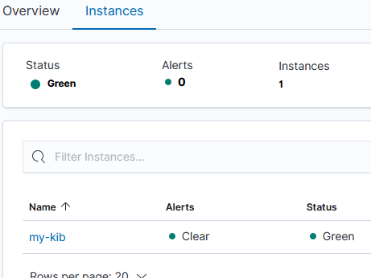

또한, kibana overview에서 instances를 클릭하면, kibana.yml파일에서 설정했던 키바나의 이름이 나오며, 해당 인스턴스의 이름이나온다. 나는 my-kib로줘서 my-kib로나옴.

위와 마찬가지로 elasticsearch의 overview에 들어가서 nodes를 클릭하면 해당 클러스터안에있는 모든 노드들이 yml파일로 설정한 이름들로 나오며 샤드, jvm heap, disk free space 등등 각종정보가 나온다.

Nodes의 각 Node의 이름을 클릭하면 각 정보를 그래프로 볼수있고, 맨 아래로 내리다보면 Shard의 정보도 확인할수있다.

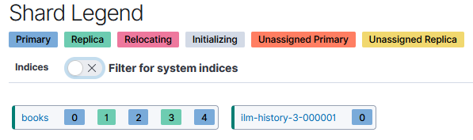

위에서 의미하는건 해당노드가 books 인덱스의 0 1 2 3 4 샤드를 가지고있다는것을 의미한다.

Kibana가 elasticsearch의 데이터를 자동으로 수집하여 UI로 나타내기때문에 데이터를 꽤 많이차지한다고한다.

하지만, Kibana는 모니터링을 시작하면 따로 종료를하는 기능을 제공하지않는다. 

그래서 수동으로 Kibana의 모니터링을 중지시켜보자.

```bash

Dev Tools에 들어가서  

GET _cluster/settings 

{
  "persistent" : {
    "xpack" : {
      "monitoring" : {
        "collection" : {
          "enabled" : "true"
        }
      }
    }
  },
  "transient" : { }
}

위와 같이나오는데, 내용은 Kibana가 elasticsearch의 데이터를 자동으로 수집하라는 내용이다.
중지시키려면 enabled를 false로 바꿔주자.

PUT _cluster/settings
{
  "persistent" : {
    "xpack" : {
      "monitoring" : {
        "collection" : {
          "enabled" : false 
        }
      }
    }
  },
  "transient" : { }
}


"enabled" : false -> null or false 둘중 하나 선택을 할수있다. 

false: 설정값을 그대로 남겨두고 "중단"만 시킴

null: 설정값을 삭제시켜버린다. "default 설정상태"로 돌아간다.

그러니, 어떤 설정의 default값으로 돌아가고싶을때는 null을쓰는게 적합하다.

```

## CRUDS(입력,조회,수정,삭제,검색)

RESP API 도큐먼트의 접근과 검색, 벌크등을 해보자.

기본 접근 구조는 아래와같다.

>http://<호스트>:<포트>/<인덱스>/_doc/<도큐먼트 id> 

```bash
#입력: PUT

PUT hi_index/_doc/1
{
  "name": "orenge",
  "message":"오렌지는 귤이 아니다."
  
}

위처럼 중복되지않는 인덱스명을 PUT명령어로 입력하면 인덱스가자동으로 생성된다.

#조회: GET

GET hi_index/_doc/1 ->인덱스의 도큐먼트정보를 보여줌
GET hi_index/_source ->인덱스의 source하위의 정보들만보여준다. name,message는 source하위의 정보이다.

#삭제 : DELETE

DELETE hi_index/_doc/1  ->인덱스의 1번아이디의 도큐먼트삭제
DELETE hi_index -> 인덱스를 통째로 삭제

그래서 GET명령으로 해당인덱스를 조회하면, 인덱스가 삭제되었는지 도큐먼트만삭제되었는지에 따라 
출력되는 오류가 다르다.

★ PUT명령으로 같은 도큐먼트에 다른 내용의 데이터를 넣으면 나중에 실행한 데이터로 덮어씌워지게된다!

PUT hi_index/_doc/1
{
  "age":50
  
}

PUT hi_index/_doc/1
{
  "name": "orenge",
  "message":"오렌지는 귤이 아니다."
  
}

위와 같이 실행하면 hi_index의 id 1번 도큐먼트는 age:50 에서
name: oerenge, message:오렌지는 귤이아니다 라는 내용으로 바뀌게된다.

```

```bash

#업데이트: POST

POST명령으로도 내용을 생성할수있다. 하지만 아래와 같이 _doc 뒤에 id값을 지정해주지않으면
id를 자동생성한다.

POST hi_index/_doc
{
  "name":"grape",
  "message":"포도는 샤인머스켓"
}
 
실행하면 옆의 화면에 "_id" : "svoNUYYBXxFIy6oeXQk1" 라고 id가 자동으로 생성된것을 알수있다.


그럼 기본내용을 업데이트해보자. PUT명령은 덮어씌워지니까 POST를 이용한다

POST hi_index/_update/1 -> 인덱스/_update/업데이트할 도큐먼트id 구조이다.
{
    "doc":{
        "age":"10"
    }
}

hi_idex의 1번 도큐먼트에 age:10이라는 정보를 추가하겠다는 의미이다.

실행결과

{
  "name" : "orenge",
  "message" : "오렌지는 귤이 아니다.",
  "age" : 10
}
```

**벌크API**

```bash

#★_bulk(벌크) 명령

벌크명령은 ID한개당 두줄씩 명령어가들어간다. 두줄이 한쌍이다.
_bulk 의 명령문과 데이터문은 반드시 한 줄 안에 입력이 되어야 하며 "줄바꿈"을 허용하지않는다!

한번에 여러 명령을 동작시키기위해 사용한다.
>index, create, update, delete< 의 동작만 가능!

POST _bulk
{"index":{"_index":"test", "_id":"1"}} -> test인덱스에 id 1번 지정
{"field":"value one"} -> id 1번에 해당 데이터를 추가해라
{"delete":{"_index":"test", "_id":"2"}} ->test인덱스 id 2번을 삭제. delete는 데이터 입력줄이없다.
{"create":{"_index":"test", "_id":"3"}}-> test인덱스에 id3번 지정
{"field":"value three"} ->id 3번에 해당데이터 추가
{"update":{"_index":"test", "_id":"1"}} ->test 인덱스의 id 1번지정
{"doc":{"field":"value two"}} ->doc안의 field를 value two로 바꿔라.

index = 색인이다. 입력이다.

★대용량 데이터와 elastic stack의 Beats나 logstash는 벌크 API를 사용한다!
```

검색 API를 사용해보자. _search

```bash

#검색 : _search

검색 API는 두가지가있다. URL과 DATA BODY.

#URL
기본형은 아래와같다.
>GET 인덱스/_search?q= 검색어

또한 검색어를 입력할때 AND와 OR조건을 줘서, 여러 검색어를 검색할수있는데, 조건은 반드시 "대문자" 로 입력해야한다.

>GET test/_search?q=value AND three 

>GET test/_search?q=field:three -> field의값이 three를포함하는 도큐먼트만 조회한다.

#DATA BODY(데이터본문)

JSON 형식으로 되어있다.

기본형태는 아래와같다.

GET 인덱스/_search
{
  "query": {
    "match": { -> 사용할 쿼리종류 
      "field": "value" ->인덱스의 찾으려는 필드명:값 형식
    }
  }
}


예시

GET hi_index/_search
{
    "query":{
        "match":{
            "message":"귤이 아니다." 
        }
    }
}

위 처럼 입력하면 hi_index라는 이름을 가진 인덱스에서 message필드의 값이 "귤이 아니다"를 포함하는 도큐먼트를 반환한다.
```

## 풀텍스트 쿼리

match, match_phrase, query_string을 알아보자

```bash

#match_all

match쿼리는 기본적으로 OR 조건으로 이루어져있다. operator 옵션을 주지않으면
검색어를 OR로 묶어서 결과를 가져온다.

GET my_index/_search
{
  "query": {
    "match": {
      "message": "dog"
    }
  }
}

가장 기본적인 형태의 match 쿼리이고, 따로 옵션을 주지않아서 "message"필드에 "dog"가 포함되어있는
결과를 모두 가져온다.

만약 "message": "quick dog"이면, "qucik"/ "dog" 을 OR 조건으로 묶어서 검색결과를 가져온다

OR -> AND 바꾸고싶으면

GET my_index/_search
{
  "query": {
    "match": {
      "message": {
        "query": "quick dog",
        "operator": "and" -> OR를 AND 로바꿔서 검색함. qucik 와 dog을 둘 다 포함하는 결과만 가져온다.
      }
    }
  }
}

#match_phrase

match_phrase는 구문을 가져오고싶을때 사용한다.

"quick dog"을 입력하면, "quick dog" 이라는 한 구문을 포함한 결과를 가져온다.

GET my_index/_search
{
  "query": {
    "match_phrase": {
      "message": "lazy dog" -> lazy dog 이라는 구문을 포함한 결과를 반환함.
    }
  }
}

결과 ▼

"_source" : {
         "message" : "The quick brown fox jumps over the lazy dog"
    }


match_phrase에는 slop이라는 옵션을 줄수있다.

  "query": {
    "match_phrase": {
      "message": {
        "query": "lazy dog",
        "slop": 1 -> lazy와 dog 사이에 단어를 1개까지 허용한다. 2,3을주면 단어를 2,3개를허용.
        
      }
    }
  }

slop: 즉, query에서 찾을 구문사이의 허용할 단어 갯수

#query_string

GET my_index/_search
{
  "query": {
    "query_string": {
      "default_field": "message",
      "query": "(jumping AND lazy) OR \"quick dog\"" -> jumping과 lazy를 포함하거나, "quick dog" 구문을 포함하는 결과를 가져오는것
    }
  }
}

qyery_string은 match_phrase와 match를 섞어서 쓰는것처럼 사용할수있다.

위의 "quick dog" 밖에 ""로 한번 더 감싼것은 match_phrases처럼 사용하기위한 문법
```

FULL TEXT

FULL TEXT는 검색결과에 score점수가있어서 점수가높은순대로 결과가 나온다는 특징이있다.

SCORE를 계산하기위한 요소에는 아래와 같이 세가지가있다.

- Term: 검색할 단어를 Term이라고부른다.

- TF(Term Frequency): 도큐먼트내에 검색하려는 단어수가 많은것에대해 더 높은 점수를 주는것(EX:A페이지에 빈도수3, B페이지에 빈도수5이면, B페이지의 SCORE점수가 더높은것)
  
- IDF(Inverse Document Frequency): TF와 별개로 Term자체가 가지는 별도의 점수.
  Term에서 더 빈도수가 낮은것을 희소성이 높다고 판단해 더 높은 Scroe점수를 준다.(단어가 흔해지면 낮은점수를 주는 구조)

- Field Length: 길이가 긴 필드보다 짧은 필드를 더 높은 점수를 준다.

```bash

# socre점수 

GET my_index/_search
{
  "query": {
    "match": {
      "message": {
        "query": "quick dog",
      "operator": "or"
    }
    }
  }
}

위와같은 명령어를 실행했을때

결과▼
      {
        "_index" : "my_index",
        "_type" : "_doc",
        "_id" : "3",
        "_score" : 0.87627405,
        "_source" : {
          "message" : "The quick brown fox jumps over the quick dog" ->quick이 2번들어감
        }
      },
      {
        "_index" : "my_index",
        "_type" : "_doc",
        "_id" : "2",
        "_score" : 0.6744513,
        "_source" : {
          "message" : "The quick brown fox jumps over the lazy dog" ->quick1번 dog1번
        }
      },
      {
        "_index" : "my_index",
        "_type" : "_doc",
        "_id" : "1",
        "_score" : 0.6173784,
        "_source" : {
          "message" : "The quick brown fox"
        }
      },
      {
        "_index" : "my_index",
        "_type" : "_doc",
        "_id" : "5",
        "_score" : 0.35847887,
        "_source" : {
          "message" : "Lazy jumping dog"
        }
      },

아래와 같이 _socre가 Full Text의 세가지 요소를 거쳐서 산출된 Score점수이다.
해당 점수에따라 점수가 높은순부터 먼저나온다.
```

## Bool(복합)쿼리 / Range(범위)쿼리

여러개의 쿼리를 함께쓰기위한것이 Bool쿼리이다. 
여러개의 쿼리를 Bool쿼리안에 같이넣어서 사용한다.

아래와 같이 4가지 요소있고 **배열**로 넣는 방식이다.

- must : 해당 요소안에 들어가는 쿼리는 무조건 **True**이여야함. 
- must_not : 해당 요소안에 들어가는 쿼리는 무조건 **Flase**이여야함
- should : 검색 결과중에(must, must_not으로 걸러진) 해당 요소안에 들어가있는 쿼리는 Score점수를 높임 
- filter : Must와 같지만 Score를 반영하지않는다. Score를 반영하지않기때문에 must보다 빠르다는 장점이있으며 캐싱이 가능함.

```bash

#Bool 기본형태

GET <인덱스명>/_search
{
  "query": {
    "bool": {
      "must": [
        { <쿼리> }, …
      ],
      "must_not": [
        { <쿼리> }, …
      ],
      "should": [
        { <쿼리> }, …
      ],
      "filter": [
        { <쿼리> }, …
      ]
    }
  }
}


EX) "quick"이라는 단어 AND "lazy dog"이라는 구문을 포함하는 검색결과를 찾는다.

GET my_index/_search
{
  "query": {
    "bool": { ->복합쿼리를 사용할것
      "must": [ -> must:[] must배열안에 들어있는 쿼리문들을 모두 만족하는결과만 반환한다.
        {
          "match": { ->쿼리1
            "message": "quick" ->"quick"이라는 단어를 포함해야함
          }
        },
        {
          "match_phrase": { ->쿼리2
            "message": "lazy dog" ->"lazy dog" 이라는 구문을 포함해야함.
          }
        }
      ]
    }
  }
}

결과)
    "max_score" : 1.3887084,
    "hits" : [
      {
        "_index" : "my_index",
        "_type" : "_doc",
        "_id" : "2",
        "_score" : 1.3887084,
        "_source" : {
          "message" : "The quick brown fox jumps over the lazy dog"
        }
      }
    ]

쿼리문에서 bool안에 must를 주고 must안에 match와 match_phrase로 검색했기때문에, match와 match_phrase 쿼리를 만족하는 결과만 반환한다.

# must not

EX) "quick"은 반드시 포함해야하지만 "lazy dog"은 포함하지않는 결과만 가져온다. 

GET my_index/_search
{
  "query": {
    "bool": {
      "must": [
        {
          "match": {
            "message": "quick"
          }
        }],
        "must_not":[
        {
          "match_phrase": {
            "message": "lazy dog"
          }
        }
      ]
    }
  }
}


#Should

검색결과중에 should안에있는 쿼리의 결과를 Score점수를 높임

EX)

GET my_index/_search
{
  "query": {
    "bool": {
      "must": [
        {
          "match": {
            "message": "fox" ->must로 match를이용하여 message 필드가"fox"단어를 포함하는 결과만도출
          }
        }
      ],
      "should": [
        {
          "match": {
            "message": "lazy" ->위에서 나온 결과에서 "lazy" 단어를 포함하는 결과의 score점수를 높임
          }
        }
      ]
    }
  }
}

```
Exact Vlue Query

＊정확값 쿼리.검색한 조건에 T/F 여부만 판별한다.
Full Text는 아니다. term, range 쿼리가 해당 쿼리안에 속하며, Score를 계산하지않는다는 특성이있어서
bool 쿼리의 filter 내부에서 사용한다.

```bash

#bool: filter


EX 1)

GET my_index/_search
{
  "query": {
    "match": {
      "message": "fox" ->"fox"만 포함
    }
  }
}

결과 : id 1/ 0.329517 | id 3/ 0.23470736 | id 2/ 0.234707

EX 2)

GET my_index/_search
{
  "query": {
    "bool": {
      "must": [
        {
          "match": {
            "message": "fox" ->"fox" AND
          }
        },
        {
          "match": {
            "message": "quick" ->"quick"포함
          }
        }
      ]
    }
  }
}

결과: id 1/ 0.9768958 | id 3/ 0.8762740 | id 2/ 0.6744513

★EX1,EX2를 비교했을때 각각 스코어점수가 오른것을 볼수있다

EX 3)

GET my_index/_search
{
  "query": {
    "bool": {
      "must": [
        {
          "match": {
            "message": "fox"
          }
        }
      ],
      "filter": [ ->아래 쿼리에 filter 조건 적용
        {
          "match": {
            "message": "quick" -> "quick"포함
          }
        }
      ]
    }
  }
}

결과: id 1/ 0.329517 | id 3/ 0.234707 | id 2/ 0.234707(3과동일)

★ 결론
- EX2는 EX1(기본점수)에서 Score점수가 증가하여 Score점수에 영향을준다는것을 알수있다. 
- EX1(기본점수) 와 EX3은 점수가 동일한것으로보아 Filter가 Score점수에 영향을 주지않는다는것을 알수있다.
```
Range Query(범위 쿼리)

범위형쿼리는 문자말고 숫자,날짜등의 범위를 검색할수있는 쿼리이다.

```bash

#Range Query(범위 쿼리)

기본형
> range : { 필드명  : {파라미터:값} } 

#파라미터 종류

범위형 쿼리는 총 4가지의 파라미터를 가지고있다.

- get : >= 이상
- gt : > 초과
- lte : <= 이하
- lt : < 미만

#예시 범위형 데이터
POST phones/_bulk
{"index":{"_id":1}}
{"model":"Samsung GalaxyS 5","price":475,"date":"2014-02-24"}
{"index":{"_id":2}}
{"model":"Samsung GalaxyS 6","price":795,"date":"2015-03-15"}
{"index":{"_id":3}}
{"model":"Samsung GalaxyS 7","price":859,"date":"2016-02-21"}
{"index":{"_id":4}}
{"model":"Samsung GalaxyS 8","price":959,"date":"2017-03-29"}
{"index":{"_id":5}}
{"model":"Samsung GalaxyS 9","price":1059,"date":"2018-02-25"}


#gte, lt

EX1) 숫자형 "값"을 찾아본다. price필드가 700 이상, 900미만인 검색결과를 찾는다

GET phones/_search
{
  "query": { ->아래내용 찾을것
    "range": { ->쿼리종류를 범위형데이터로(range)
      "price": { ->필드명
        "gte": 700, -> >= 이상
        "lt": 900 -> < 미만
      }
    }
  }
}

결과 ▼
    {
        "_index" : "phones",
        "_type" : "_doc",
        "_id" : "2",
        "_score" : 1.0,
        "_source" : {
          "model" : "Samsung GalaxyS 6",
          "price" : 795,
          "date" : "2015-03-15"
        }
      },
      {
        "_index" : "phones",
        "_type" : "_doc",
        "_id" : "3",
        "_score" : 1.0,
        "_source" : {
          "model" : "Samsung GalaxyS 7",
          "price" : 859,
          "date" : "2016-02-21"
        }
        }
        
EX2) 

GET phones/_search
{
  "query": {
    "range": {
      "date": {
        "gt": "2016-01-01",
        "lt": "2017-01-01"
      }
    }
  }
}

결과 ▼

{

      {
        "_index" : "phones",
        "_type" : "_doc",
        "_id" : "3",
        "_score" : 1.0,
        "_source" : {
          "model" : "Samsung GalaxyS 7",
          "price" : 859,
          "date" : "2016-02-21"
        }

      }
}

```

## 데이터 색인, 텍스트 분석

Elasticsearch는 역 인덱스라는 자료구조 형태로 **텍스트데이터**를 저장한다.

텍스트 데이터를 Term(단어)단위로 쪼개서 해당 Term이 어느 도큐먼트들에 포함되어있는지를
찾아서 전체 도큐먼트에서 찾는게아니라 Term이 포함되어있는 도큐먼트들에서만 찾아서 빠르다.


▲ 기본 RDBMS는 Term으로 구분하지않고, 테이블을 만들어서 순서대로 하나하나 저장하고, 검색할때도 차례대로 검색한다.


▲ Term(단어)를 쪼개서 텍스트 데이터들을 관리한다. 

그래서 대용량 데이터를 다룰때 Elasticsearch가 더빨리찾는다.

출처:[Elasticsearch공식가이드북](https://esbook.kimjmin.net/06-text-analysis/6.1-indexing-data)


### 텍스트 분석

Term단위로 저장하기위해 문장을 Term으로 쪼개는 과정을 텍스트 분석이라고한다.
해당 작업을 수행하기위해 Elasticsearch안에는 Analyzer라는 분석기가있다.

구조는 아래와 같다.


순서대로 텍스트 데이터가 들어오면 

>캐릭터 필터 -> 토크나이저 -> 토큰필터 과정을 거치게된다.

- 캐릭터 필터: 세가지 필터가있고, 텍스트 데이터를 세가지 필터에따라 토크나이저에서 사용할수있게 텍스트를 다듬어주는게 캐릭터 필터가 하는일이다. 전처리과정이라고 생각하면된다. (HTML이면 특정 태그를 치환한다던가, 삭제한다던가하는 과정)

- 토크나이저: 캐릭터 필터를 거쳐 들어온 다듬어진 텍스트 데이터를 Term단위로 쪼개는과정을 담당한다.
 
- 토큰필터: 토크나이저를 통해 쪼개진 Term을 토큰필터가 가공을한다.

토큰 필터는 아래와같은 원리로 작동을한다.(사진은 lowercase토큰필터를 적용했으므로, 대문자->소문자로 가공한다.)

첫번째로 단어를 통일화시키고 병합한다.


lowercase토큰필터로 대문자 ->  소문자로 바꾼 후, 같은 단어들을 병합

두번째  **불용어 제거**과정을 거친다. (불용어=stopword, the,an,..조사)


검색에서 가치가없는 단어들을 제거하는 작업을거쳐준다.

세번째로 **형태소 분석**을한다.


jumps, jumping 같은 단어들을 원형 jump로 바꾼 후, jump라는 토큰으로 병합한다.

추가) 연관성이있는 단어 동의어로 저장(synonym 토큰필터 이용)


quick Term에 fast를 synonym토큰필터를 이용하여 동의어로 지정하면, fast로 검색해도 quick을 포함하는 도큐먼트가 검색되도록 할수있다.


위의 사진에서 보는것과같이, 토큰필터는 **가공**을 담당한다. 
Elasticsearch에서 제공하는 기본 분석기, 토큰필터도있고, 기본말고 수많은 토큰필터나 텍스트 분석기들이있다. 

**데이터를 어떻게 분석하고 가공하고싶은지에따라 필요한 토큰필터와 분석기를 이용하면된다.**

### Analyze API

```bash

#_analyzer API (텍스트 분석)

GET _analyze
{
  "text": "The quick brown fox jumps over the lazy dog", ->분석할 text
  "tokenizer": "whitespace", ->토크나이저 종류
  "filter": [ -> 사용할 토큰필터의 종류
    "lowercase", -> 모든문자의 소문자화
    "stop",  ->불용어 제거
    "snowball" ->형태소분석 
  ]
}

▼ 결과

{
  "tokens" : [
    {
      "token" : "quick",
      "start_offset" : 4,
      "end_offset" : 9,
      "type" : "word",
      "position" : 1
    },
    {
      "token" : "brown",
      "start_offset" : 10,
      "end_offset" : 15,
      "type" : "word",
      "position" : 2
    },
    {
      "token" : "fox",
      "start_offset" : 16,
      "end_offset" : 19,
      "type" : "word",
      "position" : 3
    },
    {
      "token" : "jump",
      "start_offset" : 20,
      "end_offset" : 25,
      "type" : "word",
      "position" : 4
    },
    {
      "token" : "over",
      "start_offset" : 26,
      "end_offset" : 30,
      "type" : "word",
      "position" : 5
    },
    {
      "token" : "lazi",
      "start_offset" : 35,
      "end_offset" : 39,
      "type" : "word",
      "position" : 7
    },
    {
      "token" : "dog",
      "start_offset" : 40,
      "end_offset" : 43,
      "type" : "word",
      "position" : 8
    }
  ]
}

#★ Elasticsearch에 저장된 인덱스에 _analyze를 적용

※어떤 데이터를 불러와서 분석기로 분석하고싶으면 
분석기를 지정한 인덱스 먼저 생성하고 도큐먼트(데이터)를 넣어줘야한다.

1. 예시 인덱스생성)

PUT my_index2
{
  "mappings": {
    "properties": {
      "message": { -> 필드이름
        "type": "text", -> 필드 타입지정. 텍스트 필드로 지정
        "analyzer": "snowball" ->사용할 분석기 지정
      }
    }
  }
}

위와 같은 인덱스를 생성하면 my_index2에 message필드에 삽입되는 도큐먼트들은 snowball 분석기를 통해 가공된 형태로 text타입으로 Elasticsearch에 저장되게된다.

2. 생성한 예시 인덱스에 도큐먼트 삽입)

PUT my_index2/_doc/1
{
  "message": "The quick brown fox jumps over the lazy dog"
}


3. 분석기를 통해 제대로 가공이되었는지 GET_search로 확인

3-1: "jumps"로 찾기

GET my_index2/_search
{
  "query": {
    "match": {
      "message": "jumps"
    }
  }
}


▼ 결과

      {
        "_index" : "my_index2",
        "_type" : "_doc",
        "_id" : "1",
        "_score" : 0.2876821,
        "_source" : {
          "message" : "The quick brown fox jumps over the lazy dog"
        }
      }

3-2: "jumping" 으로 찾기

▼ 결과 
      {
        "_index" : "my_index2",
        "_type" : "_doc",
        "_id" : "1",
        "_score" : 0.2876821,
        "_source" : {
          "message" : "The quick brown fox jumps over the lazy dog"
        }
      }

결론: 3-1과 3-2의 결과를 통해 snowball analyzer가 잘 적용된것을 알수있다. 검색할때 알아서 snowball 분석기로 분석을해서 검색을함


# analyzer가 적용된 인덱스에서 정확한 Term을 찾기

GET my_index2/_search
{
    "query":{
        "term":{
            "message":"jump" ->검색할 term
        }
    }
}

▼ 결과

      {
        "_index" : "my_index2",
        "_type" : "_doc",
        "_id" : "1",
        "_score" : 0.2876821,
        "_source" : {
          "message" : "The quick brown fox jumps over the lazy dog"
        }
      }

결론: term을 이용해 jumping,jumps로 검색하면 검색이 되지않는다. term은 Elasticsearch에 저장된 term을 찾는것이기때문에, 

도큐먼트 삽입시 입력한 jumps는 이미 snowball 분석기를 통해 원형 jump로 저장이되어있다. 고로 쿼리를 match가아닌 term으로 설정하면 Jump, jumping,jumps로 검색할수없다.

(match는 검색할때 데이터가 분석기를 통해 분석이된채로 들어가기때문에 어떤단어로 찾아도 찾아지는것)

# analyzer 커스텀마이징

예시 인덱스생성)

사용자 정의 analyzer를 만들고 설정한다.

PUT my_index3
{
  "settings": { -> 가장 상위 경로 settings/
    "index": { -> settings/ index 
      "analysis": { -> settings/ index /사용자 정의 analyzer
        "analyzer": { ->정의
          "my_custom_analyzer": { ->  analyzer 이름
            "type": "custom", -> analyzer 타입
            "tokenizer": "whitespace", -> 사용자정의 analyzer 토크나이저 종류
            "filter": [
              "lowercase", ->적용할 토큰필터1
              "stop", ->적용할 토큰필터2
              "snowball" ->적용할 토큰필터3
            ]
          }
        }
      }
    }
  }
}

예시 도큐먼트 삽입)

GET my_index3/_analyze
{
  "analyzer": "my_custom_analyzer", -> 아까 생성한 사용자 정의 분석기이름
  "text": ["The quick brown fox jumps over the lazy dog"] ->분석할 텍스트
}


▼ 결과
  "tokens" : [
    {
      "token" : "quick",
      "start_offset" : 4,
      "end_offset" : 9,
      "type" : "word",
      "position" : 1
    },
    {
      "token" : "brown",
      "start_offset" : 10,
      "end_offset" : 15,
      "type" : "word",
      "position" : 2
    },
    {
      "token" : "fox",
      "start_offset" : 16,
      "end_offset" : 19,
      "type" : "word",
      "position" : 3
    }],
...등등


# 사용자정의 토큰필터, 토크나이저 과 매핑적용

위에서 생성한 분석기에서 같은 레벨에 생성

PUT my_index3
{
  "settings": { -> 가장 상위 경로 settings/
    "index": { -> settings/ index 
      "analysis": { -> settings/ index /사용자 정의 analyzer
        "analyzer": { ->정의
          "my_custom_analyzer": { ->  analyzer 이름
            "type": "custom", -> analyzer 타입
            "tokenizer": "whitespace", -> 사용자정의 analyzer 토크나이저 종류
            "filter": [
              "lowercase", ->적용할 토큰필터1
              "stop", ->적용할 토큰필터2
              "snowball" ->적용할 토큰필터3
            ]
          }
        },
        "filter":{ -> analyzer와 같은 레벨에 "filter"라고 입력하면 토큰필터를 의미함
            "my_stop_filter":{ ->사용자정의 토큰필터 이름
                "type":"stop", ->토큰필터 종류. stop타입
                "stopwords":[ ->저장하지않을 단어입력
                    "brown" ->값. brown을 저장하지않음.
                ]
            }
        }
      }
    }
  },
    "mappings": { ->매핑에서 아래내용을 인덱스에 적용할것임(위에서진행한 인덱스를 먼저생성하고 도큐먼트를 삽입하는것과 같은 작업, 도큐먼트삽입은 따로)
    "properties": {
      "message": { ->인덱스의 메세지필드에
        "type": "text", ->도큐먼트 타입지정
        "analyzer": "my_custom_analyzer" ->분석기지정(사용자정의)
      }
    }
  }
}

예시 도큐먼트 삽입)

PUT my_index3/_doc/1
{
  "message": "The quick brown fox jumps over the lazy dog"
}

검색)

GET my_index3/_search
{
  "query": {
    "match": {
      "message": "brown"
    }
  }
}

결과 : "The quick brown fox jumps over the lazy dog" 에서 brwon term은 저장되지않아서 찾을수없다.


# Termvectors API

term저장정보를 보고싶을때 사용한다.

기본형
>GET <인덱스>/_termvectors/<도큐먼트id>?fields=<필드명>

입력)

GET my_index3/_termvectors/1?fields=message

▼ 결과

      "terms" : {
        "dog" : { ->term
          "term_freq" : 1, ->해당 term이 나온횟수
          "tokens" : [
            {
              "position" : 8, ->dog term의 토큰위치. "The quick brown fox jumps over the lazy dog" 에서 The 부터 0으로 시작함. dog은 8번째
              "start_offset" : 40, ->앞에서부터 1바이트씩 쪼갰을때의 시작위치
              "end_offset" : 43 ->start_offset과 같은방식으로 dog가 끝나는 위치
            }
          ]
        },
        "fox" : {
          "term_freq" : 1,
          "tokens" : [
            {
              "position" : 3,
              "start_offset" : 16,
              "end_offset" : 19
            }
          ]
        }}
```

## Nori 형태소 분석기를 이용해보자

Nori란?

Nori는 한글을 분석하기위해 만들어진 한글 형태소 분석기이다.
Nori는 기본설치가 아니기때문에, Nori plugin을 다운로드 받아줘야한다.

**엘라스틱서치를 실행중일때 설치해도되지만, 노드를 재시작해줘야한다.**
또한, 여러개의 노드가있을때, 각 노드마다 설치해주자.

Nori분석기 설치

>elasticsearch/bin/elasticsearch-plugin install analysis-nori


Nori는 analyzer와 tokenizer로 이루어져있다.

기존 toenizer, analyzer와 사용하는 방법은 같다.

그중, 사용자정의 사전(user_dictionary_rules)를 조금 알아본다

```bash
#예시 데이터 생성
  PUT my_nori
  {
    "settings": {
      "analysis": {
        "tokenizer": {
          "my_nori_tokenizer": {
            "type": "nori_tokenizer",
            "user_dictionary_rules": [
              "해물"
            ]
          }
        }
      }
    }
  }

위와같이 저장하고 아래과같이 찾으면
  GET my_nori/_analyze
  {
    "tokenizer": "my_nori_tokenizer",
    "text": [
      "동해물과 백두산이"
    ]
  }

기본 노리처럼 "동해","물" 두개로 나뉘어서 저장되는게 아닌, "해물"이라는 텀으로 저장된다.
그래서 기본적으로 저장되는 형태말고 합성어등을 저장해야할때 사용하면좋다.

※ 인덱스는 수정하려고해도 생성한 이후에는 바뀌지 않는 부분이 많기때문에, 실제 데이터를 넣기전에 테스트인덱스를 많이 넣어볼것.

#사용자 정의 토크나이저를 이용해서 Nori 토크나이저의 세가지 옵션의 차이점을 알아본다.

PUT my_nori -> 중복되는 인덱스가있는경우 삭제후 진행
{
  "settings": { ->settings하위
    "analysis": { -> analysis하위
      "tokenizer": { ->토크나이저를 사용자지정할것임
        "nori_none": { ->사용자 정의 토크나이저 이름
          "type": "nori_tokenizer", ->어떤 토크나이저를 사용할건지
          "decompound_mode": "none" ->해당 토크나이저가 지원하는 모드. nori none모드
        },
        "nori_discard": { ->이름
          "type": "nori_tokenizer",
          "decompound_mode": "discard" ->nori discard모드
        },
        "nori_mixed": { ->이름
          "type": "nori_tokenizer",
          "decompound_mode": "mixed" ->nori mixed모드
        }
      }
    }
  }
}

#결과

- nori_none: "백두산","이"

- nori_discard: "백두","산","이"

- nori_mixed: "백두산","백두","산","이"
```
**Nori 분석기 품사표**


```bash
#Nori의 품사와, 품사제거

위는 Nori분석기의 기본 품사표이다.

nori_part_of_speech를 이용하여 Nori에서 사용자에게 필요하지않은 품사를 지정하여 제거할수있다.

사용방법은 stoptags 값에 배열로 제외할 품사 코드를 나열하면된다.

#stoptags 디폴트값

"stoptags": [
  "E", "IC", "J", "MAG", "MAJ",
  "MM", "SP", "SSC", "SSO", "SC",
  "SE", "XPN", "XSA", "XSN", "XSV",
  "UNA", "NA", "VSV"
]

위는 기본적으로 저장되어있는 제외할 품사의 코드이다.

사용자에게 필요한것들로만 stoptags를 편집해서 사용하면된다.

#사용예시

PUT my_nori_fi ->사용자정의 토큰필터
{
  "settings": {
    "index": {
      "analysis": {
        "filter": { ->analysis아래에 filter를 추가하겠다
          "my_nori_f": { -> 필터의 명
            "type": "nori_part_of_speech",
            "stoptags": [
              "NR" ->품사코드 NR을 제거.
            ]
          }
        }
      }
    }
  }
}

#분석예시
GET my_nori_fi/_analyze
{
  "tokenizer": "nori_tokenizer", ->토크나이저는 nori를사용
  "filter": [
    "my_nori_f" ->위에서만든 사용자정의 토큰필터
  ],
  "text": "다섯 아이가"
}

#결과

- my_nori_fi/my_nori_f 필터: "아이", "가"

#저장된 데이터의 품사정보확인하기

Nori를 통하여 이미 저장된 데이터가 어떤품사로 분류되어 저장되어있는지 조회하고싶을때, 사용하는 옵션이있다.

>"explain" : true

explain 옵션의 값을 true로 주게되면, 저장된 데이터의 품사정보를 조회할수있다.

해당옵션을 주고 조회하면 저장된 단어에 아래와같은 항목이품사정보이다.
"leftPOS" : "품사코드(Ending particle)" 
"rightPOS" : "품사코드(General Noun)"


#한자 -> 한글로 바꾸어 저장
nori_readingform는 한자어를 한글로 바꿔주는 역할을한다.
한자로된 데이터나, 한자가 섞여있는 데이터(뉴스나, 외국 기사같은것)을 저장할때 유용할것이라고 생각한다.


#한자텍스트 예시
GET _analyze
{
  "tokenizer": "nori_tokenizer",
  "filter": [
    "nori_readingform" ->nori에서 기본 제공하는 필터.
  ],
  "text": "囊中之錐"
}

#한자텍스트 결과

{
  "tokens" : [
    {
      "token" : "낭중지추",
      "start_offset" : 0,
      "end_offset" : 4,
      "type" : "word",
      "position" : 0
    }
  ]
}

위와같이 제대로 번역이된것을볼수있다.

```

## 인덱스 매핑 + 문자열,숫자 데이터타입을 알아보자

인덱스가 생성될때 settings와 mappings정보가 생성된다.
만약, 인덱스가 생성되지않은 상태로 도큐먼트를 elasticseach에 넣게되면, elasticsearch에서 알아서 mappings,seetings 정보를 생성하여 **자동으로 인덱스를 생성**한다.

이때, **mappings정보는 들어오는 도큐먼트의 정보 타입에따라 알아서 결정된다.**

- settings: 인덱스, 샤드(프라이머리 데이터)갯수, 레플리카 갯수
- mappings: 저장할 도큐먼트(데이터)의 데이터 타입등, RDB로따지면 스키마이다.

```bash
#아래와같이 books인덱스가 없는상태로 books인덱스안에 도큐먼트 삽입

PUT books/_doc/1
{
  "title": "Romeo and Juliet",
  "author": "William Shakespeare",
  "category": "Tragedies",
  "publish_date": "1562-12-01T00:00:00",
  "pages": 125
}

#결과

GET books ->settings정보도 함께출력
GET books/_mapping ->books인덱스의 mappings정보만 출력

        "author" : { ->위 도큐먼트의 필드이름중하나
          "type" : "text", ->author의 데이터는 문자열이므로 text와 keyword로 저장
          "fields" : {
            "keyword" : {
              "type" : "keyword",
              "ignore_above" : 256
            }
          }
        },
        "category" : {
          "type" : "text",
          "fields" : {
            "keyword" : { ->fields keyword로써, 필드명.keyword 라는 명령문으로도 접근이 가능하다. 단, keyword로 접근할때는 category에 저장된 단어 그대로 입력해야한다.(쪼개서 검색하면 X)
            ex)GET books/_search "query:"{"math":{"category.keyword":"내용"}}
              "type" : "keyword",
              "ignore_above" : 256
            }
          }
        },
        "pages" : {
          "type" : "long" ->pages필드는 데이터가 숫자이므로 long으로 지정되었다.
        },
        "publish_date" : {
          "type" : "date" ->publish_date필드는 데이터가 날짜이므로 date로 지정
        },

자동으로 매핑정보가 인덱스에 들어오는 도큐먼트에따라 지정된다.
인덱스는 필드를 추가하는것은 가능하지만, 기존에있는 필드를 바꿀수는없다.

# 매핑정보를 지정하여, 인덱스를 미리 생성해놓고 도큐먼트를 넣어보자.

PUT books/_mapping ->생성된 books라는 인덱스에 mapping정보를 바꾼다
{ 
  "properties": { ->mappings-properties아래에 필드들이있으니, 지금은 필드를 추가
    "content":{ ->추가할 필드의 이름
      "type":"text" ->content필드의 타입
    }
  }
}

#PUT books/_mappings 결과

  "books" : {
    "mappings" : {
      "properties" : {
                "content" : {
          "type" : "text"
        },
                "pages" : {
          "type" : "long"
        },
        "publish_date" : {
          "type" : "date"
        },....
      }
    }
  }

원래 없었던 필드인 content가 mappings정보에 지정한대로 생성된것을 확인.

※ Keyword타입과 text타입의 차이점
- keyword: 입력된 단어를 텀 단위로 쪼개지않고, 한개의 토큰으로 통째로 저장한다. 주로 '집계'를할때 사용된다.
- text: 텀 단위로 쪼개서 역 인덱스(위 참고)구조를 만들어 저장한다. 풀텍스트 검색에 사용할 문자열 필드를 text타입으로 지정한다.


# 매핑정보를 지정하여 인덱스 생성2.

이번엔 필드를보고 하나하나 타입을 지정해본다.

인덱스를 생성할때, 미리 만들어진 비슷한 인덱스가있다면 mappings정보 아래에 properties정보를 복사해와서 PUT할때 이용하면 편하다.

PUT books ->(위에서 생성한 동일한이름의 books는 삭제.)
{
      "mappings":{ ->books인덱스를 삭제하여 mappings가없기때문에, properties상위에 mappings를 넣어줘야한다.
        "properties" : { ->삭제하기 전, books인덱스에 남아있던 properties의 정보를 카피해와서 붙임
        "author" : {
          "type" : "text",
          "fields" : { ->필드는 멀티필드를 줄수있다.(필드를 여러개가질수있다.)
            "keyword" : { ->이 이름은 변경이가능하다. 하위필드1
              "type" : "keyword", ->키워드로 집계를해야, 다른 정보에 동일한 텀이있을경우 섞이지않는다. keyword를 text로저장하면 텀단위로 저장하기때문에 집계가 섞임.

              "ignore_above" : 256 ->데이터의 길이가 256자가 넘어가면 저장하지않는다.
            },
            "nori_fi":{ ->하위필드2. nori로 분석한내용을 저장하는 용도로 사용할것이다.
              "type":"text",
              "analyer":"nori"
            } ->위와 같이 생성하면 author.nori로 검색하면 nori로 분석한내용을 볼수있다. author.keyword는 기본분석기로 분석된 결과를 볼수있다.

          }
        },
        "category" : {
          "type" : "keyword"
        },
        "pages" : {
          "type" : "long"
        },
        "publish_date" : {
          "type" : "date"
        },
        "title" : {
          "type" : "text"
        }
      }
  }
}

# 숫자 타입을 알아보자

elasticsearch의 숫자형 데이터 타입은 아래와같다.

long : 64비트 정수 (-9,223,372,036,854,775,808 ~ 9,223,372,036,854,775,807)
integer : 32비트 정수 (-2147483648 ~ 2147483647)
short : 16비트 정수 (-32768 ~ 32767)
byte : 8비트 정수 (-128 ~ 127)
double : 64비트 실수
float : 32비트 실수
half_float : 16비트 실수
scaled_float : 실수형이지만 부동소수점이 아니라 long 형태로 저장하고 옵션으로 소수점 위치를 지정한다. 통화 (예: $19.99) 같이 소수점 자리가 고정된 값을 표시할 때 유용.

※여기서 주의할점은 "integer"로 저장해도 소수점이 저장이 되는것으로 보이지만, 실제로 elasticsearch에는
소수점이 저장되지않는다.

#integer타입 소수점실험

#예시 인덱스 생성

PUT integer_test
{
  "mappings":{
    "properties":{
      "value":{
        "type": "integer"
      }
    }
  }
}

#예시 도큐먼트값 넣기

PUT integer_test/_doc/1
{
  "value": 1

}

PUT integer_test/_doc/2
{
  "value": "234"

}

PUT integer_test/_doc/3
{
  "value": 1.5

}

#결과

GET integer_test/_search

    "hits" : [
      {
        "_index" : "integer_test",
        "_type" : "_doc",
        "_id" : "1",
        "_score" : 1.0,
        "_source" : {
          "value" : 1
        }
      },
      {
        "_index" : "integer_test",
        "_type" : "_doc",
        "_id" : "2",
        "_score" : 1.0,
        "_source" : {
          "value" : "234"
        }
      },
      {
        "_index" : "integer_test",
        "_type" : "_doc",
        "_id" : "3",
        "_score" : 1.0,
        "_source" : {
          "value" : 1.5
        }}

아직까지는 잘 저장된것처럼 보인다.

#숫자를 찾을때 사용하는 range쿼리를 이용하여 조회

GET integer_test/_search
{
  "query": {
    "range": {
      "value": {
        "gt": 0.5, ->0.5보다크고
        "lt": 1.3 ->1.3보다 작은 숫자를 다찾음
      }
    }
  }
}

#range쿼리 결과

      {
        "_index" : "integer_test",
        "_type" : "_doc",
        "_id" : "1",
        "_score" : 1.0,
        "_source" : {
          "value" : 1
        }
      },
      {
        "_index" : "integer_test",
        "_type" : "_doc",
        "_id" : "3",
        "_score" : 1.0,
        "_source" : {
          "value" : 1.5
        }
      }

의도대로라면 1번아이디의 값인 1만 조회되어야하는데, *1.3이상* 인 3번아이디의 값 *1.5가 같이검색* 되었다.
왜냐하면 1.5를 표시하기에는 1.5라고 표시하지만, 실제로 내부에 저장되어있는값은 정수형으로 저장이되어있기때문에, 1로 저장되어있다.

#1.1이상의값 찾기 
GET integer_test/_search
{
  "query": {
    "range": {
      "value": {
        "gt": 1.1,
        "lt": 3 
      }
    }
  }
}

#결과
{
  "took" : 2,
  "timed_out" : false,
  "_shards" : {
    "total" : 1,
    "successful" : 1,
    "skipped" : 0,
    "failed" : 0
  },
  "hits" : {
    "total" : {
      "value" : 0,
      "relation" : "eq"
    },
    "max_score" : null,
    "hits" : [ ]
  }
}

내부적으로 1이 저장되어있기때문에 위와같이 1이상의것을 찾으면 정상적으로 찾지못하는 결과가나온다.

그래서 소수점이 포함되어있는 데이터를 저장할때는 자동으로 생성되는 mappings을 사용하지말고, 

float,double을 이용하여 mappings정보를 미리 지정하여 인덱스를 생성해놓고 저장을하자.

#잘못된 값을 걸러내는 옵션

PUT integer_test
{
  "mappings": {
    "properties": {
      "value": {
        "type": "integer",
        "coerce": false  ->type에서 지정한 타입이아닌 데이터가들어오면, 받아들이지않는다.
      }
    }
  }
}

```

## 날짜(Date),시간 타입과 위치정보를 알아보자

날짜 데이터를 도큐먼트에 넣으면, 인덱스에 매핑이 지정되어있지않은경우 자동으로 날짜타입으로 들어가는 경우가있고, text/keyword 타입으로 매핑이 지정되는 경우가있다.

Date타입을 올바르게 입력받을수있도록 날짜형식을 매핑해보자.

아래는 Date타입을 지정할때 format옵션에서 사용하는 날짜표 이다.


```bash

# "2023-01-02 08:20:23" 으로 입력해본다.

PUT my_date/_doc/1
{
  "date_val": "2023-01-02 08:20:23"
}

#결과

GET my_date/_mapping

type : "date" 라고 출력되는것으로보아 data타입으로 매핑이 자동으로 설정되었다.

# "12/Aug/2023:01:02:23" 입력

PUT my_date/_doc/2
{
  "date": "12/Aug/2023:01:02:23"
}


#결과

GET my_date/_mapping

type: "text" 
  "firelds":
    "keyword":
      "type": "keyword"

type: text / type:keyword 으로 자동 매핑이 생성된것으로 보아, 문자열로 인식되었다.

# date타입으로 미리 매핑을 지정하여 인덱스를 생성하자

type을 date로 설정할것이지만 format옵션을 같이 사용하여 어떤 형식의 날짜를 date타입으로 받아들일것인지 지정해준다.

PUT my_date ->기존인덱스 삭제하고 진행
{
  "mappings":{
    "properties": {
      "date": {
        "type": "date",
        "format": "dd/MMM/yyyy:HH:mm:ss||iso8601||epoch_millis"
      }
    }
  }
}

format에 총 3가지의 옵션을 or로 묶어서 추가하였다.

※dd/MMM/yyyy:HH:mm:ss만 쓰면 해당 dateformat만 날짜로 받아들이기때문에 
OR로 다른dateformat도 날짜로 받아들일수있게 설정하였다.

-iso8601: "2023-01-02T08:20:23" 과 같은 가장 기본적인 형태를 저장
-epoch_millis: 특정 날짜로부터 특정 단위로 증가하는 숫자를 long타입으로 저장을한다. 하지만 elastic에는 "날짜"로 저장된다. 


#epoch_millis 형식의 데이터 추가

PUT my_date/_doc/3
{
  "date": 1568332800000
}

#결과

GET my_date/_mapping

  "my_date" : 
    "mappings" : 
      "properties" : 
        "date" : 
          "type" : "date",
          "format" : "dd/MMM/yyyy:HH:mm:ss||iso8601||epoch_millis"

GET my_date/_search/
      {
        "_index" : "my_date",
        "_type" : "_doc",
        "_id" : "1",
        "_score" : 1.0,
        "_source" : {
          "date" : "2023-01-02T08:20:23"
        }
      },
      {
        "_index" : "my_date",
        "_type" : "_doc",
        "_id" : "2",
        "_score" : 1.0,
        "_source" : {
          "date" : "12/Aug/2023:01:02:23"
        }
      },
      {
        "_index" : "my_date",
        "_type" : "_doc",
        "_id" : "3",
        "_score" : 1.0,
        "_source" : {
          "date" : 1568332800000
        }
      }
정상적으로 매핑정보가 가져와지고, 도큐먼트안에 date타입으로 데이터가 들어갔다.
epoch_millis는 일반숫자처럼 보이지만, range쿼리를 통하여 날짜로 검색하면 조회가된다.


#rnage쿼리로 epoch_millis형식으로 저장된 날짜 검색

GET my_date/_search
{
  "query": {
    "range": {
      "date": {
        "gte": "2019-09-01",
        "lte": "2019-09-20"
      }
    }
  }
}

#결과

      {
        "_index" : "my_date",
        "_type" : "_doc",
        "_id" : "3",
        "_score" : 1.0,
        "_source" : {
          "date" : 1568332800000
        }
      }
    ]
  
# Object,Nested 타입

elastic은 기본적으로 json형태이고, json는 키:밸류로 이루어진 딕셔너리다.

>{키:밸류}

Object는 키가 여러개의 밸류를 가지고있을때 여러개의 밸류값을 Object라고부른다.
즉 한개의 필드안에 하위필드를 넣는것.

>{키:{키:밸류}...}

# Object를 생성해보자.

PUT movie/_doc/1
{
  "characters": { ->캐릭터라는 필드안에
    "name": "Iron Man", 
    "age": 46, 
    "side": "superhero" -> name,age,side라는 하위 필드들을 생성한다.
  }
}

★ elasticsearch에서는 "필드 타입의 값이 일치하는 경우"에는 배열 타입을 따로 선언하지않고도,
배열로 값을 넣을수있다. 값을 단일 값으로 넣어도되고, 배열로 넣어도된다.

필드 타입의 값이 일치하는경우

>EX) {키: 밸류} ->O
>EX2) {키: [밸류1,밸류2,...]} ->O

#결과

GET movie/_mapping

{
  "movie" : {
    "mappings" : {
      "properties" : {
        "characters" : { 
          "properties" : { ->하위필드가 존재하지 않을시, 이부분은 바로 "type":"데이터타입"이 오는데, 하위필드가 존재하여,
          properties가 다시 나왔다.
            "age" : { -> properties아래에 하위 필드들이 나온다.
              "type" : "byte"
            },
            "name" : {
              "type" : "text"
            },
            "side" : {
              "type" : "keyword"
            }
          }
        }
      }
    }
  }
}

만약 name아래에 또 다른 하위필드가 존재할시,
name 아래에 properties가 한번 더 나오고, name안에있는 하위필드들이 정보가나온다.

# 결과2 (필드.하위필드 형식으로 조회하기)

GET movie/_search
{
  "query": {
    "match" {
      "characters.name": "Iron Man" ->상위필드.하위필드 키: 값
    }
  }
}

#Nested 타입

Nested타입은 Object타입에서 더 세분화시켜 검색하기위해 사용한다.
Object타입에서 역 색인 구조를 갖추게해주는게 Nested타입이다.


#Nested타입 매핑 지정방법

>type:nested

매핑에서 type만 nested로 바꿔주고, 나머지는 Object타입에서 지정하는것과 같다.

#Nested타입 조회방법

GET movie/_search
{
  "query": {
    "nested": { ->★
      "path": "characters",
      "query": {
        "bool": {
          "must": [
            {
              "match": {
                "characters.name": "Loki"
                }
            },
            {
              "match": {
                "characters.side": "villain"
              }
            }
              }
            }
          ]
        }
      }
    }

characters object들은 Nested라는 별도의 영역에 별도로 저장이된다.
그래서 조회 쿼리문을 작성할때 "nested"를 넣어주고, path에 필드이름을 상위필드이름을 적어준다.
```
### Nested와 Object의 구조


### Geo데이터 타입

위치정보를 저장하고 검색하기위해, Elasticsearch는 Geo Point / Geo Shape 타입을 지원한다.

Geo Point

두개의 값을 가진 1차원 데이터 점

- 위도(latitude)
- 경도(longitude)


Geo Shape

2차원 값을 저장할수있다.

- 선
- 면

```bash

# Geo Point

Geo Point타입을 사용할때는 반드시 미리 매핑을 선언을하고 사용해야한다.

>type:geo_point

아래 어떤 방식으로 입력해도 저장가능

##Object형식

PUT my_locations/_doc/1
{
  "location": {
    "lat": 41.12,
    "lon": -71.34
  }
}

##Text형식
PUT my_index/_doc/2
{
  "location": "41.12,-71.34"
}

##GeoHash형식

GeoHash는 전세계 지도를 바둑판 모양으로 격자로 나누어 각 칸마다 숫자와 알파벳 기호로 표시하여 알파벳을 증가시키는 형식이다. 자릿수가 커질수록 정밀도가 높아지고, 1자리값이면 대륙, 2자리값이면 한국영토크기. 4자리값이면 대도시이다.


PUT my_index/_doc/3
{
  "location": "drm3btev3e86"
}

##실수배열 형식
PUT my_index/_doc/4
{
  "location": [
    -71.34,
    41.12
  ]
}

#예시 데이터 생성

bulk기능으로 4개의 예시 도큐먼트를 my_geo라는 인덱스에 넣어줌

PUT my_geo/_bulk
{"index":{"_id":"1"}}
{"station":"강남","location":{"lon":127.027926,"lat":37.497175},"line":"2호선"}
{"index":{"_id":"2"}}
{"station":"종로3가","location":{"lon":126.991806,"lat":37.571607},"line":"3호선"}
{"index":{"_id":"3"}}
{"station":"여의도","location":{"lon":126.924191,"lat":37.521624},"line":"5호선"}
{"index":{"_id":"4"}}
{"station":"서울역","location":{"lon":126.972559,"lat":37.554648},"line":"1호선"}

#위치정보 쿼리문

GEO데이터를 검색할때 사용할수있는 쿼리가 두가지있다.

1.geo_bounding_box: 찾으려는 영역을 박스로 그려, 박스영역안에 포함되어있는 도큐먼트를찾는다.

ex) 서울역 - 종로3가 까지 포함하는 영역박스를 위도,경도로 지정하여 검색하면 서울역 - 종로3가 사이에있는 도큐먼트 출력

2.geo_distance: bounding_box는 말그대로 네모이고, 이건 지정한 반경의 원안에있는 도큐먼트를 찾는다.
geo_bounding_box와 다르게 점을 하나만준다.

#Geo_bounding_box
GET my_geo/_search
{
  "query": {
    "geo_bounding_box": { ->box모양으로 찾으려는 영역을 그릴것
      "location": {
        "bottom_right": { ->box영역이 끝날곳
          "lat": 37.4899, ->y(위도)
          "lon": 127.0388 ->x(경도)
        },
        "top_left": { ->box 영역이 시작할곳
          "lat": 37.5779,
          "lon": 126.9617
        }
      }
    }
  }
}

#Geo_distance로 찾기

GET my_geo/_search
{
  "query": {
    "geo_distance": {
      "distance": "5km", ->중심점에서 찾을 반경지정
      "location": { -> 원의 중심이되는 점의 위도,경도 하나만 준다.
        "lat": 37.5358,
        "lon": 126.9559
      }
    }
  }
}

#Geo Shape
Geo Point와 다르게, 영역을 저장할수있다.
Geo Shape를 통하여 국토면적을 그려 저장하여, 쿼리문으로 그려놓은 국토영역안에 포함되어있는 도큐먼트를 알수있다.

# 예시 Box를 영역을 저장한다.

PUT my_shape/_doc/7
{
  "location": {
    "type": "envelope", ->직사각형을 그리는데, 좌측상단,우측하단만 사용하는 타입
    "coordinates": [
      [ 126.936893, 37.555134 ],
      [ 127.004943, 37.50481 ]
    ]
  }
}
```

[Geo Shape쿼리확인](https://esbook.kimjmin.net/07-settings-and-mappings/7.2-mappings/7.2.6-geo#geo-shape)


## GCP에서 Logstash사용하기

### Logstash?

ELK에서 수집기 역할을 담당하고있으며, 수집기로는 Logstash와 Bits가있다.

- Bits: 수집기역할을하지만, Logstash보다 수집한 데이터를 가공하는데 제한이있다. 대신 Logstash보다 데이터를 가볍고 빠르게 수집할수있다.
- Logstash: 로그,데이터수집기이다. 자동화도 가능하며 수집된 데이터를 가공하는데 Bits보다 뛰어나다.
주로 데이터 파이프라인을 제어하고, 구축하는데 사용한다.

Logstash는 Elasticsearch뿐만아니라 다른곳으로도 수집하고 가공한 데이터를 전송할수있다.
Logstash의 기본적인 구조는 크게 세가지이다.

InPut: 로그스태시가 데이터를 수집할곳

Filter: 수집한 데이터를 가공할 필터지정

OutPut: 가공한 or 수집한 데이터를 로그스태시가 어디로 보낼것인지 설정

### 로그스태시 실행


    1.-e옵션을 사용하여 명령문에서 바로 파이프라인을 작성해주는것

    bin/logstash -e '
    > input { stdin { } }
    > output { stdout { } }'

    successfully started Logstash API endpoint가 뜨면 제대로 실행된것이다.

    아무문자나 입력하고, 입력한 문자가 "message"필드안에 입력되어있으면 된다.

    2. .conf파일을 만들어서 -f옵션을 이용하여 실행시키는 방법.

    vscode나, 아무편집기를 열어 파이프라인을 작성하고 확장자를 .conf로 저장한다.

    bin/logstash -f 파일명.conf

    successfully started Logstash API가 뜨고, conf파일안에 작성한 파이프라인대로 작동하면 성공이다.


### 로그스태시의 Input을 TCP로 설정해보자

로그스태시에서 Input으로 가져올수있는 플러그인이 굉장히 많다. 그중 테스트용으로 9900번포트에서
데이터를 가져와본다.

[로그스태시Inputplugins](https://www.elastic.co/guide/en/logstash/7.11/index.html)

<mark> ※단, 한개의 GCP인스턴스(서버) ELK모두 구동하는거라면, 해당 인스턴스의 외부IP도 방화벽에 추가해줘야한다. 자신이 자신의 외부IP로 접근할수있어야하기때문이다.</mark>

```bash
#work.conf

input {
  tcp{
    port => 9900
  }
}

output {
  stdout{ }
}

>bin/logstash -f work.conf파일경로

# 다른 터미널에서 logstash가 실행중인 서버의 9900번포트로 텍스트데이터를 보냄
echo 'hi logstash' | nc localhost 9900

#결과

[2023-02-21T17:37:24,510][INFO ][logstash.agent           ] Successfully started Logstash API endpoint {:port=>9600}
{
      "@version" => "1",
          "host" => "localhost",
          "port" => 52358,
       "message" => "hi logstash",
    "@timestamp" => 2023-02-21T17:39:04.240Z
}

#input은 tcp로 output을 elasticsearch로보내보자

#work.conf

input {
  tcp{
    port => 9900
  }
}

output {
  elasticsearch {
    hosts =>["엘라스틱서치에 접속할수있는 외부IP(GCP)"]
    user => "유저id" #(아이디,패스워드를 등록해놨기때문에 없는경우 생략가능)
    password => "설정한 패스워드"
  }
}


#Tcp테스트와 동일하게 다른 터미널에서 9900번포트로 텍스트데이터 전송

> echo 'hi logstash' | nc localhost 9900

위와 같이 입력하면 로그스태시가 실행중인 터미널에서는 아무런 반응이없지만, Kibana가 실행중이라면,
Kibaba의 Dev Tools를 통하여 확인할수있다.

#Kibana에서 결과 확인

> GET _cat/indices

위의 명령어를 입력하면, 모든인덱스를 조회할수있다. 그중 아래와같이 logstash-오늘날짜 이름을 가지고있는게 있으면 잘 실행되고있는것.

green open logstash-2023.02.21-000001   ...

#logstash인덱스 세부사항보기

> GET logstash-*/_search

#결과

        "_index" : "logstash-2023.02.21-000001",
        "_type" : "_doc",
        "_id" : "bZkudYYBKM1RDfnmb5Qy",
        "_score" : 1.0,
        "_source" : {
          "port" : 42198,
          "@timestamp" : "2023-02-21T18:13:42.615Z",
          "message" : "hi logstash!",
          "host" : "localhost",
          "@version" : "1"
        
        }
```

## _reindex(인덱스 재색인), 필드 매핑개선을 해보자

이미 엘라스틱에 저장되어있는 데이터를 새 인덱스에 매핑을 만들어 재색인을 해보자.

- 새로만든 인덱스 매핑: 필드 수정, 설정, 삭제 모두가능
- 만들어진 인덱스 매핑: 필드 추가만 가능. 필드삭제, 필드 세부사항 수정 설정 불가능

만들어져있는 인덱스 매핑같은경우는 위과같이 필드의 추가만 가능하다는점을 유의하자.

```bash

#1.재색인을할 인덱스를 지정하고 고친다.

이미 만들어진 필드의 매핑타입과 설정등을 고칠수있고 필드를 추가하는것이가능하다.

# Befor_index 매핑정보
{
  "mappings": {
    "properties": {
      "@timestamp": {
        "type": "date"
      },
      "auth": {
        "type": "keyword"
      },
      "bytes": {
        "type": "long"
      },
      "geoip": {
        "properties": {
          "location": {
            "properties": {
            "lat": {
              "type": "float"
            },
            "lon": {
              "type": "float"
            }
            }
          }
        }
      }
    }
  }
}


#After Index 매핑정보

PUT After_Index
{
  "mappings": {
    "properties": {
      "@timestamp": {
        "type": "date"
      },
      "auth": {
        "type": "keyword"
      },
      "bytes": {
        "type": "integer"
      },
      "geoip": {
        "properties": {
          "location": {
            "type": "geo_point"
              "properties": {
              "lat": {
                "type": "half_float"
              },
              "lon": {
                "type": "half_float"
              }
            }
          }
        }
      }
    }
  }
}

인덱스를수정한다음, 실행시켜서 인덱스를 생성시킴

#2.수정한내용으로 생성한 인덱스에 기존인덱스를 재색인하자

POST _reindex
{
  "source": {
    "index": "befor_index" #기존의 인덱스
  },
  "dest": { #목적지개념.
    "index": "After_Index" #아까 수정하여 재생성한 인덱스
  }
}

실행버튼을 눌러서 오류가생기지않으면 성공.

이것은 단일 인덱스에 적용시키는 방법이고, 다수의 인덱스의 매핑정보를 정형화시키려면 Template을 사용한다.
```

## 스크립트를 사용해보자

Template은 지정한 패턴을가진 인덱스가 Template의 구조를 따르게한다.

스크립트는 _reindex Api와 같이사용한다.

[ElasticSearch공식_DOC](https://www.elastic.co/guide/en/elasticsearch/reference/7.10/docs-reindex.html)

```bash

# Script사용

POST _reindex
{
  "source": {
    "index": "Befor_index-*" #Befor_index로 시작하는 인덱스명 모두 가져오기
  },
  "dest": {
    "index": "After_index" #목적 인덱스
  },
  "script": {
    "lang": "painless", #사용할 스크립트명
    "source": "ctx._index = 'After_index-' + (ctx._index.substring('Befor_index-'.length(), ctx._index.length()))" 
  }
}


script 하위의 source문에 대한 간략한 설명

간단하게말하면 dest(목적지)인덱스 이름 뒤에 기존인덱스 이름 뒤에 넘버링 문자를 떼서 목적지 인덱스이름 뒤에 붙여준다는의미이다. 

위의 코드에서는 "Befor_index-2023-01-01" 이라는 인덱스가있다면, script문안의 source에서 substring등을 이용하여 "After_index-2023-01-01" 라는 이름의 재색인 인덱스를 만들어주는것.

- ctx._index: 인덱스에 접근할 명령어같은것. = 이후에 목적으로하는 인덱스명을 넣어준다.


#확인

GET _cat/indices/After_index*

#결과

green    open   After_index-2023-01-01 ...


# _reindex와 script를 이용해서 특정 필드를 없애고 데이터를 넣어보자

기본형태

> _ingest/pipeline/만들고싶은 인덱스명,필요한인덱스명


PUT _ingest/pipeline/my_delete_pipeline
{
  "processors" : [ # 필드들을 아래처럼 오브젝트형태의 배열로 넣어주면된다.
    {
      "remove" : {
        "field": ["bytes","@timestamp"]
        "value": "bar"
      }
    }
  ]
}

실행시켜서 my_delete_pipeline를 생성시켜주면 사용할수있다.

# _reindex에 생성한 pipeline을 적용

POST _reindex
{
  "source": {
    "index": "Befor_index-*" #Befor_index로 시작하는 인덱스명 모두 가져오기
  },
  "dest": {
    "index": "After_index", #목적 인덱스
    "pipeline": "my_delete_pipeline"
{
  },
  "script": {
    "lang": "painless", #사용할 스크립트명
    "source": "ctx._index = 'After_index-' + (ctx._index.substring('Befor_index-'.length(), ctx._index.length()))" 
  }
}
}

# 결과

green open Afer_index-2023-01-01 9kko56aqRsaUDqksA  1 1 9412  0...
green open Afer_index-2023-01-02 mF6pQpwsVa5PGatMg  1 1 13545  0...

결론

Befor_index-2023-01-01 , Befor_index-2023-01-02... 이름을 가진 인덱스들이 생성된 pipline을따라
데이터가 삭제,가공되고, Template을따라, After_index-2023-01-01, After_index_2023-01-02...이름으로 재색인된 인덱스가 생성된다.

```
## 로그스태시로가져온 Mysql데이터를 Nori로 분석하는 탬플릿생성

**Nori를 사용하기위해서는 Nori토크나이저를 사용하는 인덱스를 미리 생성하고 사용해야한다.**

하지만 로그스태시에서 데이터를 가져올때마다 Nori를 사용하는 인덱스를 매번만들기 귀찮다.

그래서 탬플릿을 이용하여 지정한 인덱스명을 가진 인덱스는 만들어놓은 nori탬플릿의 형식을 따르도록 만든다.

```bash

일단 Mysql에 저장되어있는 데이터를 가져오는 conf파일을 작성한다.

# newtest.conf (.conf파일명)

  input {
      jdbc{
          jdbc_driver_library => "/usr/share/java/mysql-connector-j-8.0.32.jar"
          jdbc_driver_class=> "com.mysql.jdbc.Driver"
          jdbc_connection_string => "jdbc:mysql://ip:port/dbname"
          jdbc_user => "user_name"
          jdbc_password => "password"
          schedule => "* * * * *"
          statement => "SELECT * FROM tablename"
      }
  }

  filter{
      mutate {
          remove_field => ["@version"] # elastic에저장할때 제외할 필드
      }

  }

  output {
      elasticsearch{
          hosts => ["GCP외부IP"]
          user => "엘라스틱서치Id"
          password => "엘라스틱서치Password"
          index => "생성할인덱스명"
          document_id => "%{id}" #데이터가 중복으로쌓이는것을막음. 단,mysql에서 가져올 테이블의 id컬럼이 id가아닌 pkid, msg_id 이라면 해당 컬럼네임에맞춰 바꿔줘야한다.아니면 계속 덮어씌워져서 한개의 데이터만 저장된다. ex)"%{msg_id}" / "%{pkid}"
      }

  }

```

### Nori를 적용시키는 Template를 만들어보자

```bash

PUT _template/noritemplate #7.11버전이상부터는 _index_template 로 API이름이 바뀌었다.(나는 7.10버전이라 아직 _template이다.) _templateAPI/TemplateName 구조.
{
"index_patterns" : [ #적용받을 인덱스명의 패턴지정
      "nori_*"  #nori_~ 로 시작하는 파일을은 모두 해당 탬플릿구조를따른다.
    ],
    "order": 1,
    "settings": { #탬플릿구조를 설정하는부분
		"number_of_shards": 1,
		"number_of_replicas": 1,
		"index":{
			"analysis":{ 
				"tokenizer":{ #★우리가 사용하려는, Nori 토크나이저를 설정하는부분!
					"nori_mixed":{ #nori_mixed라는 이름으로 커스텀 토크나이저 설정.
						"type":"nori_tokenizer", # nori 토크나이저 지정
						"decompound_mode":"mixed" #nori가 지원하는 3가지 모드중에 mixed를 사용한다.
					}
				},
				"analyzer":{
					"nori_a":{ #분석기이름
						"type":"custom", #사용자지정 분석기를사용할것
						"tokenizer":"nori_mixed" #위에서 만든 Nori토크나이저 사용
					}
				}	
			}	
		}
    },
   "mappings": {  #가져오려는 데이터에대한 필드매핑 설정 부분. 나는 mysql에서 id,title,main,date컬럼을 가져올것이여서 가져올 데이터들이 엘라스틱에 저장될 필드를 지정한다.
      "properties": {
        "id": {
          "type": "integer"
        },
        "title": {
          "type": "text",
          "fields": {
            "title_keyword": {
              "type": "keyword",
              "ignore_above": 256
            }
          }
        },
        "main": {
          "type": "text",
					"analyzer":"nori_a",
          "fields": {
            "main_keyword": {
              "type":"keyword"
            }
          }
        },
        "write_date": {
          "type": "date",
          "format": "yyyy.MM.dd HH:mm||iso8601||yyyy.MM.dd||yyyy-MM-dd HH:mm"
        }
      }
    }
  }

```

### Template 적용 확인
newtest.conf를 실행시켜, Logstash로 Mysql에서 원하는 데이터를 가져와서 nori_2라는 이름을 가진 인덱스생성.
```bash
#logstash 실행문
>bin/logstash -f .conf파일 경로
```
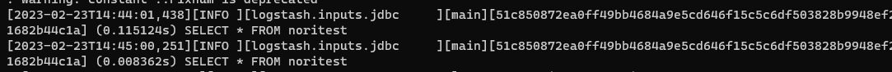

conf파일의 input내용대로 지정한 테이블을 조회해온다.

```bash
#확인
GET nori_2/_settings
```
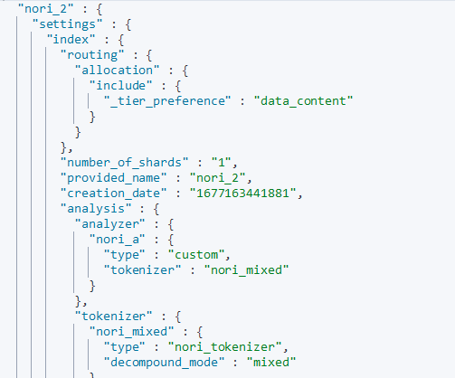

탬플릿을 "nori_"로 시작하는 모든 인덱스에 적용하기로 설정하였으니

nori_2라는 인덱스에 제대로 nori토크나이저가 setting 되어있는것을 확인할수있다.


```bash

#nori 작동확인

GET nori_2/_analyze
{
  "analyzer": "nori_a",
  "text": "동해물과 백두산이 마르고"
}
```
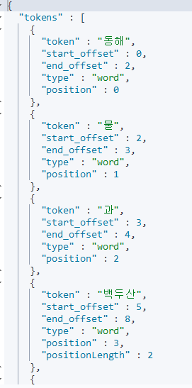

```bash

#nori_2 인덱스에 스타벅스에대한 기사가존재할때 쿼리문을 통해 제대로 결과를 가져오는지 확인

#쿼리문

GET nori_2/_search
{
  "query": {
    "match": {
      "main": "스타벅스"
    }
  }
}

```

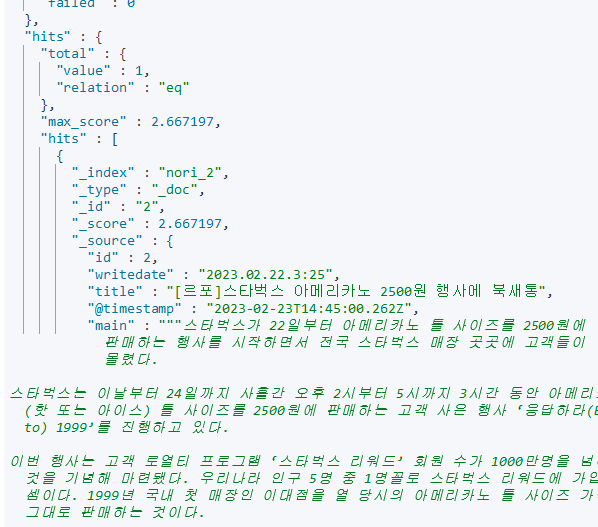


그래서 실제로 프로젝트에 NLP자료로 이용하는 Mysql에 적재되어있는 자료를 로그스태시를 이용하여 엘라스틱 서치로 보냈다. 이후, 해당 데이터들로 현재 Mysql에 적재되어있는 news의 자료들을 검색하기 쉽게 노리 형태소분석기를 적용시켰고, 키바나로 대시보드를 만들어 작은 데이터마켓을 구축하였다.

**크롤링 -> Hadoop/Spark (가공,적재) -> Mysql적재 -> 로그스태시 -> 엘라스틱서치 ->키바나** 

흐름으로 구성되어있다. 

노리 탬플릿이 적용된 인덱스패턴으로 적재하였으니, 아래와같이 합성어 '캣맘'을 검색해본다면

```bash

GET mysql-nori-2/_search
{
  "query": {
    "match": {
      "main": "캣맘"
    }
  }
}

```

Main 필드에 '캣맘'과 '캣' 이라는 단어가 들어가는 모든 기사정보가 서치된다.

----------
## + Window환경의 elk

## 로그스태시로 csv,jdbc,카프카 등 원하는 자료를 불러와보자

### 가져오는방법으로 3가지가있다. 

- 로그스태시를 이용하여 자동화,전처리를 거친 후 엘라스틱 서치 /파일데이터(json등)으로 저장하는방법
- Kibana Data Visualizer 기능을 이용하여 import하는방법. 인덱스 패턴까지 알아서만들어준다는 장점이있다.
- python elasticsearch 패키지 사용. pip install로 엘라스틱서치를 다운받아 파이썬 스크립트로 작성한다. 

나는 Kibana와 로그스태시를 이용하는방법 두가지를 해볼것이다.

먼저, 로그스태시를 이용해보자.

로그스태시는 필터가없어도 동작하지만, **파이프라인**을 설정해줘야 제대로 동작한다.
이름log.cofig같은 파일로 생성하여 관리하거나, pipline.yml파일안에서 관리하는편이 좋다.

동작방식은
    1.원하는데이터를 불러옴 (jdbc,file(csv,json,..),kafka..,syslog)
    2.로그스태시로 원하는데이터를 불러올때 어떻게 가공하고 처리할건지 ,filter 플러그인이나 output설정을해줌.
    3.원하는 데이터형식으로 가공이되었으면  엘라스틱서치나,키바나,분석 등을 진행하면된다.


### config파일의 기본적인 구조

```python
input {
    file{ #입력 플러그인종류. 파일,jdbc,카프카,시스로그사용가능
        path=> "C:/Users/Na/Desktop/projcet_3_file/산출물/crawling/합친것/news_final.csv" #path는 \=> / 로고쳐줄것
        start_position => "beginning" #처음파일을 발견했을때 파일을읽을 위치.파일의 시작부분부터 읽어들일지 끝부분부터 읽어들일지 지정할수있다.
    }
}
filter {

}

output {
    stdout{}
    
}

```
**confing파일을 실행해보자.**
logstash파일이들어있는 경로로가서 아래 명령문 입력
>logstash가깔려있는경로>.\bin\logstash.bat -f \config\읽어들일 conf파일이름


**여기서 -f**는 옵션으로, 파일을 읽겠다는 의미의 옵션이다.
Mysql에서 로그스태시로 원하는데이터를 가져오기위해서는, mysql-connector-java 가 필요하다.

>[mysql-connector-java링크](https://dev.mysql.com/downloads/connector/j/)

위의 링크에서 다운받을수있다. 기본적으로 윈도우로 설정되어있다.


2023년2월3일기준 8.0.32버전. 아래사진처럼 OS를바꿔주고, zip파일을 받아주자. 
리눅스같은경우 tar파일을받는다. 


다운로드받은 파일을 압축해제해주면 자바파일(.jar)이 나오는데, 이것을 필요한 프로젝트나 경로에 넣어주고 

jdbc경로에 이 파일이 존재해있는 경로를 써주면된다. 

나는 logstash/lib아래에 넣어뒀다.

이동경로가 logs-7.10.1이라는 가정하에 아래 conf파일이 정상작동했을때,1회성으로만 실행해주면된다.
output에 엘라스틱서치에 바로 저장시키거나 파일로만들었으면 확인해보면된다.

>.\bin\logstash.bat -f .\config\csv.conf


성공적으로 엘라스틱서버에 저장이되면 conf파일의 output안에서 지정해준 인덱스명으로 검색해보면 아주 잘나오는것을 알수있다.

브라우저

>호스트명:포트명/conf파일에서지정한인덱스명/_search?pretty

터미널

>curl -X GET 호스트명:포트명/인덱스명/_search?pretty

키바나

>GET /mysqltest_2/_search{"query": { "match_all": {}}}

**pretty는 보기좋게 출력하기위함**


### mysqlconf파일 내용

```python
input {
    jdbc{
        jdbc_driver_library => "C:/logs-7.10.1/lib/mysql-connector-j-8.0.32.jar"
        jdbc_driver_class=>"com.mysql.jdbc.Driver"
        jdbc_connection_string => "jdbc:mysql://ip:port/db명"
        jdbc_user => "user명"
        jdbc_password =>"mysqlpassword"
        schedule => "* * * * *" 
        statement => "실행할 쿼리문"
    }
}

filter{
    # mutate {
    #     remove_field => ["id", "@version"] 제외하고싶은 필드
    # }
}

output {
    elasticsearch{
        hosts => ["localhost:9200"]
        index => "mysqltest_1"
        #document_id =>"%{id}" 저장할 도큐먼트 아이디 지정. 해당옵션이없으면 데이터 중복생성이됨.
    }
    stdout{} #테스트용. 없어도 실행하는데는 상관없음.
    
}
```


## 로그스태시를 이용하여 엘라스틱서치에 적재시, 인덱스의 중복값 제거

```python
input {
  # Elasticsearch의 모든 문서를 읽음
  elasticsearch {
    hosts => "localhost:9200"
    index => "mysqltest_1"
    query => '{ "sort": [ "_doc" ] }'
  }
}

filter {
    fingerprint {
        key => "1234ABCD"
        method => "SHA256"
        source => ["id", "title", "main","writedate","url","press"] #이곳에 작성된 필드들의 값이 동일하면 삭제
        target => "[@metadata][generated_id]"
        concatenate_sources => true 
    }
}
output {
    stdout { codec => dots }
    elasticsearch {
        index => "mysqltest_2" #기존의 인덱스는 유지하고 새로운 인덱스를만들었다.
        document_id => "%{[@metadata][generated_id]}"
    }
}
```

이후,mysqltest_1인덱스는 curl을 통해 삭제해줬다.

>curl --location --request DELETE "localhost:9200/mysqltest_1"

---------

## Kibana로 CSV파일 가져오기

---------

## Kibana 인덱스 패턴생성

Kibana를 처음 실행하면 Elasticsearch에 데이터가있어도, Kibana에서 볼수있는 또하나의 View를 생성해줘야 데이터를 볼수있다. Kibana인덱스 패턴을 기반으로 Kibana는 시각화자료를 만들기때문에, 인덱스패턴을 생성해줘야한다.

두가지 방법이있다.

- Kibana 왼쪽 메뉴의 Kibana > Dashboard 에 들어가서 Create Index pattern 버튼 클릭
- Kibana 왼쪽 메뉴의 Stack Management > Kibana메뉴 > Indext Patterns > Create Index pattern

키바나 인덱스패턴을 생성 시,
>my-index  
>my_index-*

my_index로 시작하는 인덱스들을 모두 묶거나, 단일지정을 할수있다.


Next버튼을 눌러 다음으로 넘어가면 **날짜필드**하나를 선택해줘야한다.

**Kibana는** 시계열 데이터를 가정하고 생성하기때문에 **기준이될 날짜필드를 지정**을 해줘야한다.

나는 테스트용 nori_1인덱스의  write_date를 기준으로 선택했다.

이후 왼쪽 메뉴의 **Discover**에 들어가서 해당 인덱스의 기준이되는 날짜를 포함하는 날짜로 바꾸어주면 정상적으로 조회가된다.

- 상단의 서치바를 통하여 필드:조건 and 필드:조건 and 을 입력하여, 원하는 데이터만
필터링 할수있다. 

- Add filter 기능도 서치바와 같은 기능을한다. 그 중 exclude result 기능은 선택된 조건에 반대가되는 결과를 반환하는 기능이다. 

아래는 간략하게 인덱스패턴을 생성하여 조회해본결과이다.

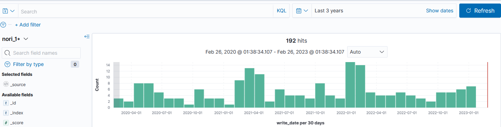

-----------

## Kibana 대시보드 생성

Kibana에서 대시보드를 생성하려면 패널을 추가해야한다.
패널을 추가하는 작업을 visualization이라고 하는데 이것도 추가하는 방법이 두가지있다.

- Kibana 왼쪽 메뉴 > Dashboard > Create New Dashboard >Create New > visualization추가
- Kibana 왼쪽 메뉴 > Create New visualization 

Dashboard에서 visualization을 추가하는 방법을 해보자

```bash

# 매트릭 Dashboard 생성

매트릭은 기본적으로 도큐먼트의 Count값을 가져온다.

또한 집계할 필드를 선택할수있는데, 숫자필드인경우 평균,최대값,최소값,랭크 등을 선택할수있다.

```

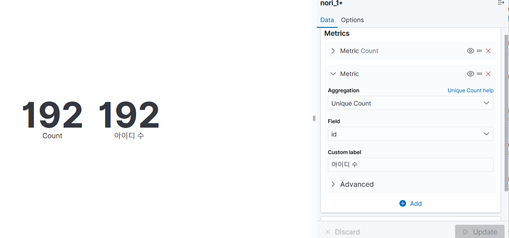

나는 id필드를 기준으로 유니크 카운트를 집계해보았다.

이후 Save를 눌러 visualization을 저장하고 나와서 Dashboard에서 다시 저장할수있다.


위는 Dashboard가 이미 저장된 모습이다.

더 많은 패널을 추가하고싶으면 Edit를 누르고 Create New 버튼을 눌러서 새로운 visualization을 추가한다.

Lens메뉴는 x,y축을 지정하거나 필요한 정보들로만 대시보드를 구성하기 쉽게 도와주는 패널이다.

Lens를 통하여 일단 연습삼아 뭔가를 만들어보았다.


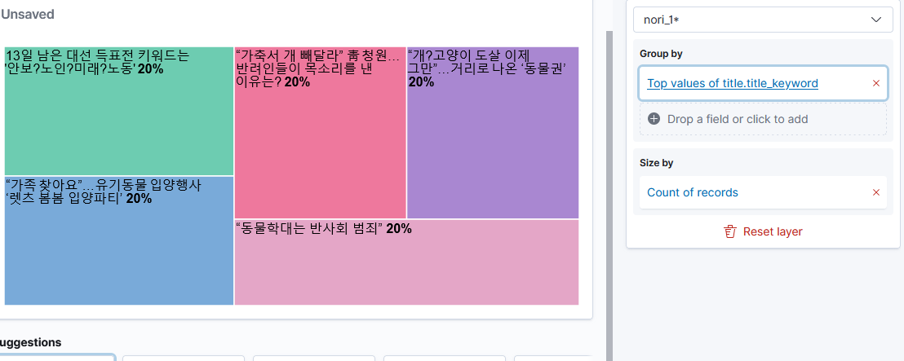

GroupBy를 클릭하여 Top Value의 수를 조절할수있다.

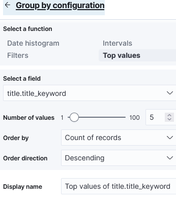

Top Value의갯수말고도 소수점이나 오름/내림차순 조절이 가능하다.


롤오버를하면 정보가 나타난다

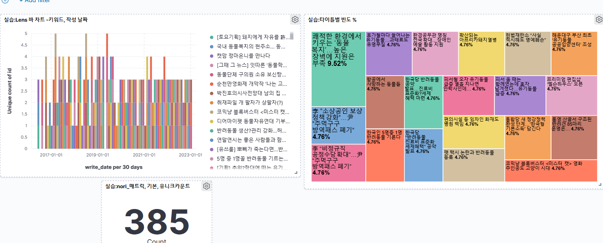

-----------

## Kibana로 뉴스기사 대시보드 만들기

파이썬으로 수집한 동물복지 News기사에서 제목을 워드클라우드로 생성


``` bash
Aggregation: Terms

Field: title.title_keyword

Order by: Metric: Count

Order: Descending / Size: 15

```


TSVB로 날짜별 News기사 갯수 

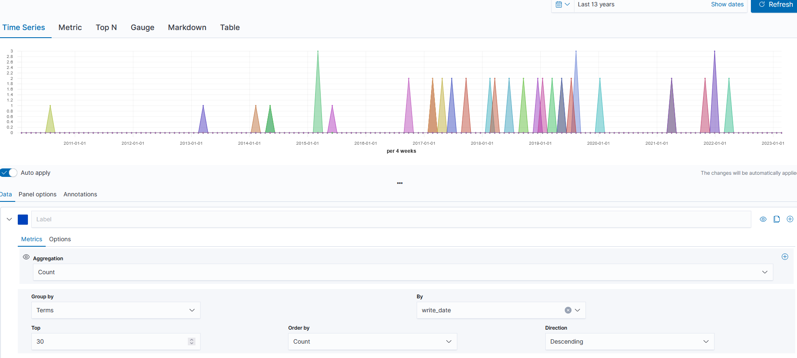


```bash

Aggregation: Count / By: write_date

Top: 30 / Order By: Count / Direction: Desecnding

Show legend: No

```

TreeMap으로 title의 비중

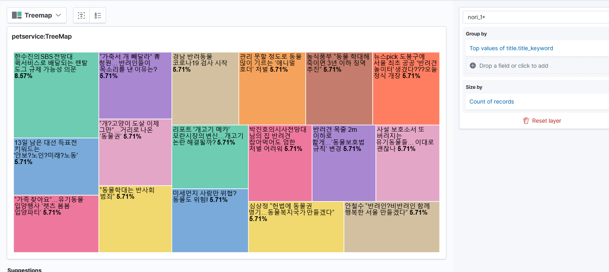


```bash
Group by configuration

Top Values: title.title_keyword

Order by: Count of records

Order direction: Descending
```

DataTabel로 날짜별 기사제목과 내용을 간략하게 조회

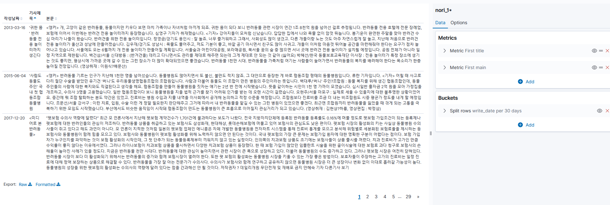


```bash
#두개의 Metric 사용

#Metric 1

Aggreation: Top Hit

Field: title

Aggreate with: Concatenate / Size: 1

Sort on: write_date

Order: Ascending

#Metric2

Aggreation: Top Hit

Field: main

Aggreate with: Concatenate / Size: 1

Sort on: write_date

Order: Ascending


#Buckets

Split rows

Aggregation: Date Histogram

Field: write_date

Minimum interval: Auto

#Options

Max rows per page: 3

```

## Kibana DataMarket 

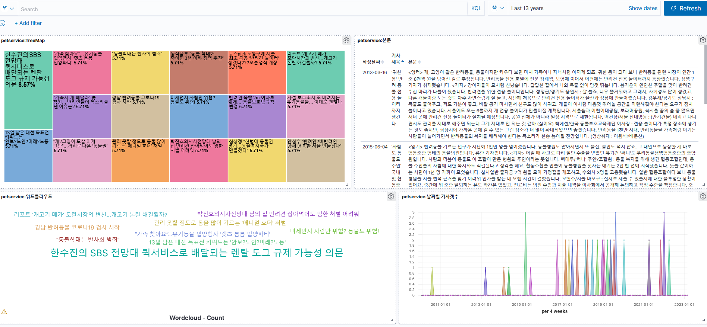


