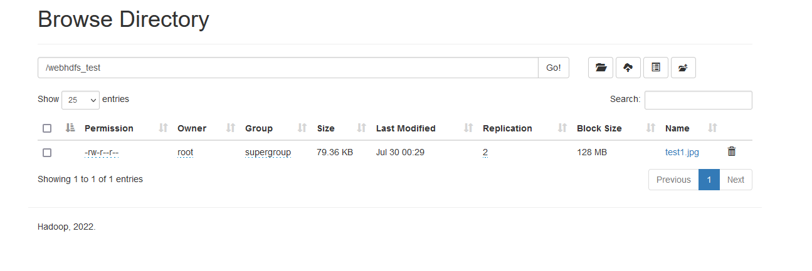

# Hadoop $ HDFS

## Hadoop: 대용량 자료를 처리하기위한 프레임워크. 여러 모듈을 포함하고있다.

- HDFS(스토리지 계층)
- Hadoop Common
- YARN(자원관리계층)
- MAPREDUCE(처리계층)

## HDFS

자바언어로 작성된 분산 확장 파일시스템이다.
대용량 데이터를 분산저장하기위해 설계되었으며 데이터를 여러 노드에 중복 저장한다.

## Master 노드와 Slave 노드

Master노드와 Slave노드로 나눠서 운영시, hdfs / dfs 명령어는 Master노드에서 내린다.
(어떤노드들을 어떻게 사용할지는 자유겠지만)

- Master node: Master노드에서 hdfs 명령어를이용해 데이터를 적재, 관리하는 용도로 사용한다.
- Slave node: 주로 대용량 데이터를 적재하는용도사용.


# Hadoop 분산시스템 구축

GCP 를 이용하여 Master - Slave 를 별개의 인스턴스에 생성하여 데이터가 분산되어 저장되게할것임

## Hadoop 설정

**통신을 GCP의 일반 유저계정으로할게아니라 ROOT계정으로 진행할것이라 ROOT계정에서 SSH키를 만들고 배포하고, 설정해야한다. ROOT계정에서 SSH호스트명 을 입력했을시, 다른 인스턴스로 접속이되면 OK, 만약 구축을 진행하려는계정이 ROOT가아니고 일반 유저계정일때는 유저명@master or slave01 등으로 표시된상태에서 ssh키와 DNS를 설정해줘야한다.**

단, ~.xml류나 env.sh 류 설정과 다운로드는 일반계정으로해도 무관하다.


### Hadoop간의 통신할 계정설정

```bash

#난 root로 통신할거니까 root로함

>sudo chown root:root -R /home/계정명/hadoop-3.3.4

```
### Haoop ssh교환 및 네트워크 설정

```bash

>su
passwd:
>root@master or root@slave01 ... 

★단, SSH키를만들때 패스워드가 없는 키를 만들어야한다.

GCP의 일반계정말고 ROOT계정으로 통신할것이므로, ROOT@인스턴스/호스트명 인 상태에서 한다.

### SSH키 생성

1.ssh-keygen -t rsa -m pem -f ~/.ssh/키이름 -P '' # -pem 은 선택사항.추후 confing에서 사용할 ssh키를 입력할때, 반드시 pem키가 아니여도 괜찮다.

2.생성된 ssh 퍼블릭키를 authorized_keys와 GCP SSH메타 데이터에 등록(SSH-COPY를 이용해도 OK)

authorized_keys에 등록
>cat ~/.ssh/slave01-root.pub >> ~/.ssh/authorized_keys

GCP 콘솔의 SSH키 메타데이터등록(server.md참조) / ssh키를 통신할 슬레이브 인스턴스에등록
>ssh-copy-id root@master # pub키들을 전송한다.
ssh-copy-id root@slave01
ssh-copy-id root@slave02
ssh-copy-id root@slvae03

3.authorized_keys 권한변경

>chmod 0600 authorized_keys 

4. config파일 생성 및 권한변경

등록한 ssh키가 있는 위치(~/.ssh)에서 config파일 생성. 해당작업은 각 인스턴스에서 모두진행.

>vi config

HOST master(ssh master 이런식으로 쓰이기때문에 이름은 자유)
        HostName gcp외부 ip
        User 리눅스유저명
        IdentityFile /home/계정명(ex:root)/.ssh/ssh키

HOST slave01
        HostName gcp외부ip
        User   리눅스유저명
        IdentityFile /home/계정명/.ssh/ssh키

>chmod 440 config

5. 접속 테스트

>ssh master or slave01 or slave02...

root@master or slave01 으로나오면 성공.


### hostname 설정 확인 및 변경

>hostname # hostname확인. GCP에서는 기본적으로 유저명@인스턴스명 으로 초기설정이되어있는데, 이것은 호스트명이 인스턴스명으로 등록되어있는것이다. 그래서 hostname명령어를 치면 인스턴스명이나오고, hostname을 변경해주면ㅡ '유저명@바꾼hostname명' 으로 나온다.

>sudo hsotnamectl set-hostname 해당인스턴스의 바꿀DNS이름(인스턴스당 1)

sudo hostnamectl set-hostname master # 각 인스턴스마다
sudo hostnamectl set-hostname slave01
sudo hostnamectl set-hostname slave02
sudo hostnamectl set-hostname slave03....

## 호스트이름으로 통신이 가능하게 하자.

- 각 인스턴스 마다 master, slave01 이라는 이름으로 통신이 가능하도록 설정을 한다.


# sudo vi /etc/hosts

Slave-1 ip      Slave-1 DNS명
Slave-2 ip      Slave-2 DNS명
.
원하는 갯수까지 등록

# 내가사용한 GCP Slave설정

GCP_MasterInstance 내부ip       Master
GCP_Slave-1 내부ip      Slave01
GCP_Slave-2 내부ip      Slave02

```

hadoop-env나 기타 실행경로 지정, 기타옵션은 해당 레포지터리의 [Install_setting_Manual]()참고.

### core-site.xml

- Hadoop 웹사이트의 설정을하는 파일. 하둡에 저장된 데이터/디렉터리를 간단하게 보여주고 정보도 간단하게보여준다.
- 해당파일을 설정하지않았을시, 디폴트파일의 설정을 따른다.

```bash

<configuration>
    <property>
        <name>fs.defaultFS</name>
        <value>hdfs://server-ip:9000</value> #포트는 자유. 
    </property>
</configuration>


# 내가사용한 GCP용 설정

<configuration>
    <property>
        <name>fs.defaultFS</name>
        <value>hdfs://마스터인스턴스내부IP:포트</value>  #지정한 마스터ip의포트로 통신
    </property>
</configuration>

```

### hdfs-site.xml

- dfs.replication : hadoop 실행시 복제파일 갯수 지정 
- dfs.namenode.name.dir / dfs.namenode.checkpoint.dir / dfs.datanode.data.dir : ~.dir종류는 주로 노드들의 정보를 저장하는 파일을 지정해줌
- dfs.namenode.http.address / dfs.secondary.http.address: 현재 실행되는 하둡의 실행정보들을 보여주는 주소지정

```bash
<configuration>
       <property>
                <name>dfs.replication</name> # 1개:가상분산모드 3개:완전분산
                <value>3</value> 
        </property>
        <property>
                <name>dfs.permissions.enabled</name>
                <value>false</value>
        </property>
        <property>
                <name>dfs.webhdfs.enabled</name>
                <value>true</value>
        </property>
        <property>
                <name>dfs.namenode.http.address</name> #http-address도가능
                <value>server-1:50070</value> #포트자유
        </property>
        <property>
                <name>dfs.secondary.http.address</name>
                <value>server-1:50090</value> #포트자유
        </property>
        #경로는 자유
        <property> 
                <name>dfs.namenode.name.dir</name>
                <value>경로</value>
        </property>

        <property>
                <name>dfs.namenode.checkpoint.dir</name>
                <value>경로</value>
        </property>

        <property>
                <name>dfs.datanode.data.dir</name>
                <value>경로</value>
        </property>
</configuration>

#내가사용한 hadoop 네임노드 페이지 설정(네임노드는 데이터노드들을 관리하는 어드민같은것.)
<property>
    <name>dfs.namenode.http.address</name> #이 옵션이 네임노드를 볼수있는 주소 설정하는것.
    <value>GCP마스터인스턴스내부IP:포트</value> #포트자유
</property>
.
.
.
이하 세컨더리 네임노드의 주소도 동일하게 설정

※세컨더리 네임노드: 주기적으로 주 네임노드에 edit로그를 요청하여 fsimage를 업데이트하고 네임노드에 복사한다. 안전한 hadoop운영을 위해서 세컨더리 네임노드를 별도의 환경에 만드는게좋다.

체크포인트는 세컨더리 네임노드가 fsimage와 edit파일을 통합하는 작업을 의미함.

#hadoop sub 인스턴스 환경

#hdfs-site.xml 레플리카 1개 / address port 동일

<property>
        <name>dfs.replication</name> # 1개:가상분산모드 3개:완전분산
        <value>1</value> 
</property>

```

**GCP말고 로컬PC나 가상머신에서 localhost로 설정하고 hdfs-site.xml에 namenode-address를 따로 설정안해줬어도 브라우저 접속이**
**잘되었는데, GCP에서는 namenode의 core-site.xml포트와 hdfs-site.xml를 다르게 설정하고 브라우저에 외부ip를 입력해줘야 접속할수있다!**

### 내가사용한 site.xml류. hadoop-env.sh 상세설정(모든 인스턴스에 설정동일)

★ 마스터인스턴스외부ip(namenode):9870 -> 하둡 마스터 네임노드의 정보를볼수있다.
★ 슬레이브인스턴스외부ip(SecondaryNameNode):secondary.http.address 에서 밸류값으로준 포트 -> 세컨더리 네임노드정보를 GUI로 출력한다.

```bash

##bashrc 설정

※root에 진입한 상태로 bashrc에 아래 내용이없으면 hdfs명령어 작동x

# HADOOP
export HADOOP_HOME=/usr/local/hadoop
export HADOOP_CONF_DIR=$HADOOP_HOME/etc/hadoop
export YARN_CONF_DIR=$HADOOP_HOME/etc/hadoop
export PATH=$PATH:$HADOOP_HOME/bin:$HADOOP_HOME/sbin


### 나는 root계정으로 통신할것이기때문에 root로 지정. 만약 원하는 계정이있다면 root자리에 계정명입력
### ex) export HDFS_NAMENODE_USER="계정명"

# HADOOP USER
export HDFS_NAMENODE_USER="root"
export HDFS_DATANODE_USER="root"
export HDFS_SECONDARYNAMENODE_USER="root"
export YARN_RESOURCEMANAGER_USER="root"
export YARN_NODEMANAGER_USER="root"

## hadoop-env.sh 

>cd $HADOOP_CONF_DIR 
>sudo vi hadoop-env.sh

#exmport hadoop_home  ->원래주석으로 되어있던부분 
->export hadoop_home=/home/계정명/hadoop  으로 설정

###(계정=hadoop이 설치되어있는 경로의 상위. 만약 hadoop이 home아래 loc라는 폴더에 설치되어있으면 /home/loc/hadoop 으로작성)

#export hadoop_pid_dir=/temp ->원래주석으로 되어있던부분 
->export hadoop_pid_dir=$HADOOP_HOME/pids


#export JAVA_HOME=
->export JAVA_HOME=/home/계정명/java
# export HADOOP_CONF_DIR=${HADOOP_HOME}/etc/hadoop 주석되어있다면 해제
# export HADOOP_OS_TYPE=${HADOOP_OS_TYPE:-$(uname -s)} 주석되어있다면 해제


## sudo vim core-site.xml
### 모든 데이터노드들이 master에 9000번 포트로 통신을 한다.

<configuration>
    <property>
        <name>fs.defaultFS</name>
        <value>hdfs://master:9000</value>
    </property>

### 하둡의 웹 UI에서 기본으로사용할 사용자를 등록해준다. 웹UI에서 권한오류를방지
   <property>
       <name>hadoop.http.staticuser.user</name>
       <value>hdfs</value> #현재 하둡을 실행시키고있는 서버의 계정명입력
   </property>
</configuration>


## sudo vim hdfs-site.xml

<configuration>
    <property>
        <name>dfs.replication</name>
        <value>2</value>
    </property>

    <property>
        <name>dfs.namenode.name.dir</name>
        <value>file:///hdfs_dir/namenode</value>
    </property>

    <property>
        <name>dfs.datanode.data.dir</name>
        <value>file:///hdfs_dir/datanode</value>
    </property>

    <property>
        <name>dfs.namenode.secondary.http-address</name>
        <value>slave01:50090</value>
    </property>
</configuration>

### sudo vim yarn-site.xml


<configuration>
    <property>
        <name>yarn.nodemanager.local-dirs</name>
        <value>file:///hdfs_dir/yarn/local</value>
    </property>

    <property>
        <name>yarn.nodemanager.log-dirs</name>
        <value>file:///hdfs_dir/yarn/logs</value>
    </property>

    <property>
        <name>yarn.resourcemanager.hostname</name>
        <value>master</value>
    </property>
</configuration>


### sudo vim mapred-site.xml

<configuration>
    <property>
        <name>mapreduce.framework.name</name>
        <value>yarn</value>
    </property>
</configuration>
```

### 마스터 인스턴스에 슬레이브 인스턴스들을 등록해주자

```bash
>cd $HADOOP_CONF_DIR (~/.bshrc에 등록해놓은 하둡 경로)
>vi workers (마스터인스턴스에 워커들을 등록해주는과정)

slave01
slave02....
```

만약 슬레이브 인스턴스들을 늘리고싶다면, 인스턴스를 생성해서 마스터 인스턴스의 /etc/hadoop/workers에 추가해주자.(기본값 localhost지우고, 슬레이브들을 각 노드들에 등록해줘야한다. localhost가 남아있으면 접근오류남.)

### 노드들을 포맷해주자. namenode와 secondary_nameNode에서 실행

master와 secondary_nameNode에서

```bash

#hadoop-3.3.4 / hadoop이 설치되어있는 경로에서 실행

/home/계정명/hadoop-3.3.4/bin/hdfs namenode -format /hdfs_dir

# 심볼릭한 경우
/home/계정명/hadoop/bin/hdfs namenode -format /hdfs_dir

```

## workerNode, DataNode에서

```bash

/home/계정명/hadoop-3.3.4/bin/hdfs datanode -format /hdfs_dir/

# 심볼릭한 경우
/home/계정명/hadoop/bin/hdfs datanode -format /hdfs_dir

```


마스터:9870으로 접속한 마스터인스턴스의 네임노드 GUI. 슬레이브 인스턴스가 스토리지로 등록되어있는것을 확인할수있다. (마스터인스턴스는 용량을 20GB로, 슬레이브는 15GB로 설정해놓았다. 사진을보면 확인가능)


마스터 인스턴스에서 start-all.sh를 입력(하둡실행)하고나서 jps명령어를 통해 실행되는 jps목록들을 확인했다. 마스터에서 실행되는 네임노드가 잘 실행되고있다.

```bash
>start-all.sh 

Starting namenodes on [master]
Starting datanodes
Starting secondary namenodes [slave01]
Starting resourcemanager
Starting nodemanagers
```


hdfs-site.xml 의 dfs.secondary.http.address 부분에서 지정해준 주소와 포트로 접속하여 세컨더리 네임노드 동작,정보를 볼수있다.


슬레이브 인스턴스에서는 START-ALL.SH로 실행X / 마스터인스턴스에서만 실행.

이후, 슬레이브 인스턴스를 하나 더 만들어서 1개의 마스터인스턴스와 두개의 슬레이브로 하둡멀티클러스터를 구축하였다.

## Django 웹 서비스가 운영되면서 수집된 데이터를 하둡에도 저장해보자

현재 진행하는 서비스는 운영되면서 수집된 데이터는 로컬에 저장하여, RDBMS로 전송되는 구조를 가지고있다.
이 단계에서 하둡에도 수집된 데이터를 저장할수있게한다.

### HDFS명령어를 이용해 하둡에 파일을 적재해보자.

기본적으로 HDFS의 파일을 조작하기위해 아래 두가지 커맨드를 사용한다.

    HDFS DFS ~
    HDFS FS ~

Django를 통해 들어온 파일 및 정보들을 Django서버가 구동되고있는 인스턴스로컬에 저장하고, 로컬에서 에어플로우를 이용하여 Hadoop으로 적재하는 방법을 그대로 이어가려고했으나, 바로 적재할수있는 방법을 생각하다 HDFS API를 이용하기로했다.

일단 hadoop이 설정한대로 파일을 잘 분산시켜서 저장하고있는지 테스트파일을 로컬에서 만들어 올려본다.

```bash

hdfs dfs -mkdir /testdir # 현재위치(/~)에 testdir라는 디렉터리를생성

hdfs dfs -put {input_file경로(로컬)} {output_file경로(하둡에저장할경로)}/저장할파일명 # 로컬->하둡으로 저장하는것

hdfs dfs -get #하둡->로컬로가져오는것

hdfs fsck [하둡파일경로]-files -blocks -locations  #저장한 파일이 어디어디에 분산저장되었는지 확인

위의 명령어 실행시

http:마스터인스턴스ip(or도메인)/포트 '' from /마스터인스턴스내부ip for path / 파일의경로 at 저장일시 '' 파일크기, 레플리카 갯수(분산저장된곳):n n block(s) :Ok '' Live_repl=n

DatanodeInfoWithStorage[데이터노드(work01 or slave01)ip:포트,데이터노드ID(저장소ID)]
DatanodeInfoWithStorage[데이터노드2(work02 or slave02)ip:포트,데이터노드ID(저장소ID)]

위와같이 분산저장이 잘되었는지 확인할수있다.
또한 웹UI를통하여 확인할수도있다.

```
※네임노드(마스터 네임노드)말고 워커 데이터노드 인스턴스의 로컬에서 파일을 업로드해도, hadoop에 업로드가 된다.

이제 Django 서비스가 구동되는 서버에서 하둡에 데이터를 전송하기위해 **WebHDFS** 와 **HttpFS**의 차이점을 알아보고 전송해보자.

### WebHDFS VS HttpFS

-WebHDFS

둘다 하둡클라이언트가 하둡바이너리를 설치하지않아도 다양한 언어로 HDFS에 접근할수있도록 REST형태로 개발된 API이다.
하둡 에코시스템 외부에서 동작하는 애플리케이션(외부 프로그램)이 HDFS에 접근해서 생성,변경하는 작업을 도와준다.

REST를 기반으로 만들어졌기떄문에, GET, PUT, POST, DELETE등 HTTP메서드를 활용한다.

EX) GET = OPEN / GETFILESTATUS / LISTSTATUS | PUT = CREATE / MKDIRS / RENAME 등

<mark>Http-GET</mark>

|옵션명|설명|
|:---:|:---:|
|OPEN|see FileSystem.open|
|GETFILESTATUS|see FileSystem.getFileStatus|
|LISTSTATUS|see FileSystem.listStatus|
|GETCONTENTSUMMARY|see FileSystem.getContentSummary|
|GETFILECHECKSUM|see FileSystem.getFileChecksum|
|GETHOMEDIRECTORY|see FileSystem.getHomeDirectory|
|GETDELEGATIONTOKEN|see FileSystem.getDelegationToken|

<mark>Http-PUT</mark>

|옵션명|설명|
|:---:|:---:|
|CREATE|see FileSystem.create|
|MKDIRS|see FileSystem.mkdirs|
|RENAME|see FileSystem.rename|
|SETREPLICATION|see FileSystem.setReplication|
|SETOWNER|see FileSystem.setOwner|
|SETPERMISSION|see FileSystem.setPermission|
|SETTIMES|see FileSystem.setTimes|
|RENEWDELEGATIONTOKEN|see DistributedFileSystem.renewDelegationToken|
|CANCELDELEGATIONTOKEN|see DistributedFileSystem.cancelDelegationToken|

[HADOOP_REST_API_공식레퍼런스](https://hadoop.apache.org/docs/r1.0.4/webhdfs.html)

**WebHDFS를 사용하기위하여 hdfs-site.xml파일안에 아래 property를 추가해줘야한다.**

```bash
#hdfs-site.xml

<property>
  <name>dfs.webhdfs.enabled</name> #webhdfs를 허용하는 속성
  <value>true</value>
</property>
<property>
    <name>dfs.namenode.http-address</name> #webhdfs를 사용할때 namenode의 주소설정
    <value>[ip or dns]:[prot]</value> #webhdfs로 통신할 namenode의 ip/port입력. 여기에 입력한 IP와 포트로만 webhdfs를 이용할수있다.
</property>
```

namenode의 hdfs-site.xml을 설정해줬으면, 하둡바이너리가 설치되지않은곳에서 curl을 통하여 HDFS에 접근할수있게된다.
보통 접근주소는 hdfs-site.xml에 지정한 ip:포트 를 따른다.
webhdfs는 사용하려면 사용설정을 해줘야하므로 worker의 hdfs-site.xml에도 속성을 추가해준다.

하둡바이너리가 설치되어있지않은 인스턴스와, 내 로컬 pc에서 gcp에서 동작중인 HDFS에 접근해본다.

```bash
#기본형식
http://HOST:HTTP_PORT/webhdfs/v1/<PATH>?op=...

#작성 예
hdfs://localhost:9000/user/temp
            ↓↓↓↓
http://localhost:50070(hdfs-site.xml에 등록한포트)/webhdfs/v1/user/temp?op=LISTSTATUS

# 특정 디렉토리 조회 (내부 파일보기)
curl -i 'http://[접근할hdfs ip]:[포트]/webhdfs/v1/[디렉토리경로]/?op=LISTSTATUS'

# 특정 디렉토리안에 있는 파일 읽기
curl -i -L "http://[접근할hdfs ip]:[포트]/webhdfs/v1/[디렉토리경로]/?op=OPEN"

# 디렉토리 생성
curl -X PUT 'http://[접근할hdfs ip]:[포트]/webhdfs/v1/[디렉토리경로 & 디렉토리명]?op=MKDIRS&user.name=하둡을실행중인기본유저명' #hdfs에 해당경로에 디렉토리 생성

```

-HttpFS

WebHDFS랑 비슷한 역할을하지만, WebHDFS보다 보안성이 뛰어나다는 장점이 있으며, HttpFS가 프록시같은 역할도 한다.

WebHDFS는 요구하는 파일을 데이터노드에서 직접 가져오기때문에,
**클라이언트 <-> 네임노드/데이터노드 사이의 모든방화벽이 열려있어야한다.**
대신 직접 가져오기때문에 속도가 빠르다는 장점이있다.

HttpFS는 단일 서버와 통신하기때문에 속도는 느리지만, 노드들사이에 모든 방화벽이
열려있지않아도 된다.
**클라이언트 <-> HttpFS서버** 의 구조로 이루어져있다.


일단 이번엔 해당프로젝트에서 속도가 조금 더 중요하기때문에 WebHDFS방식을 골랐다.

### WebHDFS을 이용하여 원격지에서 HDFS에 DB파일을 업로드해본다.

하둡이 설치되어있지않은 원격지에서 파이썬을 이용하여 HDFS에 접근하려면, **hdfs 라이브러리**가 설치되어있어야한다.
그러므로 hdfs 라이브러리를 파일을 업로드하려는곳에서 설치해준다.

`pip install hdfs`

설치가 끝났으면, 파이썬을켜서 hdfs라이브러리를 import해와서 사용한다.
hdfs라이브러리는 접근할 hdfs의 정보를 입력하고, .update / .read / .delete 등을 이용해 hdfs내에서 파일을 조작 할수있다.

더 많은 옵션들은 아래의 WebHdfs API 공식 레퍼런스에서 확인할수있다.

<u>[HDFS_API_활용_공식레퍼런스](https://hdfscli.readthedocs.io/en/latest/api.html#module-hdfs.client)</u>

라이브러리를 설치하였으면 파이썬이나 .py파일을 만들어서 hdfs에 데이터를 업로드한다.

여기서 에어플로우를 이용하던지, django서비스를 통해 바로 수집된 이미지파일등을 로컬에 저장하지않고 hdfs에 업로드시킬지는 자유이다.
나는 에어플로우를 사용하기보다 django서비스에서 수집된 파일들을 바로 hdfs에 업로드하는 방식을 선택했다.

테스트를 위해 HDFS에 이미지파일을 저장해놓고, 원격지에서 다운로드받고, 원격지에서 큰 이미지파일폴더를 올려보기로했다.



 ```python

#webhdfs.py 다운로드받는 파이썬파일

원격지 에있는 hdfs에서 특정 디렉토리 or 파일을 다운로드받아온다
import os
import hdfs
from hdfs import InsecureClient
client_hdfs = InsecureClient("http://[ip]:[port]", user="foo") # user명와 ip:port는 하둡이 실행중인 서버와 계정의정보
#client_hdfs = InsecureClient("http://[ip]:[port]", user="foo",timeout=1 or n) # 파일을 조작할때 hdfs의 서버의 응답을 지정

client_hdfs.download('다운로드받을hdfs파일경로', '로컬저장경로')

>python webhdfs.py

```


▲위와같이 원격지에있는 hdfs에서 이미지파일이 깨지지않고 제대로 다운로드된것을 확인할수있다.

```python

#webhdfs_upload 원격지에있는 hdfs에 파일을 올리는 파이썬파일
#디렉토리를 upload할것이다.

import os
import hdfs
from hdfs import InsecureClient
client_hdfs = InsecureClient("http://[ip]:[port]", user="foo", timeout=1) 
client_hdfs.upload('[파일을 업로드할 하둡경로]','[로컬에서 업로드할 파일&디렉토리경로]')

>python webhdfs_upload

```


▲로컬의 디렉토리가 원격지의 hdfs에 잘 올라간것을 볼수있다.


timeout을 코드에서 삭제하면 ConnectionPool 오류를 반환한다.

간격을 충분히줬는데도 오류를 반환한다면 webhdfs가 실행중인 포트를 확인해보자.

```netstat -an | grep 50070(webhdfs포트) | grep LIST```  

### 고려사항

서비스를 이용하면서 파일을 바로 원격지의 hdfs에 업로드시키기위해 webhdfs를 선택했는데 ConnectionPool오류가
꽤 자주 발생한다.

이것에대해서는 해결방법을 아직 찾는중이다.
서버와 포트는 정상실행중인데 불규칙적으로 오류를 반환한다.
계속 해당오류가 발생한다면 다른방법으로 hdfs에 수집된파일을 업로드하는 방식을 생각해봐할것같다.

파일을 하나하나 간격을두고 업로드하면 괜찮을것같은데 실용성이 있을진 모르겠다.
문제사항이 많으면 인스턴스를 통합하여 로컬에서 에어플로우를 이용해 hdfs에 업로드하는 방식을 채택해야할것같다.


원격지의 hdfs에 파일을 저장하기위해 코드를 작성한다.

```python

```


