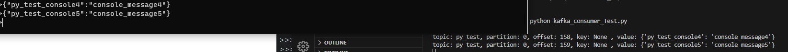

# 주키퍼 & 카프카 GCP설치 및 운영

서비스를 보완/개발하다가 실시간 데이터 수집도구인 카프카를 이용하려고 찾아보던중에 주키퍼이야기가 나와서 찾아봤다.

## 주키퍼란?

주키퍼(zookeeper)는 <u>분산 환경 애플리케이션 코디네이터</u>이다.

분산환경 시스템을 구축하고 사용하다보면 여러 서버들사이에서 서로 **정보공유**를 어떻게할것인가 에 대한 고민이많아지는데, 주키퍼는 분산되어있는 서버들사이의 상태정보/ 데이터 공유를 도와주는 코디네이션 시스템이다.

분산되어있는 서버 여러대를 주키퍼 앙상블 클러스터로 구성하여, 동일한 클러스터내에 있는 서버들은 서로 통신하여 상태 및 정보를 교환하고 이 정보들을 <u>지 노드(znode)</u>에 저장한다.

znode에는 키 - 밸류(딕셔너리 타입)으로 앙상블 클러스터로 묶인 서버들이 서로간에 교환한 데이터와 상태정보등을 저장한다.

그렇게 저장한 정보들을 클라이언트가 요구하면 저장한 상태정보와 데이터를 전달한다.  여기서 클라이언트는 **카프카나 다른 분산 어플리케이션이 된다.**

보통 주키퍼 앙상블 클러스터는 1개의 리더 서버와 N개의 팔로워 서버로 구성되어 하나의 클러스터를 이루고 클라이언트와 통신한다.

그리고 주키퍼는 생존해있는 주키퍼 앙상블 클러스터가 과반수일경우, 서비스를 지속해서 제공한다.
그래서인지 <u>주키퍼는 홀수로 구성하는편이좋다.</u>

EX) 주키퍼 앙상블 3대구성

2대가 다운 -> 과반수 이상이 다운되었으므로 서비스중단
1대가 다운 -> 과반수 이상의 서버가 동작하고있으므로 서비스 유지

## Kafka란?

카프카른 파이프라인과 스트리밍 분석, 데이터 통합 등을 위해 설계된 **고성능 분산** 이벤트 스트리밍 플랫폼이다.

나는 카프카를 실시간데이터 수집을 위하여 사용할것이다.

카프카는 반드시 주키퍼가 실행되어있는 상태에서 카프카를 실행시켜야하고,
주키퍼와다르게 <u>홀수로 구성할 필요가없다.</u>

그럼 GCP에 카프카를 주키퍼와 함께 설치해보자.


# GCP에 주키퍼 & Kafka설치

카프카와 주키퍼를 이용하기위해 총 3개의 서버를 사용할것이다.
각각 이름은 kafka01 / kafka02 / kafka03 으로 지정한다.

카프카과 주키퍼를 사용하기위해서는 반드시 <mark>JAVA</mark>가 필요하다.


Manual의 인스톨 매뉴얼에 따라 새로생성한 인스턴스에 패키지들을 업데이트/업그레이드해주고 ssh를 설치한다.
그리고 주키퍼를 사용하기위해 JAVA도 설치해준다.
<u>아마존 코레토를 이용하여 JAVA을 설치해도된다.</u> 물론 <u>OpenJDK-~,</u>로 원하는 JAVA 버전을 설치해도된다.

나는 **코레토를 이용해, JAVA11버전을 설치했다.**

[Install Manual 링크](https://github.com/LeNaHod/Manuals/blob/master/install_setting_Manual.md)


## Zookeeper 설치

아래 주키퍼 공식 홈페이지에가서 원하는 주키퍼버전을 다운로드받는다.

[주키퍼 공식홈페이지](https://zookeeper.apache.org/) 

이후 필요한 형태로 다운로드받는다.

나는 현재 안정화된 버전이라고 안내되어있는 **zookeeper-3.7** 버전을 사용할것이다.

[주키퍼3.7](https://dlcdn.apache.org/zookeeper/zookeeper-3.7.1/apache-zookeeper-3.7.1-bin.tar.gz)


```bash

1. 원하는 경로에 wget으로 주키퍼를 다운로드받아주기

sudo wget https://dlcdn.apache.org/zookeeper/zookeeper-3.7.1/apache-zookeeper-3.7.1-bin.tar.gz

2. 주키퍼를 원하는 경로에 압축해제해하기

sudo tar xvzf apache-zookeeper-3.7.1-bin.tar.gz

OR 

sudo tar xvzf apache-zookeeper-3.7.1-bin.tar.gz -C /압축해제하길원하는 경로

3. 심볼릭 링크생성 OR 파일이름 바꿔주기

좀 더 편하게 쓰기위해 파일의 이름을 zookeeper라고 바꿔줄것이다.
설치한 경로에따라 mv명령어를 써서 이름을 바꾸는 동시에 파일의 위치를 원하는곳으로 옮겨줘도되고,
zookeeper라는 이름으로 심볼릭링크를 만들어줘도된다.

ln -s apache-zookeeper-3.7.1-bin/ zookeeper

or 

mv ~/경로/apache-zookeeper-3.7.1-bin/ /원하는경로/zookeeper

5. .bashrc에 zookeeper사용을위한 환경변수 추가

자바변수를 추가했다는 가정아래 주키퍼 변수만 추가

sudo vi ~/.bashrc

# zookeeper

export ZOOKEEPER=/home/계정명/zookeeper
export ZOOKEEPER_CONF_DIR=$ZOOKEEPER/conf


6. standard alone 방식(싱글노드) 으로 구축할건지 Cluster 방식(멀티노드)로 구축할지 선택

zoo.cfg 파일은 주키퍼 환경설정파일이다.
zookeeper를 처음 설치하면 '/zookeeper/conf/zoo_sample.cfg' 라는 이름으로 만들어져있다.

이 cfg파일을 zoo.cfg로 카피명령어로 바꿔준다.

sudo cp zoo_sample.cfg zoo.cfg

그리고 해당 경로에서 ls 로 확인해보면 zoo.cfg가 생긴걸알수있다.


sudo vi zoo.cfg

### zoo.cfg의 내용을 편집한다

#dataDir=/tmp/zookeeper ▼ 원래의 값을 주석처리하고 아래와같이 변경. data디렉토리와 logs디렉토리는 mkdir명령어를 통해 만들어줘야한다. 기존디렉토리 x

dataDir=/home/계정명/zookeeper/data 
dataLogsDir=/home/계정명/zookeeper/logs

#주키퍼 포트 기본값 2181. 
clientPort=2181

#아래 속성은 클라이언트가 동시에 접속할수있는 최대갯수를 설정하는것. 아래 속성을 추가하지않는다면 기본60. 0으로 설정하면 무제한

maxClientCnxns=0

#세션타임아웃 시간 설정
maxSessionTimeout=180000

#싱글노드방식은 별도의 server지정없이 위의내용만 넣어서 실행해도 된다. 하지만 카프카나 다른 어플리케이션과 연결하려면 카프카의 호스트이름과 정보를 저장해줘야한다.

server.1=HOSTNAME or ip주소:2888:3888

#멀티노드방식 

server.1=HOSTNAME or ip주소:2888:3888 <2888번부터 3888번까지라는의미
server.2=HOSTNAME or ip주소:2888:3888
server.3=HOSTNAME or ip주소:2888:3888
.
.
.
위와같은 방식으로 홀수로지정.
주키퍼는 살아있는서버가 과반수인지 아닌지를 판단해서 서비스를 지속하느냐를 결정하기때문에 한개의 클러스터는 홀수로 지정해주는것이좋다.

# 설명

zoo.cfg에서 server.1 /server.2.. 등 뒤에 1,2,3.. 이렇게 넘버링한값은 주키퍼의 myid의 설정값과 동일하게 작성해줘야한다.

나는 gcp의 비용문제로 주키퍼를 설치한 해당 인스턴스에 카프카도 같이 동작시킬것이시때문에

zoo.cfg에서 설정한 'server.1'은 해당 인스턴스에서 실행되는 카프카를 의미한다.

만약 본인이 추가로 카프카 서버를 늘리고싶다면 server.2 /server.3과같이 추가해주면된다.

# data 디렉토리 / logs디렉토리 생성

mkdir -p /home/계정명/zookeeper/data 

OR

디렉토리를 만들 위치로 이동 후 

mkdir data 

logs디렉토리도 동일한 방식으로 만들어준다.

# 사용자 권한변경

현재 접속해있는 사용자(계정)가 주키퍼 홈 디렉토리에있는 모든 파일들을 소유할수있도록 사용자 권한을 변경해줘야한다.

sudo chown -R  $USER:$USER /home/계정명/zookeeper/

파일 소유권을 부여했으면, home으로 돌아가서 ls -al로 확인

ls -al

lrwxrwxrwx 1 계정명 계정명 27 시간 zookeeper

(보통 root로되어있음, 또한 나는 zookeeper가 심볼릭 링크이기때문에 앞에 d가 안붙음)

zookeeper 디렉토리안에서도 확인작업

ls -al

drwxr-xr-x 2 계정명 계정명  4096 시간 logs

위처럼 모든 zookeeper내부의 모든 디렉토리와 파일이 현재 접속중인 사용자의 소유로 바뀐걸 볼수있다.

# 주키퍼 myid설정

아까 zoo.cfg에서 server.1,2,3 등 넘버링한 서버에대해 myid라는 파일을하나만들어서 관리한다.

각 번호에 맞는 서버가될 인스턴스에서 zookeeper아래에 data디렉토리아래에 myid를 만들것이다.

echo 1 > /home/계정명/zookeeper/data/myid

# myid값 확인

cat /home/계정명/zookeeper/data/myid

1

echo명령어로 입력한 내용이 출력되면 정상적으로 설정된것이다.

나머지 server.2 / server.3의 서버도 위와같은방법으로 2,3이 출력되면된다.


# 주키퍼 실행 & 주키퍼 실행확인

##실행
$ZOOKEEPER_HOME/bin/zkServer.sh start 

##상태확인
$ZOOKEEPER_HOME/bin/zkServer.sh status


  Using config: /home/계정명/zookeeper/bin/../conf/zoo.cfg
  Client port found: 2181. Client address: localhost. Client SSL: false.
  Mode: standalone

▲ 현재는 다른 인스턴스를 추가하지않고 하나의 인스턴스에서 주키퍼와 카프카를쓰고있기때문에 standalone으로 나온다. 만약 다른 인스턴스가추가되어 클러스터가 구성이되면 leader/follower로 나온다.

# 주키퍼 포트 확인
netstat -ntlp | grep 2181

tcp6       0      0 :::2181                 :::*                    LISTEN      3044/java

▲ 2181번 포트가 Listen이면 정상작동중. 또한 jps를 입력해서 'QuorumPeerMain' 가 실행되고있으면 정상실행중

## logs 디렉토리에 대하여

카프카나 주키퍼나 logs디렉토리는 실행정보를 저장하는것같다.
설정파일을 변경하고 아무리재시작해봐도 제대로 변경사항이 적용되지않는경우가있는데

주키퍼와 카프카의 logs 디렉토리를 초기화시키고 새로 생성하면 변경사항이적용된다.
변경사항이 적용이안될시 logs디렉토리를 열어보자.

```

주키퍼를 설치하고 정상적으로 동작하는것을 확인했으면 이제 카프카를 설치한다.

## Kafka 설치


아파치 카프카는 주키퍼와다르게 홀수로 클러스터를 구축하지않아도된다.

아파치 카프카설치를위해 공식홈페이지에들어간다.

공식홈페이지에는 소스버전와 바이너리버전 두가지가있는데 바이너리파일을 받아준다. (버전 자유)

나는 현재 안정화된 최신버전인 Kafka3.5버전을 다운로드받을것이다.


[Kafka 공식홈페이지](https://kafka.apache.org/downloads)

[Kafka3.5](https://downloads.apache.org/kafka/3.5.1/kafka_2.13-3.5.1.tgz)

```bash

sudo wget https://downloads.apache.org/kafka/3.5.1/kafka_2.13-3.5.1.tgz

sudo tar xvzf kafka_2.13-3.5.1.tgz

ln -s kafka_2.13-3.5.1 kafka

# 카프카 홈 변수 설정 (/.bashrc)

sudo vi ~/.bashrc

# kafka

export KAFKA_HOME=/home/계정명/kafka
export KAFKA_HEAP_OPTS="-Xmx512m -Xms512m" #카프카가 실행될때 사용되는 용량을 지정하는 옵션. Xmx -> 최대로사용하는용량, Xms ->최소로 사용하는 용량

저장 후, 

source ~/.bashrc

환경변수가 잘 적용되었는지 확인

env | grep KAFKA

  KAFKA_HOME=/home/계정명/kafka
  KAFKA_HEAP_OPTS=-Xmx512m -Xms512m
  KAFKA_CONF_DIR=$KAFKA_HOME/config

위와같이 bashrc에 입력한대로 출력이되면 잘적용된것.

# zookeeper와같이 kafka소유권변경

카프카를 사용할, 카프카를 실행시킬 사용자(계정)에게 카프카파일의 소유권을 주기위해 파일 소유권을 지정한다.

sudo chown -R  $USER:$USER /home/계정명/kafka/

sudo chown root:root -R /home/계정명/kafka/ #현재 로그인중인 사용자말고 root로 통신하거나 실행시키고싶을때 파일소유권을 root로 변경

# 카프카 설정값 변경

server.properties 라는 파일을 변경하여 카프카 설정값을 변경해준다.

cd $KAFKA_CONF_DIR

vi server.properties

# server.properties파일을 열어서 작업.

broker.id=0

▼

broker.id=1

아까 zookeeper에서 server.1에 해당하는 인스턴스의 kafka의 broker.id를 1로 할당해준다.
만약 해당 인스턴스를 zookeeper에 server.2로 등록해놨고 myid값도 2라면, kafka의 properties의 broker.id도 2로 할당해줘야한다.

나는 현재 작업중인 인스턴스가 server.1이고 해당 인스턴스에 카프카와 주키퍼를 함께 설치하고 실행할것이다.


#listeners=PLAINTEXT://:9092

▼

listeners=PLAINTEXT://:9092 # 카프카가 '내부'에서 통신하는 주소 해당 인스턴스의 프라이빗 ip:포트 or hostname

주석을해제해주고 포트값을 변경하고싶으면 변경. 나는 디폴트값을 사용할것이다.


#advertised.listeners=PLAINTEXT://your.host.name:9092

▼

advertised.listeners=PLAINTEXT://kafka01:9092 #카프카가 '외부'에서 통신할때 '클라이언트'가 접속하기위한 주소설정

주석을해제하고 your.host.name부분에 프라이빗IP를 넣는대신 host명을 넣었다.
host명은 /etc/hosts에서 변경가능


log.dirs=/tmp/kafka-logs

▼

log.dirs=/home/계정명/kafka/logs # home이아니라 어쨌든 kafka 디렉토리의 경로를 적어두고 kafka안에 logs폴더로 지정할것이다.


zookeeper.connect=localhost:2181

▼

zookeeper.connect=kafka01:2181/gcp-kafka-cluster # 만약 kafka를 별도의 여러서버에서 실행할거라면 kafka01:주키퍼포트,kafka02:주키퍼포트,kafka03:주키퍼포트 .. 이런식으로 입력해주면된다. hostname대신 ip도 ok. 현재 내가 주키퍼에 설정한 주키퍼의 포트는 2181이므로, kafka01:2181이된것. 이부분에는 kafka의 브로커가 바라보는 zookeeper의 모든 호스트정보를 입력해주면된다.

#kafka01:2181,kafka02:2181,kafka03:2181/gcp-kafka-cluster

#뒤의 gcp-kafka-cluster는 z노드의(zookeeper) 루트 디렉토리 바로 하위에 클러스터를 구성하기위함임. 나중에 클러스터 유지보수에 용이

이후 wq!를 이용해 카프카 설정파일을 저장하고

위에서 log디렉토리설정값에 입력한 logs디렉토리를 생성한다.

mkdir -p $KAFKA_HOME/logs


# 인스턴스끼리 통신하기위해 ssh키 생성 (클러스터를 구성하기위한것)

ssh-keygen -t rsa -P '' -f ~/.ssh/id_rsa

cat ~/.ssh/id_rsa.pub >> ~/.ssh/authorized_keys

# 키생성이 끝났으면 생성된 ssh키로 본인 인스턴스에 통신이가능한지 확인

ssh localhost


# /etc/hosts 편집

현재 작업하고있는 인스턴스의 이름은 zookeeper여서 @zookeeper라고 나오지만, 카프카와 주키퍼에 현재 인스턴스를 kafka01로 사용할것이라고 설정해놨기때문에, host 이름을 kafka01로 변경해줄것이다.

sudo vi /etc/hosts

0.0.0.0 kafka01

#더 추가할 kafka서버가있다면 아래 주석처리된것처럼 입력
#gcp내부ip(프라이빗ip) kafka02
#gcp내부ip(프라이빗ip) kafka03

저장 후 파일닫기.

sudo hostnamectl set-hostname kafka01

hostname지정

※만약 kafka02, kafka03등 현재 작업하고있는 인스턴스 외 클러스터로 묶을 kafka서버가있다면, 해당 서버에 접속해서 위의 내용처럼 hosts파일을 편집해줘야한다.

kafka02라는 인스턴스에서 hosts파일을 편집한다면 아래의 내용처럼 작성해줘야한다.

0.0.0.0 kafka02
gcp내부ip(프라이빗) kafka01
gcp내부ip(프라이빗) kafka03

★사설ip=프라이빗ip=내부아이피=192.~~~ 10.~~~

# 카프카 실행

$KAFKA_HOME/bin/kafka-server-start.sh $KAFKA_HOME/config/server.properties

종료는 stop.sh

# 데몬으로 실행
$KAFKA_HOME/bin/kafka-server-start.sh -daemon $KAFKA_HOME/config/server.properties

# 카프카 확인

netstat -nltp | grep 9092

jps kafka 

※GCP경우 내부통신을 하기위해 방화벽 규칙에 등록해줘야한다.

카프카를 실행하기위해서는 주키퍼가 실행되고있어야한다.
카프카와 주키퍼를 데몬으로 실행하고나서 테스트용으로 토픽을 생성해보자.

# 토픽과 프로듀서, 그리고 컨슈머

토픽은 레코드의 집합체라고생각할수있다.

레코드 = 데이터 라고 생각하면되고, 즉 데이터가 모여서 덩어리로 저장되어있는게 토픽이다.

그럼 프로듀서는 무엇일까? 레코드들을 컨슈머에게 메세지형태로 보내주는 역할을 한다고 생각하면된다.

또한 여기서 중요한것은 '프로듀서'로 전송되는 레코드의 값은 UTF-8기반 바이트로 변환되고, 이 형식으로 직렬화가 이루어진다.

즉, 스트링 타입이 아닌 친구들은 직렬화해서 전송할수없기때문에, 카프카 어플리케이션(.py, .java) 파일로 직접 튜닝하여 사용해야한다.

※ 프로듀서나 컨슈머 파일을 튜닝할때  "value_deserializer=lambda x : loads(x.decode('utf-8'))" 이 코드를 많이추가하는데, 이것이 밸류값을 스트링으로 직렬화시키는 작업을하는것.

※ 그래서 위와같이 카프카 어플리케이션을 이용할때는 보통 프로듀서-컨슈머 모두 json형식으로 데이터를 전송하기때문에 json 타입으로 보내주면 오류가 발생하지않지만, 터미널에서 직접 kafka-console-producer.sh를 이용하여 밸류값만을 토픽에 추가할때 일반 문자열만 메세지로 전송한다면 해당 코드부분에서 오류가난다.

```
아래와 같은 코드를 컨슈머 파일에 추가한다면, **json**형식에 맞춰서 데이터에넣어줘야한다.

`value_deserializer=lambda x : loads(x.decode('utf-8'))`




▲왼쪽 터미널은 GCP에서 구동중인 카프카01서버에서 실행한 **프로듀서**, 오른쪽 VSCODE의 터미널은 GCP에서 구동중인 카프카02서버에서 실행한 **컨슈머**.

카프카01에서 실행한 프로듀서.py파일로 1-50까지의 밸류값만 가지는 json형태의 레코드를 넣어 토픽을 생성했고, 이후 **Kafka-console-producer.sh** 로 메세지 밸류만 json형식으로 보내보았다.

그결과, 위의 코드가있는경우 json형식 외의 포맷이들어오면 컨슈머.py파일에서 오류를발생시킨다.

튜닝하지않은 컨슈머.sh는 바이트로만직렬화하기때문에 스트링이 아닌 타입은 전송하기 어려웠다.

```consumer_timeout_ms=1000```

또한 위의 코드를 주석처리했을때, 컨슈머는 사용자가 따로 정지명령을 내리지않는이상 프로듀서와의 연결을 지속적으로 유지하며, 프로듀서로 들어오는 새로운 메세지들을 지속적으로 수신하는걸 확인할수있었다.


```python

# 토픽생성 확인

$KAFKA_HOME/bin/kafka-topics.sh --create --bootstrap-server kafka01:9092,kafka02:9092,kafka03:9092 --partitions 3 --replication-factor 2 --topic test

partitions = 파티션을 3개생성한다. 현재 카프카서버를 3개사용하고있으니 3군데에 저장됨

replication-factor = 나눠가질 파일의 갯수. 쉽게말하면 생성된 토픽파일을 각 서버에서 몇개씩 파일을 가질것인가.

topic = 토픽이름지정

bootstrap-server = 주키퍼를 바라보고있는 카프카서버들


#  토픽 리스트 확인 & 토픽삭제

## 토픽리스트 확인

$KAFKA_HOME/bin/kafka-topics.sh --list --bootstrap-server kafka01:9092..


  __consumer_offsets
  prototype
  test

※ 컨슈머 오프셋은 프로듀서-컨슈머로 메세지를 이용했을때 컨슈머가 메세지를 어디까지읽었는지 저장하는 정보이다.

(0,1,2,3,4 중 컨슈머가 0,1,2,3 까지만읽었다면 3->4 로 넘어가는 중간단계를 컨슈머 오프셋이 저장)

컨슈머 오프셋은 내부적으로 따로 저장하기도하지만, kafka가 토픽으로 생성하여 관리하기도한다.


## 토픽 상세확인

$KAFKA_HOME/bin/kafka-topics.sh --bootstrap-server kafka01:9092,kafka02:9092,kafka03:9092 -
-topic kafka-test --describe

--describe: 토픽의 상세내역을 조회하는 옵션


## 토픽 삭제명령어

$KAFKA_HOME/bin/kafka-topics.sh --delete --bootstrap-server your.host.name:2181 --topic topic-name

->your.host.name:9092
※2.2버전 이하는 --zookeeper 2.2버전 이상은 --bootstrap-server 옵션을사용해야한다.

### zookeeper쉘을 이용한 토픽삭제방법도있다.

$ zookeeper-shell localhost:2181 
ls /brokers/topics 
토픽이름 토픽2 토픽3
deleteall /brokers/topics/test
ls /brokers/topics


## 토픽삭제 허용하기. 
### kafka/server.properties에서 아래의 내용을추가해준다.

delete.topic.enable = true

※만약 삭제명령어를 이용했을시 에러가 발생한다면 위의 설정값을 추가해주자. 나는 추가해주지않았지만 삭제가 잘 이루어졌다.

이후 logs 파일에서 삭제가 잘 이루어졌는지 확인하고 같은이름으로 새로운 토픽을 생성해본다.

# 프로듀서로 토픽내용 추가하기

kafka-console-producer.sh --bootstrap-server kafka01:9092.. --topic 토픽명

## 밸류값만을 메세지로 전송하기

kafka-console-producer.sh --bootstrap-server kafka01:9092.. --topic 토픽명

## 키와 밸류 모두 메세지로 전송하기

kafka-console-producer.sh --bootstrap-server localhost:9092 ---topic 토픽명 --property "parse.key=true" --property "key.separator=:"

※ property "parse.key=ture" ->레코드를 전송할때 키를 추가할수있다.
※ property "key.separator=:" -> 키와 밸류를 구분하는 구분자 지정. 기본값은 탭임(\) 

# 브로커 확인

$KAFKA_HOME/bin/kafka-broker-api-versions.sh --bootstrap-server your.host.name:9092

# 카프카 컨슈머 그룹아이디 생성

그룹아이디가있으면, 여러 인스턴스에서 작동중인 컨슈머 모두가 메세지를 소비하지않고 카프카라 메세지를 자동분배하여 한개의 컨슈머에서만 메세지를 소비할수있다.

$KAFKA_BIN/kafka-console-consumer.sh --bootstrap-server your.host.name:9092.. --topic [토픽 이름] --group [그룹 이름]

# 카프카 그룹아이디 확인

$KAFKA_BIN/kafka-consumer-groups.sh --bootstrap-server kafka01:9092,kafka02:9092,kafka03:9092
92 --describe --group [그룹 이름]

# 카프카 프로듀서로 데이터를 입력하고 컨슈머로 출력하기

## 카프카 프로듀서

###kafka01에서 진행

$KAFKA_BIN/kafka-console-producer.sh \
--broker-list kafka01:9092,kafka02:9092,kafka03:9092 \
--topic test
>a
>b
>c
>d
>e
>f
>g
(추가입력)>hi
## 카프카 컨슈머

###kafka02에서 진행

$KAFKA_HOME/bin/kafka-console-consumer.sh \
--bootstrap-server kafka01:9092,kafka02:9092,kafka03:9092 \
--topic test \
--from-beginning

>a
>b
>c
>d
>e
>f
>g
(추가입력분이 컨슈머로 실시간출력)>hi


※순서는 파티션이 나눠져있기때문에 뒤죽박죽일수있음


# 로컬 vs코드에서 카프카사용하기

GCP에 구축되어있는 세개의 카프카서버의 로컬의 VS코드에 연결해서 사용할수있다.

그렇게 사용하려면 일단, GCP에서 방화벽규칙에 접속하여 새로운 로컬PC가 GCP에 접속할수있게해 방화벽 규칙을 새로생성해준다.

자세한건 해당 폴더의 [server.md]를 참조.

카프카 인스턴스에대한 방화벽규칙을 성공적으로 생성하였으면, 로컬의 vs코드를 실행시켜서 [확장] 탭 에 들어가서 'Tools for Apache Kafka'를 설치해주자.

성공적으로 카프카 툴이 설치되었으면 'Add new Cluster'를 누르자.

이후 주키퍼쉘을 이용하여 연결해줘야한다.

# 카프카 인스턴스에서 주키퍼 쉘 실행

  $ZOOKEEPER_HOME/bin/zkCli.sh

  (주키퍼 쉘이 실행되면, 아래명령어로 vs코드와 연결하길원하는 클러스터를 탐색. 나는 루트 바로아래에 클러스터를 구축해놨기때문에 아래 명령어로 조회.)

  ls / 


원하는 클러스터 이름을 복사해서 로컬의 vs코드에 이름과 서버정보들을 넣고 연결하면된다.

※로컬pc에 카프카 인스턴스의 ip를 hostname으로 등록해서 쓰고싶으면 vs코드와 연결하기전에 먼저 로컬pc에 hostname을 지정한다(외부ip,퍼블릭ip)

제대로 연결이되었다면 해당 클러스터의 브로커와 토픽정보를 볼수있고 관리할수있다.
또한, 자동완성기능 등 을 이용하여 명령어를 입력하면, 데이터가 프로듀서가 가져온 데이터를 컨슈머가 실시간으로 소비하는것도 확인이 가능하다.

```

## 파이썬으로 카프카와 연동하여 컨슈머 조작하기


[kafka-pyton-doc](https://kafka-python.readthedocs.io/en/master/)

위는 파이썬에서 kafka를 사용할수있게 도와주는 라이브러리의 공식문서.

Kafka를 vscode와 연동해서 사용해도되지만, .py파일이나 java파일을 생성하여 원하는대로 프로듀서/컨슈머의 작동을 튜닝할수있다.

파이썬으로 프로듀서 작동 파일과 컨슈머 작동파일을만들어서 작동테스트를해본다.

먼저 파이썬에서 kafka 라이브러리를 설치한다.

```python

pip install kafka-python


위의 라이브러리를 설치하였으면 이제 파이썬에서 불러와서 사용할수있다.
코드를 작성해보자


  from kafka import KafkaProducer
  from json import dumps
  import time

  # kafkaproducer안에는 카프카의 정보와 메세지의 압축방식, 보낼방식,확인 등을
  # 옵션으로 지정할수있다.
  # acks=n -> 메세지가 잘 전달되었는지 확인하는 옵션 / compression_type -> 메세지 전달할때 사용하는 압축방식
  # 부트스트랩서버 -> 메세지를 전달할 브로커들의 정보, value_serializer -> json파일을 전송을위해 바이트로 바꾸고 인코딩함

  producer = KafkaProducer(acks=0, compression_type='gzip',bootstrap_servers=['kafka01:9092','kafka02:9092','kafka03:9092'],
  value_serializer=lambda x: dumps(x).encode('utf-8'))

  # 데이터를 보내는데 걸리는 시간을 체크하기위해.

  start = time.time()

  for i in range(1000):
      data = {'kafka_test' : 'test'+str(i) }
      producer.send('py_test', value=data)#patitions=n -> 특정파티션을 지정할때 토픽명 py_test, 토픽안의 값들은 data의 값, 
      producer.flush() # 데이터를 비우는작업

  print('send seepd : ', time.time() -start)


>python kafka_test.py

send seepd :  0.4088451862335205

▲100개의 데이터를 프로듀서에 보내는데 걸린 시간

# 컨슈머로 실시간으로 확인해본 결과

$KAFKA_HOME/bin/kafka-console-consumer.sh --bootstrap-server kafka01:9092,kafka02:9092,kafk
a03:9092 --topic py_test --from-beginning

{"kafka_test": "test0"}
{"kafka_test": "test1"}
{"kafka_test": "test2"}
{"kafka_test": "test3"}
{"kafka_test": "test4"}
{"kafka_test": "test5"}
{"kafka_test": "test6"}
{"kafka_test": "test7"}
{"kafka_test": "test8"}
{"kafka_test": "test9"}
{"kafka_test": "test10"}
{"kafka_test": "test11"}
            .
            .
            .
            .
            .
{"kafka_test": "tset99"}


▲ragne(100)이었으므로 0-99까지 총 100개의 데이터가 토픽에 정상적으로 넣어진걸 확인할수있다.


## 1000개의 데이터도 전송시켜본다.

send seepd :  0.707979679107666


{"kafka_test": "tset999"}

다른 콘솔에 컨슈머를 미리 켜놓으면, 실시간으로 데이터가 쌓이는걸 확인할수도있다.

※단, 저장되는 파티션은 랜덤(브로커가 만약3개있다면 3개중 랜덤)이므로, 특정 파티션으로보내고싶을때는 파티션을지정해줘야한다.
토픽 내부에 파티션이있다.

## 컨슈머 파일도 만들어보자

프로듀서로 데이터를 수집하였으면 읽어오는 컨슈머파일도 만들수있다.

하지만 여기서 컨슈머파일로 데이터를 읽어오지않고 다른 방식으로 전송,읽는 방법이있다.
대표적인예로 엘라스틱서치의 '로그스태시', '텔레그래프'등이있다.


트위터 api가 정상적으로 작동한다면, 프로듀서를 통해 트위터에서 수집된 데이터를 로그스태시를 사용하여 엘라스틱서치에 적재하고 시각화하는것도 진행해봐야겠다.


토픽에 들어있는 데이터를 읽어오는 컨슈머파일을 만들어보자.

  from kafka import KafkaConsumer
  from json import loads


  consumer = KafkaConsumer(
      'py_test', #읽어올토픽명
      bootstrap_servers=['kafka01:9092','kafka02:9092','kafka03:9092'],
      auto_offset_reset='earliest',
      enable_auto_commit=True,
      group_id='my-group',
      value_deserializer=lambda x : loads(x.decode('utf-8')),
      consumer_timeout_ms=1000
  )

  print('start get consumer list')

  for message in consumer:
      print("topic: %s, partition: %d, offset: %d, key: %s , value: %s" % 
      (message.topic, message.partition, message.offset,message.key,message.value)
      )

  print('end get consumer list')

# 결과 

topic: py_test, partition: 0, offset: 0, key: None , value: {'kafka_test': 'test0'}
topic: py_test, partition: 0, offset: 1, key: None , value: {'kafka_test': 'test1'}
topic: py_test, partition: 0, offset: 2, key: None , value: {'kafka_test': 'test2'}
topic: py_test, partition: 0, offset: 3, key: None , value: {'kafka_test': 'test3'}
topic: py_test, partition: 0, offset: 4, key: None , value: {'kafka_test': 'test4'}
topic: py_test, partition: 0, offset: 5, key: None , value: {'kafka_test': 'test5'}
topic: py_test, partition: 0, offset: 6, key: None , value: {'kafka_test': 'test6'}
topic: py_test, partition: 0, offset: 7, key: None , value: {'kafka_test': 'test7'}
topic: py_test, partition: 0, offset: 8, key: None , value: {'kafka_test': 'test8'}
topic: py_test, partition: 0, offset: 9, key: None , value: {'kafka_test': 'test9'}
topic: py_test, partition: 0, offset: 10, key: None , value: {'kafka_test': 'test10'}
.
.
.


py_test라는 토픽은 아까 프로듀서.py파일을 통해 100개의 데이터를 json형태로 넣어놨고, 그것을 읽어오는 컨슈머.py파일을 만들어보았다.

이렇게 프로듀서로 수집한 실시간데이터를 토픽으로만들어 컨슈머에서도 실시간으로 쌓이는것을 확인할수있다.
또한 이렇게 쌓인 토픽을 데이터베이스에 저장하는것도가능하다. 단, 카프카가 json형태로 데이터를 쌓기때문에 nosql인 몽고디비나 엘라스틱서치(로그스태시로 엘라스틱서치에쌓는방식)이 편할수있다.

```

# 트위터 API로 실시간 스트리밍기능을 다시 이용해보자.

이슈가있어서 작동하지않았던 트위터 API를 다시 이용해보기로했다.
그런데 꽤 오랜시간이 지나서들어가보니 뭔가 많이 업데이트된것같아서 새로 연구해야겠다..

트위터에서 실시간 으로 수집한 트윗은 카프카 토픽으로 보낼것이고, 카프카에서 로그스태시를이용해  엘라스틱서치에 적재할 예정이다.
물론 바로 로그스태시로 엘라스틱서치에 적재해도되지만.. 카프카를 이용해보겠다.

일단 Python에서 트위터를 이용하기위해 라이브러리를 설치해줘야한다

```pip install tweepy```

  WARNING: The script normalizer is installed in '/home/-/.local/bin' which is not on PATH.
    Consider adding this directory to PATH or, if you prefer to suppress this warning, use --no-warn-script-location


설치를 하다가 위와같은 경고메세지를 받았는데 해당 경고메세지에서 알려주는 경로가 쉘이 인식할수없는 경로이기때문에 export PATH를 통해 경로를 지정해줘야한다.

아니면 경고메세지에서 안내해주듯 --no-warn~ 옵션을 사용하여 설치해도 사용하는데는 무방하였다.

```pip install tweepy --no-warn-script-location```

그리고 트위터에서 가져오고싶은 키워드를 선정하여 카프카로 전송하는 python 파일을 만든다.

<u>import 에러에대해서는 아래 글을 참고하였다.</u>

[트위터API_V2_stream](https://devkhk.tistory.com/37)


```python

from tweepy import StreamRule,StreamingClient
from kafka import KafkaProducer
from kafka.errors import KafkaError
import json
from json import dumps
#from tweepy import OAuthHandler,Stream,StreamListener #1.1에서 사용되던것. 이젠 사용x

# API Key
consumer_api_key="" # 1.1에서 사용. 
consumer_api_secret="" # 1.1에서 사용.
access_token=""# 1.1에서 사용.
access_token_secret=""# 1.1에서 사용.
BEARER_TOKEN="" #api 2버전에선 해당 토큰만 사용

# Kafka topic 생성
# 바로 토픽을 생성하지않고 미리 생성해둔 토픽을 사용할것이다.

kafka_topic="twittertest"

#on_Data에 들어온 트윗을 컨슈머로 보내는 메소드를 가지고있는 클래스생성

class StdOutListener(StreamingClient): #데이터가 들어오면 해당 메소드 실행
    def on_data(self,data): # 정상적으로 작동할때
        tw_data=json.loads(data)
        tw_key_data={'Tweet':tw_data["text"]} #응답되어오는 josn포맷에서 text만 출력하여 tweet:text json형식으로 만든다.
        producer.send(kafka_topic, value=tw_key_data) #카프카 토픽에 받아온 데이터를보냄
        return True
    def on_error(self,status): #오류가 발생했을시 오류메세지 출력
        print(status)

def delete_all_rules(rules):
    # 규칙 값이 없는 경우 None 으로 들어온다.
    if rules is None or rules.data is None:
        return None
    stream_rules = rules.data
    ids = list(map(lambda rule: rule.id, stream_rules))
    client.delete_rules(ids=ids)

# 저장할 포맷과 Kafka 서버설정

producer=KafkaProducer(acks=0,bootstrap_servers=['kafka01:9092','kafka02:9092','kafka03:9092'],
value_serializer=lambda x: dumps(x).encode('utf-8'))
#outlisten=StdOutListener() #1.1버전에서사용

# 트위터랑 연동하는부분
client = StdOutListener(BEARER_TOKEN)
rules = client.get_rules()
delete_all_rules(rules)
client.add_rules(StreamRule(value="반려동물")) #키워드 필터링
client.filter() #스트림 시작

```

위와같이 진행하였는는데 403오류가 계속나서 찾아본결과, api_v2의 권한 문제가있는것같다.
트위터 포럼에서 올해 올라온 글을 찾았는데 무료버전은 자동 트윗 생성/삭제 그리고 특정사용자의 트윗을 가져올수있고 특정 검색어로 트윗을 가져오는것은 스트리밍 기능은 기업버전, 혹은 기본버전($100)에서만 사용할수있는것같다. 그리고 api_v1.1같은경우는 이제 완전히 중단되었다고한다.


또한 tweepy 최신버전에서는 공식적으로 Stream,StreamListener 가 삭제되어서 사용할수없다.
Stream,StreamListener는 StreamingClient 로 변경되었다.

[tweepyDoc](https://docs.tweepy.org/en/v4.14.0/streamingclient.html)

내가 코드를 잘못작성해서 오류가나는줄알고 정말 오래 삽질했는데 저번엔 이슈로발목잡더니 다시돌아오니 이젠 아예 문전박대를 당한상태이다... 트위터에서 무료버전으로 실시간으로 데이터를 받아올수없다니 매우 아쉬웠다.

그렇다면 아쉬운대로 카프카와 엘라스틱서치를 연동시키는 작업을 진행해야겠다.

