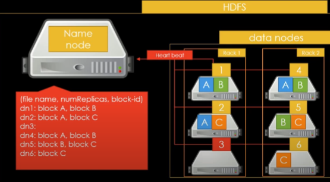
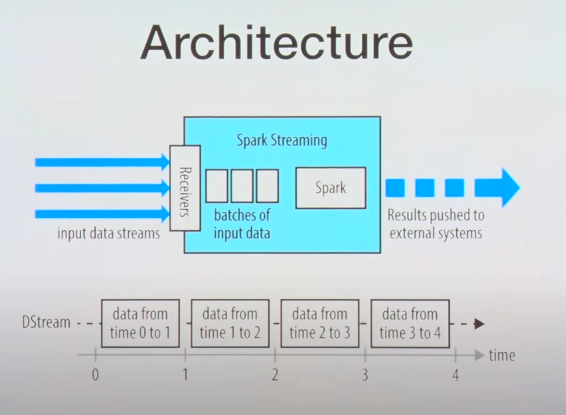
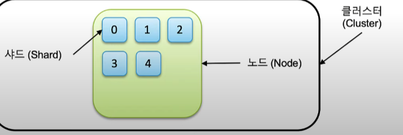
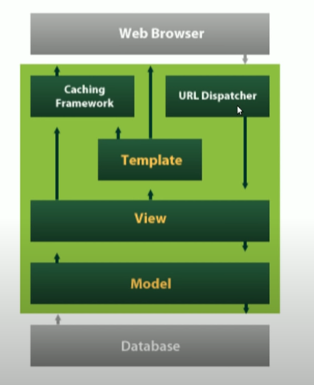

# 프로젝트를 진행하면서 사용한 기술스택들에대한 기본 개념정리

많지는않지만 프로젝트들을 진행하면서 여러 기술들을 사용하게되었다.
보통 프로젝트에 기술을 적용하면서 바로바로 기본개념들을 간단하게 정리해놨지만 기술들의 갯수가 많아지고 프로젝트에 적용시키면서 트러블슈팅들을 같이 작성해놓으니까 찾아보기가 힘들어지는 문제점이생겼다.

그래서 프로젝트에 이용했던 기술 스택들에대한 기본 개념들을 이곳에 정리해놓고 필요할때 찾아보는편이 낫겠다고 판단하여 작성.

- Celery
- Redis
- Airflow
- Django
- GCP
- Kafka
- Hadoop & hdfs
- Spark
- Elastic search
- logstash
- Kibana 
- SQL
- Nginx
- uWsgi
- Zookeeper
- Pandas
- Numpy
- Docker
- CloudFlare
## Celery와 사용이유

Celery는 많은 작업을 분산처리를 할 수있도록 해주는 Task queue이다. <u>Task는 비동기 처리를 도와주는 친구로 Celery는 비동기 작업 큐 라고 생각하면된다.</u>

<u>그럼 비동기 작업이 왜 필요한가?</u> 

이건 간단하게 생각하면 쉽다.
예를 들어 내가 스타벅스의 매장을 조회하기위하여 스타벅스 홈페이지에 접속하여 매장 조회를 눌렀다고 가정하자.

그런데 웹 페이지의 경우, 전국의 스타벅스 매장의 정보를 DB에서 가져오기때문에 이 가져오는 작업이 끝날때까지 나는 하염없이 웹 페이지의 응답을 기다려야한다.

그래서 그러한 무거운 연산 및 처리들을 Task라는 비동기 작업을 처리해주는 큐에 넘겨주고, 이용자는 다른작업을 할 수 있도록하는것이 원리이다.
그런고로 Celery는 클라이언트와 worker사이를 중재하는 메세지 브로커를 사용하여 통신하게되는데, worker들에게 task를 처리하도록 시키기위해 메세지 브로커로써 Redis나 Rabbit MQ를 사용하게된다.


그럼 queue는 뭘까? 이건 컨테이너벨트에 적재된 화물을 생각하면 쉽다.
예를들어, 택배사에서 컨테이너 벨트위에 배송되야할 택배들이 줄지어있다고치면 이 화물들이 처리해야할 작업이되는것이고 큐는 컨테이너벨트가되는것이다.

그러면 컨테이너벨트에 택배(화물)을 올려주는 작업을해주는 친구가 필요한데, 그 역할을하는게 시스템 브로커이다.

클라이언트에서 처리해야할 작업(task)를 생성하면 celery는 브로커를 통해 worker들에게 메세지를 전달하여 worker들이 해당 작업을 처리하게한다.

celery는 1분에 수백만건의 task를 처리할수있는 속도를 제공하기때문에 분산작업 처리를할때 유용하다.

보통 Airflow+celery+redis or rabbit mq를 많이 사용한다.

## Redis

<u>Airflow와 Redis</u>

redis를 airflow와 함께 사용할때는 보통 메세지 브로커로써 활용한다.
하지만 Redis의 태생 자체가 메세지 브로커가아니라 인 메모리 db로, <u>Key-value형식을가진 Nosql에 속하는 자료구조 서버이다</u>

우리가 흔히 사용하는 DB는 데이터를 물리 디스크에 직접써서 요청,쿼리가 발생할때마다 디스크에 접근하여 데이터를가져온다.
이러한 방법은 <u>서버에 장애가 발생하여도 데이터가 손실되지않는다.</u>

하지만 단점이있다.
사용자가 늘어가서 데이터베이스에 요청되는 쿼리가 커지고 많아진다면 디스크에 접근하는 횟수도 많아지기때문에 DB에 부하가발생하고 속도가 현저히 느려진다.

이때 캐시(메모리 기반) 서버를 도입하게되는데 이 Redis라는것이 인 메모리 DB이다.

캐시서버의 특징은 한번읽어온 데이터를 임의의 공간에 저장하여 다음에 읽을때 새로 읽어오는게 아니라 저장하고있던 정보를 빠르게 받아볼수있게 도와준다.

캐시서버가 한번 읽어온 데이터를 임의의 공간에 저장하고있기때문에, 당연히 매번 데이터베이스를 거치지않기때문에 DB의 부하를 줄이고 서비스 속도도 느려지지않는 장점이있다.

Airflow에서 redis를 같이쓰게되면 redis가 메세지 브로커로써 클라이언트가 생성한 Task가 지정된 큐에따라 redis서버안에 Key-Value타입으로 쌓이는것을 확인할수있다.

만약 내가 airflow task에 큐를 worker-1이라고 지정해놓으면 celery worker를 실행시킬때 워커가 모니터링할 큐를 worker-1이라고 지정해놓으면 해당 worker가 redis 큐 안의 task를 순차적으로 처리하게된다. 

redis 큐 안에 적재되는 task는 <u>task id</u>라는 고유한 task 아이디값이 있어서 아이디 값에따라 순차적으로 처리되는것을 확인할수있었다.

그렇다면 기본 Redis에 대해서 조금 더 알아보자.

Redis의 Key값의 자료형은 String형이지만 Value값의 자료형은 다양한 타입을 지원한다.

서버가 1개라면 굳이 Redis를 사용할필요는없겠지만(인 메모리 데이터베이스로써), 분산환경에서라면 원격 프로세스간의 데이터를 일치시키기가 Redis가 더욱 편리하다.

Redis의 단점은 무엇일까?

1.메모리 기반 DB이기때문에 서버에 장애가 발생했을시 데이터의 유실이있다.

2.메모리 기반 DB이기떄문에 메모리관리가중요하다.

3.싱글 스레드의 특성상, 처리하는데 시간이 오래걸리는 요청이나 명령은 비효율적이다.

### Redis VS Rabbit MQ

둘다 Airflow에서 메세지 브로커로 주로 활용된다.

두가지 다 Airflow와 사용하기 좋지만, 조금씩 특징이 다르다.

<u>Redis</u>

Key-Value를 이용해 Celery가 처리할 작업을 Celery에 보낸 후 캐시에서 해당 Key를 제거하는 방식으로 작동한다.

1.Redis는 데이터 검색을 위해 Database에 접근하기 전 메모리에서 Cache를 가져다 쓴다는 점에서 속도가 빠르다.

2.매우 빠른 서비스 및 메모리 내 기능을 제공하기 때문에 지속성이 중요하지 않고 약간의 손실을 견딜 수있는 짧은 보존 메시지에 적합하다.

3.큰 메시지를 처리 할 때는 대기 시간이 오래 걸린다.


<u> Rabbit MQ</u>

응용 프로그램(applications)에게 메시지를 주고 받을 수 있으며, 메시지가 수신될 때까지 안전하게 있을 수 있도록 하는 공용 플래폼(common platform)을 제공한다.

1.메시지를 다른 대기열로 보낼 수있는 라우팅 시스템을 갖추고 있다.

2.우선 순위가 높은 메시지를 먼저 사용하기 위해 작업자가 사용할 수있는 메시지의 우선 순위를 지원한다.

3.메시지 브로커로서 Redis와 비교할 때 훨씬 더 다양한 기능을 제공한다.
크고 복잡한 메시지에 적합하다.


<mark>나는 뉴스기사를 짧은간격으로 자주 수집해오는것을 목표</mark>로 하였기때문에, 약간의 데이터손실을 감당하고 빠른 속도가 장점인 Redis를 airflow에 적용시켰다.

## AirFlow 

Airflow는 오픈소스 워크플로 관리 플랫폼이다. 아파치 재단에서 만들었고, 파이썬으로 작성되어있으며 워크플로우를 작성할때 파이썬 스크립트를 통해 만들어진다.

Airflow를 접하다보면 <u>워크플로우</u>, <u>DAG</u>,<u>스케줄,스케줄링</u> 라는 단어를 많이 접하게된다. 이것들은 Airflow를 구성하는 아주 기본적인것들이며 Airflow를 사용하게된다면 좋든 싫든 친해져야할 친구들이다.


그럼 Airflow에대해서 상세하게 알아보자.

Airflow는 워크플로우 스케줄링(주기적으로 자동화시키길 원하는 스케줄의 관리)와 감시(모니터링)를하는 기능을 제공한다.

Airflow의 이름을 떠올려보면 이 도구가 뭐하는 도구인지 잘 알수있다.
바람개비인데 바람개비가 바람이불면 순차적으로 돌아가는것처럼 우리가 자동으로 작업되길 원하는 스케줄을 파이썬 스크립트파일을 통해 워크플로우( 의존성으로 연결된 작업들의 집합.)를 작성하면 Airflow가 이 워크플로우를 알아서 관리하고 실행시키고 모니터링한다.

Airflow가하는 역할을 예를들어본다면 이런거다.

우리는 알아서 식사시간이되면 식사를한다.
우리는 사람이기떄문에 알아서 때가되면 요리를하고 음식을만들고 음식을먹는 행동을한다.

**하지만 컴퓨터는 다르다.** 이 친구는 똑똑한것같으면서도 바보이기때문에 우리가 밥을먹으라고 명령을내려야 밥을먹는다.
하지만 이친구는 밥을먹으라고하면 정말 밥만먹는다. 먹을 밥이없으면 밥을만드는 그 전 단계를 처리하지않고 되려 오류를 발생시킨다.

*예를들면, 에러:먹을밥이없습니다. 이런식으로 말이다.*

그러면 우리(사용자)는 컴퓨터에게 하나하나 모든 작업을 스크립트파일로 명령을 내려줘야한다. 

요리 > 밥먹기 

이렇게보면 두개밖에없으니까 괜찮을것같지만 이런일을 매일매일, 식사뿐만아니라 우리가 하루를 보내듯 많은일을 시키려면 굉장히 번거로운 작업이될것이다.

그런것을 한번의 명령으로 컴퓨터가 알아서 동작하게하는것을 도와주는게, **Airflow**다.

단어를 조금 자세하게 살펴보자.

#### 개념 및 단어

- 워크플로우 : 의존성으로 연결된 작업들의 집합. 마트에가서 식자재를 사서와야 요리를할수있고, 요리를해야 점심식사를 할수있다. 이러한 작업들의 집합을 의미한다.

- DAG : 방향이 있는 순환되지않는 그래프(Directed Acyclic Graph)의 약자로 DAG라고 말한다. Task들의 집합이고, 작업집합의 그래프이기때문에 파이프라인으로 볼수있다. 점심식사를하기까지의 전체적인 흐름이라고 보면된다.
  
- Task : 아주작은 작업의 단위이다. 예를들면 마트에서 양파를사오기, 마트에서 계산을하기, 마트에서 장바구니를 구입하기 이런것들 하나하나가 각각의 Task가된다. 그리고 이 Task가 모여서 마트에서 장을보고 나오기 라는 하나의 DAG가 된다.


#### 에어플로우 구성요소

- Airflow_user: 나 (컴퓨터가밥먹길원하는사람)

- 웹서버 : 컴퓨터가 user가시킨 식재료를 제대로 사고있는지, 조리법대로 요리하고있는지 등을 감시하고 관리해서 내게 정보를 제공하는 화면. 내가 직접 컴퓨터에게 명령을 내려도 되지만, 웹 서버에게 명령을 내려도된다.

- 스케줄러 : 워크플로우 시간 관리 담당 비서같은녀석

- 메타스토어 : 여러 DAG들의 정보를 기록해놓은 파일함같은것. 해당 DAG가 왜 실패했는지, 어디서 문제가생겼는지 어떤 오류를 반환했는지를 기록한다.

- 익스큐터 : 작업을 배치하는 작업반장 역할을하는 친구이다. Airflow의 환경설정에서 바꿔줄수있다.

- 워커 : 작업반장에게서 작업을 할당받아서 일을해주는 친구. 

- 오퍼레이터 : 특정 작업을 수행할때 사용되는 기계같은것이다. 식기세척기를 떠올리면 적합하다. 이 오퍼레이터들을 이용하면 하나의 task가될수있다. (DAG:설거지, TASK:접시를닦기, 숟가락을 닦기, Operator:식기세척기) 이런식으로 이해하면 편하다.

<mark>예시</mark>

    with DAG :

        TASK_1:(
            식기세척기 오퍼레이터:
                숟가락 닦기
                ..
                .
        )

        TASK_2:(
            건조기 오퍼레이터:
                접시말리기
                ..
                .
        )

    TASK_1 >> TASK_2  # 이 친구는 DAG의 방향, 즉 파이프라인의 흐름을 지정하는것. 이것까지 완성해줘야 진정한 하나의 DAG가 완성된다.

DAG의 종류로는 

-generic_transfer : sql를 다룰때 주로 사용한다. airflow에서 수집, 가공되고있는 데이터를 지정한 db에 작성한 sql문을 실행하고 적재한다.

-Dummy : 아무작업도 하지않는 연산자로 다른 작업을 그룹화하는데 사용되는 오퍼레이터.

-＊Sensor : Task를 언제 실행시킬 트리거를 기다리는 특별한 오퍼레이터. (어떤 폴더에 데이터가 쌓이고있는지, hdfs에 내가 찾는 폴더나 파일이있는지 등을 감지하는 작업을하는 오퍼레이터)

-PythonOperator : 파이썬 코드, 함수등을 작업하게 도와주는 오퍼레이터.

-BashOperator : bash 명령어를 사용할수있도록 도와주는 오퍼레이터.

-sqlOperator :  sql 관련 작업들을 도와주는 오퍼레이터이다. 

-SimpleHttpOperator : HTTP요청을 보내고 응답 텍스트를 받는 작업을한다.

-HttpSensor : 응답(response)하는지 확인할 때 사용하는 센서 기계

간단하게 위와같은 오퍼레이터 및 센서들만 알아도 어느정도 작업은 다 처리할수있다. 


[Operator_정리](https://yhjin.tistory.com/26)

### Connections

ssh, sql 연동 정보등을 생성 및 등록하여 고유한 id로 연동정보를 불러서 사용한다.

웹서버에서 Admin->Connections 를 통해 등록할수있다.

자세한건 해당 페이지의 Airflow.md를 참조하자.


## Hadoop

하둡을 한줄로 요약하고 설명하자면 **일반수준의 PC 여러대를 하나의 가상 스토리지로 만들어서 스토리지안에 저장된 빅데이터를 병렬처리해줄수있게하는 오픈소스 프레임워크이다** 

그러나 이렇게 말한다면 조금 하둡이라는 녀석을 알기어렵다.

그렇다면 하둡이 어떻게쓰이는지, 왜 하둡이 탄생하였는지를 보면 이녀석의 역할을 잘 알수있을것이다.

#### 하둡의 탄생배경

하둡의 등장은 시대가변하면서 데이터의 타입과 크기가 다양해지고 커지면서 하둡이 등장하게되었다. <u>일반 디스크같은경우는</u> 데이터를 저장할수있는 용량은 크지만 <u>읽는속도는 초당 100MB</u>로, 만약 하드디스크에 저장된 <u>1TB짜리 데이터를 읽는다고친다면 약 두시간이걸릴것이다.</u>

그렇다면 기업에서는 하루에 많은일을 처리하지못하게될것이다. 그러한 문제를 해결하기위해 나온것이 하둡이다.

만약 1TB 크기의 데이터를 100개로 쪼개서 100개의 디스크에 각 100분의 1만큼씩의 데이터를 저장했다고 가정한다면, 크기가 작은 데이터를 불러오는것이기때문에 2분이면 충분히 데이터를 읽어올수있을것이다.

그렇게 데이터를 쪼개서 하둡 클러스터에 저장하는 파일시스템을 HDFS라고하고, 쪼개진 데이터를 계산이나 조작하는것을 도와주는친구가 맵리듀스라고 생각하면된다. 

즉, 하둡은 여러대의 저장소를 하나로 묶어, 하나의 저장소처럼 사용하며 데이터의 분산 저장 및 처리를 도와주는 오픈소스 프레임워크라고 생각하면된다. 

기본적으로 구조는 

HDFS : 하둡파일 시스템.

맵리듀스 : 일괄 질의 처리기. 일괄로 처리하기때문에 짧은 시간내에 응답을 돌려받진못한다. HDFS에 저장된 큰 데이터를 계산하고 처리하는 역할을한다.JSON포맷으로 데이터를 처리한다. (키-밸류) 여튼 핵심은 계산이 맵과 리듀스로 분리되어있고 그 둘 사이를 혼합해주는 인터페이스가 존재한다는것.

YARN : 하둡 클러스터의 자원 관리시스템이다. YARN이 있으므로 맵리듀스뿐만아니라 **어떤분산처리 프로그램도 하둡 클러스터에 저장된 데이터를 처리할수있게해준다.**


으로 이루어져있다.


이러한 하둡은 **하둡에코시스템** 이라고해서 하둡과 함께사용하는 타 프레임워크들과 생태계를 이루어서 살아가고있다고 보면된다.

(하둡이 코끼리이고 하둡을 사용하는 사람들이 자신의 프레임워크의 이미지를 꿀벌, 돼지 등으로 해서 동물원을 연상시킨다고 하둡에코시스템이라고 부른다. 그리고 주키퍼는 말그대로 이것들의 사육사, 즉 관리자역할을하는 프레임워크가되는것이다.)

하둡은 타 프레임 워크들과 함께 작동할때 더욱 좋지만, 우리는 일단 하둡이라는녀석을 알아봐야하기때문에 위에서 언급한 하둡의 기본구성 **(HDFS, 맵리듀스 , YARN)** 을 알아볼것이다.

#### HDFS

위에서도 언급했듯이 하둡은 아주 큰 빅데이터를 하둡 클러스터에 분산저장하여 관리하고 잘 정리정돈하는 친구이다.

그렇기때문에 하둡에 파일을 저장하면 **하둡은 블록단위로 데이터를 저장하게되고**, 이 블록은 한개당 128MB 크기를 가진다. 왜 128MB이냐면 우리는 어떤 크기의 비정형,정형 데이터를 저장할지 모르고 가장 계산하기 쉬운 단위가 128MB이기때문에 기본적으로 128MB로 설정되어있는것이다.

블록의 크기는 **hdfs-site.xml의 dfs.blocksize 속성**을 사용해서 바이트 단위로 설정해줄수있다. (256,268,435,465등등.. 네임노드의 메모리부담을 줄이면서 매퍼가 더많은 데이터를 처리할수있도록하는것이다.)

#### NameNode

하둡은 분산처리시스템이기때문에 '어떤곳에 어떻게 저장하고 관리할것인가'를 담당하는 관리자가 꼭 필요하다.

그러한 역할을하는것을 보통 MasterNode라고 표현하고 HDFS에서는 NameNode, 맵리듀스에서는 Job Tracker 라고 부른다. (Task Tracker는 DataNode와 같은개념 다만 맵리듀스에서 사용하는 단어이다.)

즉, **NameNode**는 해당서버에 워커로 등록된 DataNode들을 관리하는 *마스터*인것이다.

NameNode는 DataNode에게 저장해야할 데이터를 분배하는 역할을하는것이다.

얼만큼의 크기의 블록으로 들어오는 데이터를 쪼갤것인지, 들어오는 데이터에대해서 복제본을 몇개를 생성할지 이러한것들을 정해서 DataNode에게 저장하라는 명령을 내리는것이다.

NameNode는 마스터 역할을하기때문에 관리자가있는 서버에 장애가생겨버리면 실제 데이터를 저장하고있는 DataNode을 사용할수없기때문에 **부하가 가장 적은 환경으로 구축**한다.

그러니, 아주 당연하게도 NameNode는 하둡클러스터 내부에있지만 하나의 Node에서 단독으로 NameNode를 실행하게된다. NameNode를 실행시키는 노드에서는 NameNode만 실행시키고 DataNode들과 같이 실행시키지않는다.

또한, NameNode에는 HDFS에 업로드한 파일이나 데이터를 실제로 저장하지않는다. (당연히 부하가 적은 환경에서 실행되고있어야하니까 데이터의 저장을 하지않는다.)

<u>NameNode의 역할 간단하게 정리</u>

- 메타 데이터 관리 : 파일 시스템을 유지하기 위한 메타데이터를 관리함
- 데이터노드 모니터링 : 3초마다 Hart-beat를 전송한다(워커가 동작중인지 주기적으로 확인해야하니까) DataNode도 NameNode에게 Hart-beat를 전송함으로 서로간에 주고받는다. 10분이상 반응이없을시 NameNode는 DataNode가 죽었다고 판단한다.
- 블록관리 : 장애가 발생한 데이터노드가있을수있으니 복제. 어떤 파일이 어떤 블록으로 어떤 데이터노드에 저장되어있는지 기록한 장부같은것도 가지고있음. 그걸보고 파일을 반환함
- 파일시스템에 이미지파일 관리(fsimage)
- 파일시스템에 대한 Edit Log관리

※메타데이터란?

전체적인 구조를 뜻함. 파일시스템이 어떤 구조로 이루어져있는지에 대한 전체적인 관리를 NameNode가 한다.

※fsimages란?

파일시스템 이미지 관리를 fsimages 라는 이름으로 NameNode가 떠있는 디스크에 저장을하게되어있다. 
이 파일은 매우매우 중요한데, 해당 이미지파일에 손상이 생길경우 하둡안의 데이터가 다 손상되는 상황이 발생할수있다.
일종의 **스냅샷**같은것.

※Edit Log

fsimages가 스냅샷같은것이라고 설명했으니, 저 스냅샷이후로 변경된 사항들이나 기타 사항들에대한것은 Edit Log에 작성된다.


#### DataNode

NameNode가 마스터노드였다면 DataNode는 워커노드이다. 관리는하지않고 NameNode에게서 전달받은 데이터를 지정된 블록단위만큼 쪼개서 저장하고 지정된 복제본의 갯수만큼 백업용으로 복제해서 가지고있는다.

여기서 복제본 같은경우는 같은 DataNode에 저장되지않는다. 다른 DataNode과 복제본을 나눠갖게되는 구조이다.

지정된 블럭의 단위만큼 파일을 쪼개서 관리하되, 하나의 원본을 저장하되 지정한 갯수만큼의 복제본을 같은 rack에도 저장하고 다른 rack에도 저장하는 방식으로 저장이된다.

그렇다면 HDFS에는 한개의 원본 + 지정한 복제본 만큼의 쪼개진 블럭을 나눠가지게되는것이다.




▲ 위와 같은 구조가되는것이다.

파일을 쪼개서 A B C 가나왔다고 친다면 RACK1의 데이터노드1번에 A블럭 저장(원본) RACK1의 데이터노드2에 A블럭 저장(사본) RACK2의 데이터노트3번에 A저장(사본2)


그럼 여기서 이런 생각이든다. <u>'엥 굳이 복제본을?'</u>

이유는 간단하다. 여기저기 분산해서 저장해놨는데 하나의 노드가 고장이나버렸다고 가정하자.

만약 이런상황에 복제본을 만들어놓지않았다면 문제가생길것이다.

HDFS에서 복제본을 지정하고 여러 DataNode에 저장하는이유가 바로 이것이다. HDFS는 복제본을 여러곳에 저장함으로써 안정성을 보장한다.

<u>DataNode 역할 간단하게 정리</u>

- 클라이언트가 HDFS에 저장하는 파일을 로컬 디스크에 유지
- 실제 데이터를 저장하는역할
- 알번적으로 레이드 구성을하지않음(패리티 체크 들어가고하면 디스크의 전체 사용용량이 줄어들어버리니까)
- 블록 리포트 : NameNode가 시작될때, 주기적으로 로컬파일시스템에있는 모든 HDFS블록들을 검사 후 정상적인 블록의 목록을 만들어 NameNode에 전송.만약 문제가있는 블록이있는것을 NameNode가 보고받는다면 해당 DataNode에게 그 블록을 지우게하고 같은 블록을 저장하고있는 다른 DataNode에게 똑같은 블록을 장애가생겼던 DataNode에게 복사하도록 명령을보낸다.

여기서 우리가 주의해야할점은 HDFS는 위에서 말한것과같이 지정된 블록단위로 쪼개서 저장하기때문에, 쪼개고 남은 용량은 지정된 블록만큼 용량을 차지하진않고 지정된 블록의크기내에서 쪼개고 남는만큼의 용량만 차지한다.


EX) 612MB 짜리 원본파일 | 블록단위 128MB 라고 치면, 128/128/128/128/100 의 용량을 가진 블록들로 나눠서 저장된다.


보통 하둡 클러스터를 구성할때 DataNode디스크는 Raid를 사용하지않는다.

(왜냐면 DataNode는 HDFS를 통해서 블록으로 쪼개진 블록파일들이 로컬디스크에 '실제로 저장'되기때문에 Raid를 하면 사용할수있는 전체 디스크 용량이 줄어드니까.)

#### 블록에대하여

하둡 2.X 부터는 블록의 기본크기가 128MB로 커졌다. 왜 블록의 단위가 커진걸까?

그건 **탐색**과 관련이있다. 탐색에대해서는 아래 하둡단어쪽에 잘 정리를해놨으나, 간단하게 말하자면 디스크에서 데이터를 찾기위해 헤더를 특정 위치로 옮기는 작업. 정도이다. 탐색의 코스트가 클수록 디스크에서 데이터를 찾아오는 속도가 느려지게된다.

그래서, 블록이 커진이유는 바로 이 **탐색 비용을 최소화하기위해**이다.

블록이 크면 하드디스크에서 블록의 시작점을 탐색하는데 걸리는 시간을 줄일수있고, 이렇게 절약한시간을 네트워크를 통해 데이터를 전송하는데 더 많은시간을 할당할수있다.


HDFS는 기본적으로 블록의 복사본을 3개를 만들도록 설정되어있다.
만약 사용자가 하둡을 설치할때 conf파일에 기본적으로 복사본을 만들 갯수를 조정해놨다면 조정한 갯수만큼의 복사본을 만든다.

이러한 복사본은 위에서 말했던것처럼 매우 중요한 역할을한다. 장애가 났을시에도 유용하지만, 결과적으로 NameNode는 DataNode에 장애가생겨서 지정해준 값만큼의 복사본을 유지할수없게되면 장애가 난 DataNode가 가지고있는 블록들의 복사본을 가지고있는 다른 DataNoode들에서 백업해놨던 복제본 블록을 복제해서 또 다른 DataNode에 복제하여 <u>블록 복제본의 갯수를 항상 일정하게 유지하게된다.</u>

그럼 HDFS에 파일을 저장하게된다면 NameNode가 DataNode에게 지정한 갯수만큼의 복사본을 나눠저장하게하라고 명령을내리고 장애가 생겼을시는 복사본의 갯수를 유지시키기위해 DataNode에게 또 다른곳에 복사하라는 명령을 내리며 관리가된다면, 아주 당연하게도 하나의 파일을 HDFS에 저장하게되면 원본파일크기*지정한복사본갯수 만큼의 용량이 필요하다는것을 알수있다.

기본 복사본 3개로 설정되어있다 가정하고 24GB짜리를 HDFS에 저장한다면 24*3 = 72GB, 72GB로 저장되는것이다.

##### 세컨더리네임노드

NameNode를 실행시키면 처음에 해당 디스크 어딘가에 저장되어있는 fsimages를 읽어서 (스냅샷같은기능) 메모리에다가 그 스냅샷을 구성을한다. 
이후 Edit Log를 쭉 읽어서 메모리에 반영을시킨다.
그러한 모든 작업을 마치면 NameNode는 실행이된다.

세컨더리 네임노드를 설명하는데 갑자기 NameNode의 설명? 이라고 생각할수도있지만, 사실 세컨더리 네임노드에 장애가 생긴다고해도 하둡 실행에는 큰 문제가없다.

다만, 위에서 말한것처럼 Edit Log 파일의 크기가 무한히 커진다는 문제점이 생긴다. (왜냐하면 계속 우리는 시스템을사용하니까 변경점이나 기타사항이 계속 log에 기록되니까.)

<u> 그럼 이 세컨더리 네임노드는 무슨 역할을 하는가?</u>

시스템에 변경점이생겼을때 Edit Log에 기록이남으니 NameNode의 fsimages와 Edit Log는 주기적으로 병합해줘서 관리를해줘야한다.
(아니면 log파일이 계속 커지니까)

하지만 병합하는 작업은 NameNode에서 실행시키지않고 세컨더리 네임노드에서 실행시킨다.

해당 데몬은 NameNode에서 Edit Log와 fsimages파일을 세컨더리 네임노드로 보내고, <u>fsimages에 Edit log 를 Merge하는 작업을 세컨더리 네임노드에서 처리하고 합쳐진 fsimages파일을 NameNode에있는 기존 fsimages파일과 바꿔치기하는 작업을 주기적으로 실행</u>하는 역할을하는 고마운 친구이다.

※fsimages파일을 저장하는 경로의값을 복수로 늘려서 여러군데에다 동시에 저장하게하는 방법도있다. 주로 2.x을쓰는 기업에서는 이런방식으로도 fsimages파일을 관리한다고 한다.

#### 각 버전별 HDFS특성

- 하둡 1.X : 블록기본크기 64MB. NameNode에 장애가 발생하였을떄 대비책이없다.
- 하둡 2.X : NameNode에 장애가 발생하였을때의 대비책이있다.
- 하둡 3.X : 기존파일의 2배의 용량으로 HDFS를 운영할수있는 기술도입. 이것을 **Erasure Coding**이라고하는데, 이것은 하둡 내부적으로 Raid를 구성하는것과 같다고 생각하면된다.

※Erasure Coding?

보통 2.x대에서는 100mb의 파일을저장하기위해 레플리카포함 300mb 내외의 저장공간이 필요했는데, 약 200mb 정도로 줄여줄수있는 알고리즘 방식이다. 디렉터리나 파일단위로 Erasuer Coding을 적용하고, 적용하지않고, 레플리카를 그대로 유지할수도있다.

주로 적용하지않는 파일들이나 디렉토리는 용량이 매우작은경우이고

적용하는 파일이나 디렉토리는 용량이 큰 경우이다.

  
### 하둡 유용한 커맨드

```bash
hdfs dfsadmin -report :hdfs의 각 노드들의 상태를 출력하며 hdfs의 전체 사용량과 각 노드의 상태를 확인할수있음.

hdfs dfsadmin -report -live : live한 data node포함 hadoop상태 레포트
hdfs dfsadmin -report -dead : 죽은 data node 레포트
hdfs fsck [하둡파일경로]-files -blocks -locations :저장한 파일이 어디어디에 분산저장되었는지 확인

hdfs dfs balancer : 서로다른 스펙의 데이터노드를 하나의 클러스터로 구성하게될때 노드간 디스크 크기가 다르거나 등의 문제로 전체 데이터의 밸런싱이 되지않는 문제가 생겼을때 해결하는 커맨드. (신규 데이터 노드를 추가하는 경우에도 발생할수가있다.)

#하둡파일에서 balancer설정 
#hdfs-site.xml

<property>
    <name>dfs.datanode.balance.max.concurrent.moves</name>
    <value>50</value>
</property>

<property>
    <name>dfs.datanode.balance.bandwidthPerSec</name>
    <value>104857600</value>    
</property>


```

#### 맵리듀스

이 친구는 HDFS에 저장된 데이터를 계산 및 처리하는 역할을한다.
하지만 아까 위에서도 말했듯이 일괄 질의 처리기고 이녀석은 RDBMS와 좀 다르다. RDBMS는 상대적으로 크기가 작고  **정형데이터** 를 처리하는데 특화되어있다는 강점을 가지고있다. 그러므로 특정 쿼리와 데이터를 변경하는데 적합하다 (상대적으로 크기가작은)

또한 분산처리되어있는 데이터를 다시한곳으로모아 통합처리를한다면, 데이터를 계산하거나 처리하는데 매우 많은 시간이 들고 비효율적이게된다.

그래서 맵리듀스는 각각의 노드에서 처리를한 결과를 통합하는것이다.

각각의 처리는 맵이하고 리듀스는 통합하여 결과를 반환한다. 그리고 그 리듀스의 출력값을 중앙에 넘겨주는 흐름이다.

하지만 시대는 '빅데이터'라는 단어가 생겨날만큼 데이터의 크기가 커졌다.
수집되는 데이터는 정형데이터가아니라 이미지, 동영상, 텍스트 등 비정형 데이터가 주를 이루면서 수집되고 이동되는 데이터의 크기가 늘어나버린것이다.

빅데이터: 1024TB는 1PB(페타 바이트)가 된다. 일반적인 빅데이터는 현재 페타 바이트 단위이다.

데이터의 단위 : 비트(yes or no) < 1바이트(알파벳1 숫자1) < 1킬로바이트kb(몇개의 문단) < 메가바이트mb(1분길이의 mp3노래) < 1기가바이트 (30분 길이의 HD영화) < 1테라바이트(195~200편의 FHD영화) < 1페타바이트pb 

※ 1024배씩 단위가 커진다. 1바이트는 1024비트, 1기가바이트는 1024메가바이트.

RDBMS와 맵리듀스의 차이를 표로 표현한다면

|구분|RDBMS|맵리듀스|
|:-----:|:-----:|:----:|
|데이터크기|기가바이트|페타바이트|
|접근방식|대화형과 일괄 처리방식|일괄 처리방식|
|변경|여러번 읽고 쓰기|한번 쓰고 여러번 읽기|
|트랜잭션|ACID(원자성,일관성,고립성,지속성)|없음|
|구조|쓰기 기준 스키마|읽기 기준 스키마|
|무결성|높음|낮음|
|확장성|비선형|선형|


맵리듀스는 크게 맵(매퍼) / 리듀스로 단계로 나눠져있다. 

각 단계는 입-출력 으로 나눠져있고 JSON파일형식으로 데이터를 처리한다.

맵 단계에서 입력,처리하여 출력한 값은 리듀스가 입력으로 건네받게되고, 리듀스는 사용자가 지정한 리듀스단계에서 수행해야할 일을하여 최종적으로 결과물을 출력하게된다.

그럼 어떤 단계에 어떤 작업을 맡기는게 좋을까?

맵 단계에서는 주로 **이상치** (결측값, 문제가있는 값이나 레코드 등)를 걸러주는 작업을 수행하는것이 적합하다.
이렇게 걸러진 JSON값들을 리듀스의 입력값으로 넘겨서 리듀스는 깨끗한 데이터세트에서 우리가원하는 값을 찾아 출력하게된다.

단, 맵 -> 리듀스 단계로 넘어가는 과정에서 JSON값들은 KEY를 기준으로 정렬되고 그룹화하게된다.

    EX) 

    #맵 출력
    

    (1950, 11)
    (1950, 12)
    (1950, 03)
    (1821, 01)
    (1822, 07)
    (1821, 05)

    #리듀스 입력
    #reduce (key, list(value))

    (1821, [01,05])
    (1822, [07])
    (1950, [11,12,03])


맵에서 리듀스로 넘어가는 단계에서 위와같은 작업이 이루어진다. 아까 말했던것처럼 KEY를 기준으로 정렬되고 그룹화하게되는것이다.

그렇다면 내가 만약 리듀스 단계에서 각 년도가 가지고있는 가장 마지막달을 구하는 함수를 작성하였다면, 리듀스 단계에서는 위와같이 입력받고 아래와같이 출력하게된다. 
    

    (1821, 05)
    (1822, 07)
    (1950, 12)


이제 맵리듀스가 뭘하는 친구인지 간단하게 알아보았다. 맵단계에서 입력할때, 어떤 데이터를 어떤 타입으로 넣을지는 사용자가 정할수있다.
각 행의 타입을 텍스트로 인식하는 텍스트 입력 포맷을 선택하면 텍스트이면서 키-값 의 형태를 가지게된다.

#### YARN

YARN은 하둡2.0부터생긴 **하둡클러스터 리소스 매니저**이다.
맵리듀스같이 분산처리 알고리즘, 시스템을 YARN 이라는 녀석위에서 작동시킬수있고, 맵리듀스뿐만아니라 **다른 분산처리 시스템**도 YARN에서 실행시킬수있다.

이말은 즉, YARN라는 친구는 하둡안에 원래 내장이되어있던 맵리듀스가 하둡 클러스터내부에있는 자원(HDFS파일 등)을 사용할수있게하는 중간 다리 같은 역할을하는것이다.


이 YARN이라는 녀석은 하둡 2.X부터 나온친구이고, YARN을 사용하게 하둡을 설정하면 데몬에 **리소스매니저**라는 데몬이 하나 더 뜨게된다.

- 리소스 매니저 : 하둡 클러스터내부에 딱 1개. 하둡 클러스터 전체의 리소스(자원)을 관리하는 역할을한다. 클라이언트가 요청한 어플리케이션마다 자원을 관리.

- 노드 매니저 : 각 슬레이브 노드마다 1개씩있다. 컨테이너와 자원의 상태를 RM(리소스 매니저)에게 통지한다.

- 어플리케이션 마스터 : 각 어플리케이션마다 1개.어플리케이션의 실행을 관리하고 상태를 RM에 통지. 중요한건 <mark>어플리케이션 마스터 실행 요청이들어와야 실행된다. 평소에는 실행x </mark>

- 컨테이너 : 어플리케이션을 수행할수있는 역할을한다. 제한된 자원을 소유하고 제한된 자원만큼 컨테이너를 만들어 그 안에서 어플리케이션을 수행한다. 상태를 리소스매니저에게 통지.
  

그러니 이 YARN이라는 친구가 생김으로써 실행되는 데몬은 위와 같이 하둡 클러스터 내부에 하나있는 리소스매니저, 각 노드마다 하나씩있는 노드 매니저, 평소에는 동작하지않고 가만이있다가 RM에게서 작업 요청이들어오면 실행되는 어플리케이션 마스터 로 구성되어있다.


그러니까 유저가 어떤 어플리케이션을 만들어서 일을 제출하게되면(YARN에게 서브밋하게되면), <u>리소스 매니저가 전체 클러스터의 리소스 상태를 주기적을 보고 받고있다가 리소스 매니저가 어플리케이션 마스터(각 어플리케이션마다 한개있는것)을 어느 노드에서 실행시킬지 선출해서 선출된 노드매니저에게 명령을 내리게된다.</u>


그렇게 리소스 매니저에게 명령받은 해당 노드매니저의 노드는, 평소에 존재하지않고 가만이있던 어플리케이션 마스터를 (1.x버전으로친다면 잡트래커임, 일관리자) 구동시켜서 일을 처리한다.

YARN의 동작구조를 보면 아래와 같다.


하둡2.X버전부터는 잡트래커나 태스크 트래커가 없어지고 YARN이 생기면서 위의 그림같이 **리소스매니저, 노드매니저, 어플리케이션마스터, 컨테이너** 등 새로운것들이 생겨났다.

또한 YARN같은 경우 위의 그림과 설명대로 1.X버전대보다 실행이 복잡하게 바뀌어서 작은 단위의 작업을 처리하는데 YARN을 이용하는것은 비효율적이다.

왜냐하면 YARN에게 어떠한 작업을 제출하게되면 이 제출된 작업을 실행하기위해서 자바에서 어떤 머신을 포크하고, 기타 등등 여러가지의 작업을 거쳐서 구동시키고 리소스 매니저가 노드매니저들에게 상태를 보고받아 체크하고 일을 시킬 적절한 노드를 선출하고 또 어플리케이션 마스터를 구동하고,  등등의 많은 사전작업들을 하기 때문이다.

그렇기때문에 아주 간단한 작업을 제출한다고해도 20초 ~ 30초가 걸리는것이고 작은 데이터를 처리하기에는 적합하지않은것이다.

YARN을 조금 정리해보자면

-어플리케이션은 메모리의 최소할당과 최대할당에 대한 요청이 가능하다.
-기본적인 메모리 할당은 스케줄러에 지정되어있다.
-YARN에서는 진행상황과 상태정보를 어플리케이션마스터에게 보고
-클라이언트는 진행 상황의 변화를 확인하기위하여 매초마다 어플리케이션 마스터를 조회
-YARN에서 진행상황 모니터링은 리소스매니저의 웹UI를통해 실행중인 모든 어플리케이션을 확인할수있고, 각 링크가있는데 이것이 <makr>어플리케이션의 마스터의 웹UI로 연결된다.</mark>

어플리케이션 마스터의 웹 ui로 연결된다는 말은 곧 리소스매니저가 어느 노드의 노드매니저에게 일을 시킬지 우리는 모르므로 언제나 바뀔수있다.


#### 하둡의 주요 단어

-노드 : 하나의 컴퓨터. 하나의 서버. 즉 클러스터로 묶을수있는 구성원. 30~4-개의 노드가모여 하나의 rack을 이룬다.

-rack : 노드들이 모여 하나의 rack을 이룬다. rack은 물리적으로 같은 네트워크의 스위치에 모두 연결되어있다. 데이터의 이동할수있는 폭이 크기때문에 속도가 빠르다.

-하둡클러스터 : 여러개의 rack이 모여 하나의 하둡 클러스터를 구축하게된다.

-탐색 : 디스크상에서 탐색이라는것은 데이터를 읽거나 쓸 때 디스크의 헤더를 디스크의 특정위치로 이동시키는 조작이다. 디스크의 전송속도는 디스크의 대역폭과 관계가있다. 대역폭이 작을수록 데이터를 읽어오거나 작성하는데 시간이 줄어든다.

-B트리 : 관계형 데이터베이스에서 사용되는 자료구조이다. 탐색을 수행하는 속도에 제한이있다. 데이터베이스의 상당 부분을 변경할때 B-트리는 데이터베이스를 재구성하기위해 소트와 머지를 사용해야하므로 맵리듀스보다 비효율적이다. 이것이 빅데이터를 RDB에서 처리하는것이 비효율적인 이유이다.


-★블록의 지역성(Locality) : 맵리듀스같이 하둡내에서 어떤 일을 시킬때 작업에 필요한 정보를 가지고있는 블록만 일을하도록 NameNode나 JobTracker가 일을시킨다. 또한 해당 블록을 가지고있는 DataNode는 **네트워크를 통해 데이터를 전송하지않고** 일단, 로컬에있는 블록데이터를 가지고 연산을 실행한다. 이것을 블록의 지역성이라고부른다.

    ex) 기온정보를 담고있는 파일의 블록이 3개로 쪼개져있고 각각 DataNode 1,5,12번에 저장되어있다고 가정한다면, 맵리듀스를 통해 년도별 기온정보를 추출하는 코드를 작성했다면 기온정보 파일의 블록을 가지고있는 1,5,12번 DataNode만 로컬에 가지고있는 블록정보로 작업을 시작하는것.

## Spark

하둡에 저장된 자원,데이터들을 분석하고 조작하는 일종의 처리기다.
하이브랑 유사하게 하둡내부에있는 데이터를 sql로 배치로 사용할수있게 해주고 하이브에비해 속도도 굉장히 빠르다. 
spark가 빠른이유는 **메모리상에서 데이터를 처리하기때문이다.**
spark가 등장하게된 이유는 MR(맵리듀스)의 단점을 보완하려고 나온거였다. 덤으로 램 가격이 싸지면서 메모리상에서 처리할수있는것이 많아졌기때문에 메모리상에서 데이터를 처리할수있도록하여 MR보다 빠르다는 특징을 가지고 출시되었었다.

mr과 spark의 차이점을 간단하게 정리해보자면

    MR VS  Spark

    MR : INPUT이 HDFS에 읽고 >  HDFS에 쓰고 > HDFS에 읽고 > HDFS에 쓰고 를 반복한다. 그렇기때문에 DISK IO가 많이 발생한다.
    
    SPARK: 메모리상에서 데이터를 처리하기때문에 DISK IO가 발생할것을 메모리에서 처리해버린다. 뭔가를 처리할때마다 매번 디스크에 접근해서 읽고/쓰고 를 반복하지않는다는말이다. 읽어와서 메모리에 저장하고있다가 필요할때 불러왔던 결과를 메모리에서 불러다준다. 단, 메모리기반이기때문에 접속장애에 취약하다. 실행되고있을때는 이미 메모리에 임시로 저장해놨기때문에 괜찮지만, 따로 저장하지않은상태에서 접속이 끊기거나하면 연산했던 결과는 사라진다

    또한 같은 4테라의 파일을 정렬처리할때 시간이 약 3배정도 절약되는걸 확인할수있다. (2004년기준)

다만, 단점이있는데 메모리상에서 데이터를 처리하기때문에 <u>전체 클러스터의 메모리 사이즈에서 벗어날만큼 큰 데이터의 처리는 할수없다는것이다.</u>  보통은 메모리보다 디스크가 더 크기때문에, 스파크에서 처리하지못한 데이터는 하이브에서 처리할수있다.
<u>(하이브는 디스크단위로 읽고쓰기때문에)</u>


그럼 Spark의 구조는 어떨까?

크게 RDD와 DataFrame 으로 구분되는데 리스트형식으로 RDD를 구성하고 RDD를 DF로 만들기위해 차원으로 구성하면 DF가 만들어진다.

### RDD 자세히 알아보자.

RDD는 SPARK의 가장 기본개념이자 코어 개념이며 사상이기도하다.
지금은 SPARK가 많이 보완되고 발전함으로써 거의 모든것을 데이터 프레임으로 처리할수있지만, 초창기의 SPARK는 데이터프레임이 없었기때문에 RDD 프로그래밍으로 처리했다고한다

SPARK의 SQL이나 스트리밍,분석,데이터 프레임 등 모든 프로세싱들은 다 RDD기반이다.

그렇기때문에 RDD는 SPARK의 가장 기본이자 기초 개념이고 코어 개념이기때문에 알아두는것이좋다.

그럼 RDD는 무엇이고 어떤 구조로 이루어져있을까? 알아보자.

RDD는 <u>Resilient Distributed Datasets</u>의 약자로, 대충 <u>탄력적인 분산 데이터셋</u>, 컨테이너를 의미한다.

아래에서 다룰 예제에서 볼수있듯이, <u>s.split('\t'[2])</u> 라고 사용한 이유가 바로 <u>rdd는 스키마가 없기때문에 탭이나 일련의 기준으로 나눠준다음에, 나눠준 라인에서 우리가 원하는 값이 들어있는 위치를 직접 지정해줘야한다. [n]처럼 말이다.</u>

RDD Fault Toleranece : 작업중 장애가발생한 rdd의 변환단계에서 어떻게 리트라이를 할것인지에대한것. rdd는 바로 전 단계의 rdd 변환단계를 다시 실행한다.


예제

    ex) txt로된 log파일에서 error로 시작하는것들만 모아서 새로운 RDD생성

    messages = logtext.filter(lambda s: s.contains("ERROR")).map(lambda s : s.split('\t'[2]))

    #(※위는 RDD기반이라 lambda가 계속나오는것이고, 데이터프레임 사용시 logtext(데이터프레임이라는가정).filter(col("str").contains("ERROR")).collect()) 

    #위의 두 구문은 한줄의 라인, 데이터프레임의 한줄의 열에서 "ERROR"를 포함하는 내용을 모두 찾는다. (.contains가 해당 열이나 라인에서 매개변수로들어온 값과일치하는것을 찾아 반환.)
    이후 탭으로 다 스플릿을해서 두번째에존재하는 값을 메세지로 가져온다.

    #만약 error로 시작하는 라인을 찾고싶다면 .startswith('error')로 사용하면된다. 단 rdd.

    messages.cache()

    #캐시가되면 해당 서브밋(spark마스터 노드가 나눠준 task)을 처리하는 노드(워커가될수도있고 로컬이면 자기자신이되겠다.)의 메모리 영역에서 일부 영역을 캐시영역으로 활용한다. 
    재플린이나 그런걸쓰면 해결이되겠지만, 안쓴다면 해당 기능을쓰는게좋다. 왜냐하면 데이터프레임이든, RDD는 HDFS에서부터 파일을 불러오는것을 BASE RDD/ DATA FRAME이라고하고 그 RDD, DATA FRAME을 원하는 값을 얻어내기위해 보통 한번의 변환작업으로 끝나지않기때문에 계속 변환 RDD가 생겨난다.

    #RDD1= baserdd.filter(~~)
    #RDD2= RDD1.filter(~~~)

    #위와같은 작업모두 변환작업에 속한다. 이렇게 전단계나 전전단계에서 만들어낸 RDD를 계속 활용하기위해서 캐시에 저장해놓고 이미 불러오고 만들어냇던 결과들을 잠시 저장해놓고 쓰는게 작업 효율성이 당연히 좋아진다. 만약 캐시기능을 쓰지않는다면 SPARK는 HDFS부터 파일을 읽어오는 처음작업부터 다시시작하게된다.


    messages.filter(lambda s : "syntax" in s).count()

    #그렇게 error의 내용을 포함하고있는 내용만 rdd에서 (위에서는 error만 추출한 결과를 새로운 rdd로만들지않고 바로 덮어썼다.)
    syntax가 몇개나왔는지 갯수를세서 결과를 반환한다.


위의 예제에서도 볼수있듯이, RDD는 두가지 종류의 함수로나누어진다.

- Transformations(변환):filter, map,groupby,join 등
- Action : show,save,count 등 <u>실질적으로 동작하여 결과물을 드라이버에 리턴하거나 외,내부에 저장</u> 등을 수행하는것들.

위와 같이 나눠진 동작들중에서 SPARK가 실제로 동작을하는 시점은 <mark>Actions</mark> 시점이다.

### DATA FRAME

RDD를 구성하여 DATA FRAME을 구성할수있다. 데이터 프레임은 무엇인가? 간단한게 말하면 SQL의 테이블과 비슷하게생긴건데 더 정확하게는 <u>엑셀의 스프레드시트와 똑같이 생겼다</u>.
열과 행이있으므로, 스키마가 존재하는것이다. (스키마: 데이터의 구조를 정의해놓은 내부 구조, 뼈대, 틀 같은것)

데이터프레임이 스키마를 가지고있어서 조금더 관계형 DB같은 구조를 (정형화)가지고있기때문에, 데이터 프레임에서는 SPARK SQL을 사용할수있다.

하지만 SPARK의 데이터프레임은 어디까지나 RDD를 기반으로 만들어진것이기때문에, 우리가 흔히아는 <u>Pandas data frame</u>과 호환되지않는다. 또한 데이터 프레임을 구성하는 방식도 다르다.

### RDD VS DataFrame

RDD와 데이터프레임의 차이점과 서로 어떤면에서 강점을 가지고있는지 알아보자.


- RDD개발은 SPARK에서 로우레벨 인터페이스이다. 직접 데이터를 핸들링하는 로우레벨 인터페이스에 속한다. 스키마가 없기때문에, 데이터프레임이 스키마가있어서 2차원이라면 RDD는 1차원에속한다. 한줄,한줄 라인처럼 되어있는것.

- 데이터프레임은 스키마를 가지고있다. '분산되서 저장되고있는 스프레드시트' 정도로 이해할수있다. 즉 조금 더 관계형,정형에가까운 구조를 가지게된다.

- 데이터 프레임은 python이나 스칼라(spark의 개발언어)나 큰 성능의 차이는 없지만 RDD는 python과 스칼라의 성능차이가 꽤나 차이가난다.

- 데이터프레임은 스키마가 있기때문에 rdd보다 더욱 데이터를 직관적으로 알아보기쉽다.

#### SPARK STREAMING

스파크 스트리밍은 INPUT되는 데이터를 배치사이즈만큼 쪼개서 데이터를 처리하게되는 구조를 가지고있다.

여기서 배치사이즈는 사용자가 지정하는것이고, 실제로 데이터를 처리하는 과정은, 내부에 있는 <u>스파크 엔진 쪼개진 배치사이즈만큼 프로세싱을해서 데이터를 처리하게된다.</u>

여기서 INPUT데이터는 Kafka가될수도있고 HDFS/S3에서도 가져올수있고, 트위터 등 다양한곳에서 가져올수있다.

이름은 스파크 스트리밍이지만 실시간으로 처리하는구조는아니고 내가 지정한 배치사이즈만큼 인풋데이터를 쪼개서 스파크 엔진이 사이즈만큼 처리하는것이기때문에, 어떻게보면 몇초간격으로 데이터를 처리할것이냐 같은 느낌에 가깝다.

예를들어 0~4초의 시간이있다면 이 시간동안에 각각의 DStream을 생성하게되고, 각각 Dstream별로 스파크 연산을 적용하게하는 아키텍쳐를 가지고있다.



## Zookeeper

주키퍼는 하둡 에코시스템을 관리하거나 분산시스템을 관리하는 **분산코디네이터**라고 보면된다.

주키퍼 서비스는 복수의 서버에 복제되며, 모든 서버는 데이터 카피본을 저장한다.

주키퍼는 보통 n개의 서버로 단일 클러스터를 구성하고 이렇게 구성한것을 서버 앙상블이라고하는데 주로 **홀수**단위로 구성을한다.

zookeeper를 설치하고 실행시켜보면 먼저살아나는 순서대로 리더와 팔로워가 나누어진다. 언제나 리더와 팔로워가 바뀔수있는것이다.

팔로워 서버들은 클라이언트로부터 받은 모든 업데이트 이벤트를 리더에게 전달한다. 또한 클라이언트는 모든 주키퍼 서버에서 읽을수있으며, 리더를 통해 쓸수있고 과반수 서버의 승인이 필요하다.

여기서 중요한건 <u>과반수</u>이다.이 주키퍼를 홀수로 구성하는이유는 주키퍼는 살아있는 서버가 과반수이면 계속 서비스를 유지할수있는 특성을 가졌기때문이다.


주키퍼는 분산 베타적 잠금이라고해서 이것은 DB의 락 시스템을 생각하면 어렵지않을것이다.
서로다른 어플리케이션이 데이터를 쓰거나 변경하려고하면, 먼저 쓰거나 변경을하고있는 어플리케이션의 작업이 끝날때까지 아무도 데이터를 읽거나 쓸수없는것이다.


주키퍼 내부에는 **z노드라는** 녀석이있다.

그럼 이 <u>z노드는</u> 무엇인가?

z node란 Zookeeper에서 데이터가 저장되는 단위로서, 데이터가 저장되는트리의 노드라고 생각할 수 있겠다.

총 세종류의 znode로 분류하는데 영속의 종류에따라 세 종류의 차이점이 생긴다.

1. Persistent Nodes(영구노드) : 명시적으로 삭제되기 전 까지 존재한다.
2. Ephemeral Nodes(임시 노드) : 세션이 유지되는동안 활성(세션이 종료되면 삭제된다.) 자식 노드를 가질수없다.
3. Sequenece Nodes(순차노드) : 경로의 끝에일정하게 증가하는 카운터가 추가된것. 영구 및 임시노드 모두에적용가능하다.
   


위와같은 형태를 가진것이 znode인데 간단하게 설명하자면 

- '/' 처럼 절대경로로 구분된다.
- 변경이 발생하면 버전 번호가 증가한다.
- 데이터는 항상 전체를 읽고쓴다
- znode는 1m이하의 데이터를 가질수 있으며 자식노드를 가질수있음

ZooKeeper는 여러 서버에 분산되어 있는 znode를 관리하기 위한 서비스이다. znode는 메모리에 저장되어 빠른 속도를 보장하지만, 크기에 제한을 갖는다. 그러므로, ZooKeeper는 여러 클러스터에 공유되어야 하는 설정 값이나 리소스 상태 정보등을 저장할 때 매우 유용하다.

znode에 분산관리가 필요한 서비스같은것들을 node형식으로 znode에 붙여서 그것을 주키퍼가 관리할수있도록 만드는것이 주키퍼의 역할이다.

znode에서 node를 삭제시키고 주키퍼에서 관리하길원하지않는다면 node를 삭제시킴으로써 주키퍼에서 탈퇴를할수있다. 반대로 등록은 가입이되는것이다.

## Kafka

카프카는 실시간 데이터 수집을 도와주는 프레임워크다.
저장방식은 HDFS와 비슷하게 지정한 갯수만큼의 복제본을 서로다른 노드에 저장하고, Kafka에서는 파티션이라는 개념이있다.

파티션의 개념과 토픽 레코드 등을 알기위해서는 카프카의 내부 구조를알아야한다.

-토픽: **데이터를 구분하기위해 사용하는단위.**한개이상의 파티션이 존재하고, 프로듀서로부터 받은 데이터를 보관하고있다. 프로듀서로부터 받은 오프셋, key,value(즉 실제값)들을 **레코드**라고 부른다.

-**파티션** :  토픽에 속한 레코드를 실제 저장소에 저장하는 가장 작은 단위라고 보면된다. 여러개의 브로커에 나눠서 파티션을 구분할수있다. 만약 내가 어떤 토픽을 생성하면서 그 토픽에 세개의 파티션을 할당했다고하자, 그러면 0부터 시작해서 파티션 0 , 1, 2 로 구성이되어서 각 브로커의 상태에 맞게 파티션별로 오프셋을 0부터 차례로쌓는다. 파티션이 여러개일때는 <u>라운드 로빈 방식으로 파티션별로 번갈아가면서 저장한다</u>

-레플리카: hdfs와 똑같이 복제본을 의미한다.

-브로커 : 메세지큐 시스템에는 메세지를 관리하거나 보관해주는 서버가 필요한데 Kafka에서는 이것을 **브로커**라고부른다.
<u>즉, 메세지를 저장하는 물리적 서버</u>

-오프셋 : 각 메세지의 저장위치를 뜻한다. 메세지를 식별할수있는 유니크한값인데 **0 부터 시작한다.**  어떠한 토픽을 저장하면, 이름은 <u>토픽이름-n</u> 이다. 여기서 n이 0부터 시작하는것이다.


컨슈머 : 메세지를 소비하는쪽. 이미 소비한 메세지는 다시 읽지않는다. 각 브로커가 관리하고있는 오프셋을 따라간다.

프로듀서 : 메세지를 보내는 녀석. 실시간으로 데이터를 수집해서 메세지형식으로 보내는 역할을하는 친구라고 생각하면된다.


## ELK Stack

### Elastic search

엘라스틱서치는 Nosql의 구조를 가지고있는 검색엔진 중 하나이다. 함께 사용할수있는 키바나, 로그스태시와 같이사용하게되면 대시보드나 시각화 모니터링등을 더욱 편리하게할수있으며 데이터의 수집도 편리하게할수있다. 즉 엘라스틱서치는 <u>JSON</u>포맷을 사용한다는것이다.

엘라스틱서치는 저장소로쓰일수도있고 분석기로 쓰일수도있고 여러가지로 활용 가능하다.

그럼 엘라스틱서치의 기본적인 구조를 알아보자.

엘라스틱서치의 시스템구조는 아래와 같이 되어있다.

- 클러스터 : 독립된 엘라스틱서치의 시스템환경. 1개이상의 노드가 모여서 이루어진것. 타 시스템, 프레임워크의 클러스터와 거의 동일한개념이다.

- 노드 : 실행중인 엘라스틱서치의 시스템 프로세스. 클러스터의 구성이된다. 하나의 물리적인 서버에서 여러개의 노드도 실행가능하다는점이 조금 특이한점이다. <u>노드들간에는 tcp port를 통해 서로 통신한다.</u>

- 도큐먼트 : 저장된 단일 데이터 단위. 이녀석이 가장 최소의 단위이다.

- 필드 : 도큐먼트안에 들어있는 실질적 값. {"name": "myname"} 이것은 필드이다. 

- 인덱스 : 도큐먼트의 논리적 집합. 1개 이상의 '샤드'로 구성되어있다. <u>RDB의 테이블</u>

- 샤드 : 색인 & 검색을 진행하는 작업단위이다. 프라이머리 샤드(원본) / 레플레카 로 나뉜다. 샤드의 저장구조는 Kafka에 파티션개념과 비슷하다. 프라이머리 샤드와 복제본은 반드시 서로 다른 노드에 저장된다. 또한 프라이머리 샤드도 같은 노드에 연속되게 저장되지않는다. (ex) node-1:프라이머리 0,2 | node-2:프라이머리1,3..)



위의 그림을보면 더욱 이해가쉽다.


기본적으로 엘라스틱서치 시스템은 위와같은 구조를 가지고있으며 사실 이름이 생소해서그렇지 인덱스, 샤드, 도큐먼트가 RDB의 어떤 기능과 일치하는지만 이해하면 크게 어렵지않다.

문법은 PUT, GET, POST 등 HTTP 요청을 통해 이루어진다.

여기서 알아아할점이있는데, 인덱스(테이블같은개념)을 생성할때 각 인덱스별로 프라이머리 샤드와 복제본 세트 수를 설정할수있다.

또한 멀티 테넌시 기능을 지원한다.

멀티테넌시는 서로다른 인덱스를 묶어서한번에 검색하는 기능이다.

    get books,foods/_search 


엘라스틱 서치에는 <u>매핑</u>이라는 기능도있는데,
해당 기능은 엘라스틱 서치의 특정 인덱스의 구조를 미리 정의하는 작업으로, 굉장히 중요한 작업이다.


매핑작업을 하지않는다고해서 엘라스틱서치에 데이터를 적재할수없는것은아니다. 하지만, 매핑작업을하지않은 인덱스에 데이터를 밀어넣게되면 엘라스틱 서치는 들어오는 데이터의 구조에따라 임의로 타입을 지정하게된다.

이 말은, <u>들어간 데이터가 내가 원하지않는 데이터의 타입을 가질수있게된다는것.</u>이다.

데이터의 타입은 무척이나 중요하고 추후에 다룰 키바나 또한 데이터타입에 따라 시각화한 자료가 다르게 나올수있기때문에 반드시 매핑작업을 사전에하는것을 추천한다.


**매핑작업 = RDB의 스키마정의** 라고 이해해도된다.

단, 매핑작업을할때 필드를 추가하는것은되지만 (중복되지않게), 이미 만들어진 필드를 삭제하거나 필드 타입 및 설정을 변경하는것은 **불가능**하다. 즉, 이미 매핑된 인덱스의 구조를 바꾸는것은 안된다는것이다. 

그럼 이미 매핑을해버렸는데 인덱스의 구조를 바꾸고싶을땐 어떻게해야할까?

어쩔수없이 해당 인덱스의 구조를 복사해서 원하는대로 구조를바꾼 후,**인덱스를 재생성**해야한다. 또한 **재색인**작업도 해줘야한다.

-색인:데이터를 검색될 수 있는 구조로 변경하기 위해 원본 문서를 검색어 토큰들로 변환하여 저장하는 일련의 과정

### Kibana

엘라스틱서치에 적재된 데이터를 기반으로 주로 시각화를 하여 데이터 마켓을 구축하는 등, 엘라스틱 서치에 최적화된 <u>시각화 툴</u> 이다.

또한 엘라스틱서치 내부에있는 데이터를 실시간으로 가져오는 모니터링 기능도 탑재하고있다.

키바나를 설치하고 실행한다고해서 바로 알아서 엘라스틱서치의 데이터를 가져오는것은 아니다. 

키바나를 켜고, 좌측 메뉴 최하단의 대시보드의 스택 매니지먼트를 클릭하면, 좌측의 메뉴가 새로바뀌며 '키바나'라는 항목이 아래에있다.
그곳의 <u>create indexpattern</u> 를 눌러줘서 <u>인덱스 패턴을 생성해줘야 엘라스틱서치의 데이터로 대시보드나, 시각화를 할수있다</u>

### Logstash

로그스태시는 ELK 스택에서 데이터의 수집을 담당하는 일종의 '수집기' 이다.

이 ELK 스택안에는 사실 Beats라는 친구도있는데, 이 친구는 데이터를 수집을하되, 데이터를 가공하는기능은 전혀없기때문에 빠르고 가볍게 데이터를 수집하는데 의의를둔다.

하지만 로그스태시는 Beats와 다르게, 데이터를 수집하는 동시에 데이터의 가공도된다. SPARK나 하둡의 맵리듀스처럼 엄청나게 큰 데이터와 엄청나게많은 가공을할수있는것은 아니고, 데이터 가공에있어서 조금 제한적이다.

로그스태시의 조금 더 정확한 기능은 <u>데이터 파이프라인 구축</u>이다.

로그스태시는 카프카나 메세지큐(레빗mq,redis 등등), 인터넷, db,lot.. 어디서든 데이터를 수집해와서 어디로든 보낼수있다.

로그스태시의 구조, 문법은 아래와같이

>INPUT > FILTER > OUTPUT 으로 이루어져있다.


인풋이 수집, 필터가 가공, 아웃풋이 가공한 데이터를 어디로 보내고 적재할것인가를 설정해주는 부분이다.

로그스태시는 name.conf 파일이라고해서 .conf 파일 포맷으로 파일을 만들어야하는데, 로그스태시의를 작동하기위해 코드를짤때도

    input
    {

    }


    filter{

    }

    output
    {

    }


위와 같이 세 단계의 구조로 이루어져있다. 여기서 filter는 생략해도되지만, 가공이 필요하다면 엘라스틱서치에서 지원하는 여러 필터기능을 이용해서 input에서 수집해온 데이터를 가공하여 output으로 처리할수있다.


## Django

장고는 웹 프레임워크이다. PYTHON기반이고 경량의 웹 어플리케이션을 만들때 많이들 사용한다.
장고의 가장 큰 강점은 **MVC,MVT** 구조라는것이다.

장고의 핵심인 MVC 구조에대해 알아보자.


### Django의 구조

MVT? MVC? 조금 생소할수도있겠지만 결론적으로말하자면 **MVC==MVT**이다. 그저 약자의 차이일뿐이고 개념은 같다.

약자를 하나하나 살펴보면,

- MODEL : 안전하게 데이터를 저장. 유저들이 발생시킨 데이터나 우리(개발자)가 DB서버에 반영시키거나 추가,변경한 데이터들을 전송, 관리등을 하는 역할을한다. 

- VIEW : 데이터를 적절하게 유저에게 보여준다. 모델에있는데이터를 들고와서 유저가 원하는 형태로 만들어서 보여준다. 이부분은 우리가 직접 개발하여 어떤 데이터를 어떻게 보여줄것인가를 만들수있다.VIEWS.PY파일안에서.

- CONTROL/TEMPLATE : 사용자의 입력과 이벤트에 반응하여 모델과 VIEW를 업데이트한다. 


즉 MVC는 옛날의 웹 페이지같이 하나의 파일에 여러가지 기능들이 다 들어가있어서 섞여있는 구조였다면, MVC는 디자인/동작(컨트롤)/데이터 이러한 부분들을 각각 분리시켜서 작동하게하는 구조를 만든것이다.

이러한 구조의 장점은 개발자가 디자인을 수정한다고해서 이미 만들어놓은 동작이나 데이터구조에 영향이가지않는다. 

물론 디자인수정을 잘못해서 디자인이 깨져보이거나, 경로 설정을 잘못해서 페이지를 못읽어오는 경우도있겠지만, 동작이나 데이터부분의 코드를 직접적으로 잘못건드리는일이 없을것이다.


그렇게 모델 ,뷰 , 컨트롤러, 클라이언트(유저)가 유기적인 관계를 유지하며 동작하는것이 MVC패턴이고 대부분의 프로그램의 코드를 대분류로나눠서 관리하는것이 MVC패턴 의의이다.

MVC 패턴을 적용한 웹 프레임워크가 **Django**인것이다.
다만 Django에서는 Controler라는 단어대신 Template이라는 단어를 쓸 뿐이다.


Django의 구조를 알아보았으니 Dajango가 어떻게 MVT구조로 작동하는지 알아보자.




위와같이 Django의 구조는 MVT구조라고 위에서 설명했다.
그 설명을 토대로 그림을 보며 자세한 설명을 덧붙이자면,

    -웹 브라우저에서는 여러가지 액션이일어나게된다.

    #WEB BROWSER에서 클라이언트나, 누군가가 URL을 클릭하게되는등, 정보를 입력하던(이미지 파일 업로드나 회원가입을위한 정보등)

    -웹 브라우저에서 일어난 액션은 장고서버로 들어오게되고, 사진의 URL DISPATCHER라는 부분이 요청된 URL 및 액션에대하여 분석을 진행하게된다.

    #액션은 꼭 URL이아니여도 여러가지가 될수있다.

    -분석한 URL에해당하거나, 클라이언트의 요청에 일치하는 VIEW로 요청을 또 전달하게된다.

    -VIEW는 사용자요청을받아서 데이터베이스에서 어떤 정보를 가져와야할지 모델에게 보낸다.

    #여기까지의 작업이 웹 브라우저>URL DISPATCHER > VIEW > MODEL 까지의 흐름으로 작업이 이루어진다고볼수있다.

    -그렇게 VIEW에게서 어떤 데이터를가져오라는 요청을받은 모델은 장고와 연결된 '실제데이터베이스'에서 통신을 주고받으며 필요한 데이터를가져와서 다시 VIEW에게 돌려준다.

    -모델을통해 실제 데이터베이스에서 가져온 데이터를 VEIW가 돌려받았기때문에 그것을 'Template'이 자바스크립트나 HTML등, 우리가 만들어놓은 홈페이지를 통해 웹브라우저가 원했던 정보를 보여주게된다.

    #기본적인 장고의 흐름은 위와같이 동작되지만 이 모든 작업은 각 영역을 분리하기위해 이렇게 동작되는것이다.


### Django의 미들웨어

Django가 어떻게 동작하는지 알아봤으면, Django 프로젝트를 생성하면 기본적으로 같이 사용할수있는 미들웨어, .py파일들에대해 알아보자.

- WSGI(wsgi.py) : 웹서버 게이트웨이 인터페이스의 약자. 브라우저,클라이언트의 요청이 웹서버 소프트웨어들를 거쳐 가장 먼저 wsgi에 들어오게된다. **웹서버**와**장고**를 적절하게 결합시켜주는 역할을한다.
- SETTING(settins.py) : **전체 프로젝트를 관리하는 설정파일**이다.
- URL RESOULOTION(urls.py) : wsgi를 거쳐 다음으로 요청을 처리하는부분. 주로 요청된 url에 따라 (urls.py는 정규표현식으로 url와 view를 연결시켜놓음) 연결된 view로 요청을 넘겨준다.
- VIEW(views.py) : 요청받은 요구에따라 데이터를 반환할지, 데이터를 가져올지 실질적으로 결정하는 부분. 모델.py에서 가져온 데이터를 가공한다. 따지자면 백엔드에 속하는 기능들을 주로 작성함.
- MODEL(models.py) : 장고와 연결된 데이터베이스에서 데이터를 가져오는 클래스로된 모델객체를 작성하는 부분이다.
- FORM(forms.py) : html을 통해 다양한 기능을 구현하면서 form을 생성해야할때 forms.py를 이용하면 쉽게 폼 객체들을 이용할수있다. 템플릿과 뷰를통해 충분히 폼을 구현할수있지만, forms.py에서 관리하게된다면 코드가 조금 더 깔끔해지고 편리해진다는 장점이있다. 모델에서 불러온 데이터들을 바로 불러다가 쓸수도있고 저장할수도있다.
- TEMPLATE(ex_name.html) : 웹서버 > wsgi > urls > veiw > model > managers > db 를 거쳐서 가져온 데이터를 다시 view가 돌려받아 가공하면 그것을 template이 가져다가쓰는것이다. .html파일로 여러기능을 구현할수있기때문에 실직적으로 동작의 마지막단계이자 **표현**에 속한다. 

위의 미들웨어 밖에있는것들

- Managers : 모델.py에서 클래스로 모델을 객체를 선언하기만하면 Managers라는 이 친구가 모델.py와 데이터베이스 사이에서 일을하며 데이터 베이스에서 모델에 선언된 모델객체의 구조에맞는 데이터를 꺼내 모델.py에게 돌려준다.  즉, 데이터베이스에 날리는 SQL쿼리문을 담당하는 녀석이다.
- Webserver : wsgi와 유저사이에 존재하며 클라이언트,브라우저를 통해 들어온 요청을 wsgi에게 보내고, 반대로 요청받은 작업을 wsgi가 클라이언트,브라우저에게 되돌려줄때도 wsgi대신 웹서버가 받아서 결과를 반환해준다. 이 부분은 밑에서 설명할 Nginx나 Gunicon등 서버소프트웨어가올수있다.

그외



    <u>폼 태그로 데이터를 전송할때 필수로 csrf_token을 요구한다.</u> csrf는 cross-site request forgery의 약자로, 정처기 준비해본사람이라면 이것이 <u>사이트 간 위조 요청</u> 공격기법이라는것을 알수있을것이다.

    csrf_token는 이 공격을 막기위해 보안적인 차원에서 폼에 해당 토큰을 필수적으로 요구한다.

    csrf_toekn의 작동원리는 서버는 클라이언트의 세션에 무작위 난수를 저장하고, 이후 클라이언트가 csrf_token 코드를 포함한 모든 리퀘스트에대해 서버에 저장된 난수 값과 클라이언트 세션에 저장된 난수값이 동일한지 확인한다.

    그래서 위조된 페이지는 서버가 발행한 무작위 난수 토큰값과 일치하지않을것임으로, 접근을 막아버리는 방식이다.

    이러한 보안토큰방식을 회피하고 탈취해서 사이트위조를 하려면 할수있지만, 그렇게하기위해서는 매우 까다로운 기술이 필요하다.

    즉, 정리하자면 서버가 클라이언트에게 난수 id를 발행시켜 관리하고있다가 해당 클라이언트의 요청이 위조된 요청이아닌지 id를 대조시켜보는것 정도로 이해할수있다.


### 프로젝트와 App

Django 프로젝트를 처음 만들면 프로젝트폴더와 APP폴더로 나누어져있다.

처음엔 프로젝트와 앱이 왜 나눠져있지?하고 생소할수도있다.

둘의 차이점과 하는 역할을 알아보자.

**프로젝트** : 하나의 웹 사이트를 구성하는 파일들이 모두 한곳에들어있는 폴더이다. 쉽게 말하면 하나의 웹사이트를 이루는 폴더.

App : APP은 의미있는 어떤 하나의 기능들을 뜻한다. 웹 사이트안에는 여러가지의 기능을 당연히 포함하고있을것이기때문에, <u>프로젝트안에는 다수의 app(기능)을 생성할수있다.</u>

### Settings.py

django의 환경 설정파일의 주요 요소를 살펴보자.

- DEBUG : TRUE모드이면 자세한 에러나 변수들의 다양한상태들으 볼수있다. 하지만 실제로 서버를 배포할때는 FALSE모드로 해놓아야지 이용자에게 디버그 정보를 유출시키지않을수있다.
- INSTALLED_APPS : pip로 설치한 app또는 본인이만든 app을 사용하기위해 추가해줘야한다. 즉 아까 위에서 설명한 app을 장고의 다른프로젝트의 하위 기능으로 똑딱 떼서 붙여넣을수있다는소리이다.한번만들어놓은 유용한기능을 재활용하는데 아주 유용하다. <u>내가만든것뿐만아니라 pip, 다른 사용자가만든 app을 가져다쓸수도있다.</u>
- MIDDELWARE_CLASSE : 리퀘스트와 리스폰스 사이의 주요 기능레이어이다. 주로 인증과 보안에관련된 내용들이 우리(개발자)는 모르지만 미들웨어부분에서 다양하게 처리하고있다.
- TEMPLATES : 장고 템플릿 관련설정, 실제 뷰(html,변수) 템플릿과 관련된 변수들의 컨텍스트과 탬플릿들을 검색하기위한 다양한 기능들을 다루는 파일.
- DATABASES : 데이터베이스 엔진의 연결 설정.
- STATIC_URL : 정적 파일의 URL(css,javascript,image,etc..),디렉토리의 위치나 찾는방식 기본경로 등 을 설정한다.


### Manage.py

프로젝트 관리를 위해 명령어를 제공하는 모음 파일이라고 이해할수있다.

주요 명령어로는 

- start [app] : 프로젝트에 앱생성 app부분은 만들고자하는 app 이름
- runserver : 테스트를위한 테스트 서버실행
- createsuperuser : 관리자 생성
- makemigrations [app] : app모델의 변경사항 체크(중요!)
- migrate : makemigrations 명령으로 체크된 변동사항을 실제로 DB에 반영.
- shell : 쉘을 통해 데이터를 확인한다.
- collectstatic : app마다 존재하는 static 파일을 한곳에 모은다.
  
<u>단, runserver 명령어로 실제 서버를 배포하면안된다.</u>

왜 runserver로 구동시키면안되느냐?

runserver로 서버를 잠깐 띄우는것은 장고에서 테스트를해보라는 의미로 제공하는 **테스트용 서버**이기때문에 실제로 프로젝트를 

배포하는데있어서 보안문제나 서버의문제나 여러가지 문제가많이 발생함으로써 <u>실제서버로 사용하기에는 부적합하다.</u>

## Nginx 

Nginx는 서버 소프트웨어이다. <u>서버 <-> Nginx <-> 클라이언트</u> 구조로, 클라이언트에서 받은 요청을 처리해주는 서버 소프트웨어라고 간단하게 볼수있다.

##  통계

DA만큼은아니지만, 통계또한 어느정도 알아두는것이좋아서 아주 간단한것만 정리해본다.

아래의 **ANOVA**를 이해하기 위해서는 몇가지 알아야할것이있다.
통계 왕초보라면(나) 모든 단어가 생소하게들릴것이다. 모집단과 표본은 쉬운개념에속하지만 ANOVA는 매우 생소할것이다.


**ANOVA**란?

쉽게 말해 분산분석을 의미한다. ANOVA = 분산분석. 

주로 두개이상의 집단들의 평균간 차이에 대한 통계적 유의성을 검정한다. 
집단평균들간 분산이 클수록, 집단 내 분산이 작을수록 평균의 차이가 분명해져서 분산분석이다. 두개 이상의 집단 평균들간 분산으로 비교하는것이기때문에.

- 사후검정 : 분산분석 후 어떤 집단이 유의미한 차이를가지고있는지 확인한다.
- 사후검정-귀무가설 : 집단들 사이의 평균은 같음
- 사후검정-대립가설 : 집단들 사이의 평균은 다름. (다르니까 대립한다 라고 암기해도 괜찮다.)

그럼 독립변수와 종속변수가 무엇인가?

- 독립변수 : <u>다른변수에 영향을받지않는다는 뜻</u>을 가진 변수이다. 말 그대로 통계분석이나 실험을계획할때 독립변수로 분류된 변수들은 다른 변수에 영향을받지않는 변수이다. 어디까지나 <u>영향을 받지않는다</u>이고, **종속변수에 영향을준다.** 이러한 독립변수는 연구자(우리)가 의도적으로 변화시킬수있다. 즉, <u>입력변수,x</u>

- 종속변수 : 다른말로 해석하면 의존적 변수이다. **독립변수에 영향을 받아서 변화하는 변수를 종속변수** 라고한다. 이 말은 결국 종속변수는 연구자(우리)가 독립변수의 변화에 따라 어떻게 변화하는지 알고싶어하는 변수라고 말할수도있다. 즉, <u>출력변수,y</u>


설명대로라면 독립변수와 종속변수는 <u>원인과 결과</u>의 관계를 가지게된다. 독립변수의 영향(원인) 을 받아서 종속변수가 변화(결과)하기 때문이다.

독립,종속 변수는 <u>범주형,연속형</u>모두 올수있다.

- 공변량 : 독립변수가 연속형 자료일때를 공변량이라고부른다.
- 요인 : 독립변수가 범주형 자료일때
- 연속형 자료 : 몸무게, 키 성적 등등
- 범주형 자료 : 지역, 성별, 학력 등등


### one way anova

집단의 평균들의 분산을 비교하는것인데 <u>오직 하나의 독립변수 또는 오직 하나의 요인을 고려할때만 해당</u> 한다.

가지고있는 데이터에대한 여러 상호배제적인 이론들에 대해서 평가하는것이 목적이다.

3개 이상의 그룹들을 비교하여 이 그룹들 사이의 차이가있는지 없는지 판별하는것이다. 각 그룹내에서 3개 또는 그 이상의 관찰값이 있어야함.

ONE WAY ANOVA를 통한 통계분석의 좋은예로는 
우리가 분석하려고하는 모집단이 펭귄이라면, 펭귄은 털갈이 시즌에 몸무게의 유의미한 변화가있는가? 를 알고싶어할수도있다.

그렇다면 이 가설에서 **독립변수=털갈이시즌** 이고, 분산분석에서 독립 변수들은 카테고리 그룹 내에서 조직되어야하므로 3월,4월,5월,6월 4개의 월별 분석이 진행되어야한다. 즉 <u>4개의 그룹이 분석에 사용된다.</u>

one way anova는 3개 또는 3개이상의 카테고리 그룹을 비교하여 이 그룹들 사이의 차이가있는지 없는지 판별하고 각 그룹내에서 3개 또는 그 이상의 관찰값이 있어야한다.

여기서 가설은 anova의 가설과 똑같이 **귀무가설**과 **대립가설**이있다.

### two way anova

two way anova는

one way anvoa와 비슷하지만 **독립변수가 한개 더 늘어났다.**
라고 생각할수있다. 

위의 펭귄의 예제를 two way에 적용시켜본다면, 펭귄은 털갈이시즌에 몸무게에 유의미한 변화를 보이는가? 에서 성별이라는 요인을 추가시킬수있다.

그러니 two way anova는 <u>펭귄은 털갈이 시즌에, 성별에따라 몸무게의 변화를보이는가?</u> 가 되는것이다.

그러면 요인은 시즌, 성별 두개가 되는것이고
**two way anova는 두개의 요인을 효과적으로 분석하는것이다.**

그러면 우리는 여기서 출력변수, 즉 종속변수에 영향을 주는지, 안주는지를 분석할수있다.


### manova

<u>다변량 분산분석</u>이다.

위의 아노바(anova,one,two way anvoa등)이 주로 독립변수 즉 입력변수의 갯수나 입력변수에따라 나뉘었다면 <u>manova는 출력변수, 즉 종속변수 중심이다. 종속변수가 2개 이상일때, 집단 평균의 **벡터**를 비교하는데 사용한다.</u>

그럼 왜 manova를 사용해야하는가? 어떨때 이걸 사용하지?

첫번째로 **종속변수들이 서로 상관이 높은경우 사용한다.** 왜냐하면 첫번째 케이스같은경우 단일변량에서 밝히기힘든 결합차이를 밝힐수있기때문이다.

첫번째 케이스는 예를들면 이러한 경우이다. 

    가계의 소득과 지출, 자동차의 휘발유 소모량과 배기량

두번째, 아노바(anvoa)를 반복해서 사용하면 1종 오류의 확률이높아진다. 즉 이말은 <u>실제로는 유의미한 차이가없는데 차이가있는것으로 결론내릴수있다는 의미이다.</u>

또한 anvoa를 많이 반복하게되면 1종 오류를 높이는 결과를 초래하기때문에 manova를 사용하는것이 적절하다.

만약 다섯번 사용하면 1종 오류의 확률은
>1-(.95)^(5)=23%

위의 확률 만큼 1종오류를 발생시킬 확률이 높아진다.


    1종오류?

    귀무가설(HO)가 실제로 참(True)여서 채택해야하는데 표본의 오차때문에 채택하지않는 오류는 말한다. 보통 알파 로 표기하고 유의수준이라고 부르기도한다.


    2종오류?

    1종오류와 반대로 귀무가설이 거짓이라서(False) 채택하지말하야하는데 표본의 오차때문에 이를 채택하는 오류이다. 보통은 베타라고 표기한다.

### one way anova / two way anova / manova 차이점


1. one way anova
2. 
   -3개 또는 그이상의 그룹에 대한 데이터를 비교하고 검정한다.

   -입력의 변수가 1개이다.

   -출력변수에대한 하나의 입력변수의 3개 또는 그 이상의 그룹의 평균들이 비교대상이다.

   -샘플의 그룹수는 3개 또는 그 이상이다.


2. two way anova

    -2개의 입력변수가 고려된 상태에서 3개이상의 그룹에대한 데이터를 비교하는 검정이다.
    
    -입력변수가 2개이다

    -출력변수에 대한 2개의 입력변수의 여러그룹에 대한 효과와 서로간의 효과가 비교대상이다.

    -샘플의 그룹수로 각변수는 여러 샘플을 가져야한다.


3. manova
   
   -출력변수(종속변수)간의 상관관계가 높은경우 사용한다.
   
   -출력변수(종속변수)가 2개이상일때 사용한다.

### 모집단 & 표본

모집단과 표본은 거의 세트라고 할만큼 뗄레야 뗄수없는 관계에있다.

- 모집단 : 연구자가 연구하고자하는 집단. ex) 대한민국 남자 여자의 키의 평균을 알고싶다면, 모집단은 대한민국의 모든 남자,여자의 키 가 된다. 

- 표본 : 모집단의 분포가 어떻되는지, 모집단이 어떻게 생겼는지 완벽하게 파악할수없기때문에, 모집단에대한 **표본**을 측정 또는 관찰해서 연구자가 알고하자는 모집단을 추정하는것.

- 상관관계 : 두 변수간의 직선관계를 의미하는데, 간단한 예를들어본다면 x가 작은 값을 가질때 y도 점점 작은값을 가진다면, <u>x와 y는 양의 상관관계를 가진다.</u>라고 표현한다. 반대로, x가 큰값을 가질수록 y가 작은값을 가지거나, 그 반대인 경우 <u>음의 상관관계를 가진다</u>라고 말한다.

- 상관계수 : 상관관계의 힘과 방향을 의미한다. -1에서 1까지의 값을 가질수있다. 어떤 상관관계에대한 상관계수가 0이라면, x와y는 아무런 관계가없다. -1이면 음의 상관관계를 가진다. 1이면 양의 상관관계.


## DB & SQL 

DB와 SQL에 대하여 알고있는것을 막상 표현하려고하니까 어려워서 면접에서 제대로 대답을 못하였다.
알고있는지식을 말로 표현하지못한다면,알고있지않는것이된다고했던가...맞는말이다.

그러한 실수를 방지하기위해 면접에서들었던 질문과 내가알고있었던것을 정리하고자한다.


### 실행계획


### 파티션 테이블


### 정규화를하는이유

### OSPF


## 단어

-데이터 마이닝 : 결과를 예측하기위해 대용량 데이터세트에서 의미있는 패턴이나 통계적 규칙을 찾아내는것.

-데이터 파이프 라인 : 다양한 데이터 소스에서 원시데이터를 수집한다음 분석을위해 데이터 레이크나 데이터 웨어하우스같은 저장소로 흐름을 구성하는작업. 일반적으로 데이터 저장소에 저장되기전에 <u>전처리과정을 거치기때문에</u> ETL과 비슷할수도있지만 데이터 파이프라인이 조금더 광범위한 개념이다.
ETL은 추출 변환 로드, 즉 추출하고 변환하고 적재하는과정을 의미하지만 데이터 파이프라인은 데이터를 한 시스템에서 또다른시스템으로 옮겨가는작업을 뜻하기도하기에 좀 더 광범위하다.

-ETL: 추출 , 변환 ,로드 의 각 약자를 모은것이다. 다양한 데이터 소스 시스템의 데이터를 단일 통합 데이터 저장소(데이터 웨어하우스, 데이터 레이크)로 수집하고 처리하여 훨씬 쉽게 분석할수있도록 하는것이다.

-데이터 레이크 : 정형,반정형, 비정형 등 데이터를 비롯한 모든 가공되지않은 다양한 종류의 데이터를 한곳에 모아둔 중앙 레포지토리쯤으로 볼수있다.빅 데이터를 효율적으로 분석하고 사용하고자 다양한 영역의 Raw데이터를 한곳에 모아 관리하고자하는 목적이다.

-데이터 마켓 : 특정 팀 또는 사업단위의 요구를 충족시키는 데이터 웨어하우스. 일반적인 데이터 웨어하우스보다 규모가 작고 집중적이며 사용자 커뮤니티에 갖아 잘맞는 데이터 요약을 포함할수있다. 아무래도 데이터 웨어하우스보다는 작은개념이기에 데이터 웨어하우스 > 데이터 마켓 의 구조로도 표현할수있다. (즉 데이터웨어하우스에 데이터마켓이 포함되는것과같이.)
 
**-데이터웨어 하우스** : 사전적 의미로는, 기간시스템의 데이터 베이스에 축적된 데이터를 공통의 형식으로 변환해서 관리하는 데이터베이스를 말한다.
즉, <u>사용자 의사결정에 필요한 데이터가 들어있으면서 공통의 형식으로 관리되고있는 데이터베이스</u> 정도로 생각할수있겠다.

데이터 웨어 하우스의 목적으로는
    1.데이터를 기반한 의사결정이 가능
    2.여러 소스의 데이터를 통합해서 분석이가능
    3.과거 데이터분석이가능
    4.기존정보를 활용해서 더 나은정보 제공.

정도인데, 데이터 웨어하우스를 쓰는 이유를 알아야 데이터 웨어하우스를 좀 더 이해하기 쉬울거다.

그럼 데이터 웨어하우스는 왜 사용하는걸까? 일반 DB에 걍 쓰면안되나?싶은 생각이들겠는데, 일반 DB 즉 우리가 작은 토이프로젝트를 진행하면서 100GB언저리의 DB를 운영할때는 데이터 웨어하우스를 구축할 필요도없이 그냥 DB를 써도된다.

하지만, 빅데이터를 관리하거나,엄청나게 오랜기간동안 쌓여온 기간시스템(기간데이터)를 일반 DB에서 관리한다면 어떻게될까?

여기서 기간데이터란, 기간으로 이루어져있는 데이터를 의미한다. 예를들면 내가 운영하는것이 쇼핑몰이라고 가정한다면 DB에는 아래와같이 DB를 나눠서 관리할것이다.

    1.결제 관련 데이터(결제내역, 결제목록 등)
    2.재고 관리 시스템(현재 재고수량,부족한 재고수량 등등)
    3.주문관리 시스템(주문내역)
    4.회원관리 시스템(주소,유저ID,사용자 나이 및 이름 등등)

그럼 위와같은 4개의 데이터베이스에서 10개월 기간동안 회원들이 어떤품목을 얼마나 주문했는지 알아보고싶다면 회원관리 시스템 + 주문관리 시스템 DB에 쿼리를 작성해서 데이터 분석을 진행해야한다.

하지만, **운영 시스템에 SELECT,JOIN등 쿼리를 기간으로 작성하게된다면 시스템에 부하가 발생하게되어 앱이 동작하지않거나 분석을 진행하는동안은 마비가 발생할것이다.**

왜냐하면 시스템DB는 작은 규모의 데이터를 조회,삽입,삭제,수정을 빠르게하기위해 만들어진 시스템이라서 큰 규모의 데이터를 조회하게되면 부하가발생하게된다.


<mark>그러한 부하를 발생시키지않으면서 운영DB를 추출하여 큰 규모의 데이터 조회 및 분석을위해 만들어진것이 데이터 웨어하우스이고, 데이터 웨어하우스를 사용하는 목적이다.</mark>


-데이터 웨어하우스, 데이터 레이크 차이점 : DW,DL 둘 다 데이터를 저장하고 처리한다는 부분에서는 유사하지만, 서로 전담하고있는 분야가 다르다. 그러므로 보통 기업의 분석 에코시스템에는 DW,DL 둘다 포함하는것이 일반적이다. 그럼 DW와 DL의 궁극적 차이점은 무엇일까? <u>DW는 기본적으로 관계형이다.</u> 특정 목적을 염두에 두고 처리 및 변환된 데이터를 저장하여 분석 또는 운영 보고를하는데 사용할수있다. 데이터 웨어하우스는 보다 표준화된 형태의 BI 분석을 생성하거나 이미 정의된 비즈니스 사용 사례를  제공하는데 좀 더 적합하다.

반면 DL은 읽을때까지 스키마나 구조를 정의할 필요없이 반정형,비정형,정형의 데이터를 모두 저장하고 처리할수있다. 이것은 곧 DL이 유연하고 확장 가능한 특성으로인해 복잡한 형태의 데이터분석을 수행하는데 꼭 필요하다는 의미이다.


-UDP : 비연결지향적 프로토콜. TCP와 좀 반대되는것들이많다. 연결절차를 거치징낳고 발신자가 일방적으로 데이터를 발신하는 방식으로 **신뢰성이 떨어지나 속도가빠르다.** 다만 잘못된 선로로 데이터가 전송될경우 데이터가 유실될 가능성이있다. 이렇게 유실된경우 **TCP와 다르게 UDP는 패킷도착확인 및 재전송을하지않는다.**

-TCP : 연결지향적 프로토콜. 클라이언트와 서버가 연결된 상태에서 데이터를 주고받는 프로토콜을 의미하는데, **UDP보다 신뢰성을 보장하고 속도가느리다.** 왜냐하면 데이터를 송신할때마다 확인 응답을 주고받는 절차가있기때문이다. 1:1 통신만 가능하다.

-리스트 : [a,b,c,d..]의 구조를 가지고있다. <u>요소를 삭제하거나 변경할수있다.</u> 는 점이 튜플과 가장 큰 차이점이다.한개의 리스트에 같은 타입의 데이터만 담을수있는게아니라 다른 타입의 데이터도 담을수있다.

-튜플 : (1,2,3,4..) 의 소괄호로 이루어진 구조를 가지고있다. 리스트와 동일하게 <u>서로 타입이 다른 데이터</u>를 담을수있다.
리스트와 가장 큰 차이점은 **요소를 삭제하거나 변경할수없다.**
append,remove등의 메소드로 삭제 변경 추가 등이 불가능하다. 정말로 삭제나 변경등을 하고싶다면 튜플+튜플 로 추가해주거나 인덱싱을통해 삭제하고자하는 요소와 남겨둘 요소를 떼어내야한다.

-dict : NoSql에서 가장많이 사용되는 자료포맷. 반환 타입은 dict이지만 set으로 구현된거라서 <u>중복이 불가능한 콜렉션 자료형</u>이다. {'key':'value'} 중괄호로 이루어져있으며, 키-값이 한쌍으로 이루어진 데이터 포맷이다. **중복이 불가능하다는것은 key의 값이 중복이불가능하다.** 밸류값에 리스트형식으로 여러값을 넣을수있다.

-set : **순서가없는 중복이불가능한 자료형**. 주로 리스트에서 순서를 보장받지않아도되면서 중복제거가 필요할때 많이쓰인다. list > set > list의 형식으로 다시 변환하면 순서가 엉망이되지만 중복은 제거가된다. 그외에노 합,교,차집합 등 수학적인 계산이 가능하다. <u>인덱싱이불가능</u>. add/update/remove 메소드를 활용하여 요소를 추가,삭제한다.

-정형 데이터 : 날짜, 시간 및 고객 ID같이 미리 정의된 특정 스키마를 가진 데이터베이스 테이블과 같이 형식이 정해진 항목으로 구조화되어있음.값과 숫자로 구성되어있다. 의미파악이 쉽고, 규칙적으로 입력되는값을 정형 데이터라고 볼수있다. (데이터베이스에 들어가있는 값이라고 다 정형은아니다)

-반정형 데이터 : 정형데이터에 비해 스키마가 유연하거나 생략되있을수있다. 데이터 구조에대한 최소한의 규칙만있으면된다. 그리드 형태의 셀 구조로된 스프레드시트는 셀 자체에 어떤 형태의 데이터도 담을수있는것처럼말이다. 비정형과 반정형이 섞인것이다. JSON 형식을 예로 들어본다면 json형식의 글 내용본문은 반정형이다(비+정 섞임), db에 저장된 글제목 > 비정형, db에 저장된 성별 > 정형

-비정형 데이터 : 어떠한 내부 구조가없는것. 일반 텍스트나 음성 이미지 영상 등 아무런 규칙도 구조도 없는 데이터들을 의미한다.

-선형

-비선형

-객체

-속성 : 테이블의 컬럼에 해당한다. 속성=어트리뷰트=열=차수=디그리

-튜플 : 테이블의 행에 해당한다. 속성의 모임으로볼수있다. 행=튜플=카디널리티. 파일구조의 레코드와 같은의미로 해석될수있다.

-스키마 : 관계형의 아이덴티티. 테이블에 자료를 담을 기본 구조 및 뼈대라고 설명할수있다.

-도메인 : 속성의 원자값.

-후보키 : 기본키가 될수있는 키의 집합. 유일성+최소성을 만족함으로써 아직 기본키가 선발되지않은 후보군이다. 모든 릴레이션은 반드시 하나이상의 후보키를 가져야한다.

-대체키 : 후보키에서 기본키가 되지못한 키들이 2개이상일때 이것을 대체키라고부름. 간단히말해서 후보키중에서 기본키가되지못한 키들.


-릴레이션 : db에서 정보를 구분하여 저장하는 기본단위이며 엔터티에 관한 데이터를 릴레이션에 담아관리한다. RDB에서의 릴레이션은 **테이블**을 의미하고, NoSql에선 **컬렉션**을 의미한다.

-엔터티 : 이것또한 테이블과같은 개념이다. 어떠한 정보를 관리하기위한 어떤것이라고 말할수있다. 또한 엔터티는 인스턴스가 두개 이상인 집합이여야한다.

-인스턴스 : 도메인정도로 이해할수있다. 예를들어 회사라는 엔터티에 인스턴스가 Lg cns한개라면 이것은 엔터티라고할수없다. 


즉, 엔터티 테이블 릴레이션 모두 완벽하게같은것을 의미하진않지만 거의 유사한 개념을가지고있어서 통칭해서 사용하기도한다.


**설계단계에서는 엔터티**

**구현단계에서는 테이블**

**개념단계에서 엔터티간의 연관관계를 릴레이션**

-엔터티,테이블,릴레이션 : 엔터티>테이블>릴레이션 의 관계를가지고있다고 보면된다.

-타임시리즈 데이터 : 시간의 흐름에따라 계속해서 생성되는 데이터.

-온프레미스 : 기업의 서버를 자체적으로 보유하고있는 서버에 직접 설치하고 운영하는 방식. 클라우드 이전에 가장 일반적으로 사용하던 시스템이고 직접인프라를 구축하는 방식을 의미한다.

-REST : 약자로 자원 이름을 구분하고 해당 자원의 상태와 자원을 주고받는것. 기본적으로 HTPP URL을 통해 명시하고 PUT,GET,POST,DELETE 를 통해 자원을 주고받는다.


-CRUD : 크리에이트,리드,업데이트,딜리트 의 약자. 가장 기본적인 데이터처리 기능을 묶어서 지칭하는말이다.

-REST API : REST의 원리를 따르는 API. HTTP(REST)요청을 통해 통신하여 CRUD작업을 수행할수있는 API.

-API : 데이터와 기능의 집합을 제공하여 프로그램간 상호작용을 도우며 서로정보를 교환하게하는기능.

-REST FUL : REST의 원리를 따르는 시스템. REST라는 아키텍쳐를 구현하는 웹 서비스를 나타내는 용어이기도함.

